# **Chap01 导论**

**1.OS的三个主要目的是啥？**

1.  为电脑使用者提供一个在电脑硬件上方便、高效地执行程序地环境；
2.  根据需要分配计算机的单独资源以解决给定的问题，分配进程要尽可能地公平和高效；
3.  作为一个控制程序，它有两个主要功能：（1）监督用户程序的执行，以防止错误和不当使用计算机；（2）管理输入/输出设备的操作和控制。

**2.我们强调需要一个操作系统来有效利用计算硬件。操作系统何时应该放弃这一原则并“浪费”资源？为什么这样的系统不是真正的浪费？**

单一用户系统需最大化的为用户提供服务。GUI可能会“浪费”CPU周期，但它优化了用户与系统的交互。

**3.程序员在为实时环境编写操作系统时必须克服的主要困难是什么？**

主要的困难是将操作系统保持在实时系统的固定时间限制内。如果系统在特定时间段内未完成任务，则可能会导致其正在运行的整个系统崩溃。因此，在为实时系统编写操作系统时，编写器必须确保其调度方案不允许响应时间超过时间限制。

**4.牢记操作系统的各种定义，考虑操作系统是否应包括Web浏览器和邮件程序等应用程序。争论它应该和不应该，并支持你的答案。**

支持将流行应用程序包括在操作系统中的一个论点是，如果应用程序嵌入到操作系统中，那么它很可能更好地利用内核中的功能，因此与在内核之外运行的应用程序相比，它具有性能优势

反对在操作系统中嵌入应用程序的论点通常占主导地位：（1）应用程序是应用程序，而不是操作系统的一部分，（2）在内核中运行的任何性能优势都会被安全漏洞所抵消，（3）它会导致操作系统臃肿。

**5.作为保护（安全）系统的基本形式，内核模式和用户模式之间的区别如何发挥作用？**

内核模式和用户模式之间的区别以以下方式提供了一种基本的保护形式。某些指令只能在CPU处于内核模式时执行。类似地，只有当程序以内核模式执行时，才能访问硬件设备。只有当CPU处于内核模式时，才能控制何时启用或禁用中断。因此，在用户模式下执行时，CPU的能力非常有限，从而强制保护关键资源。

**6.以下哪项操作应具有特权？**

a、 设置计时器的值。      Yes

b、 阅读时钟。                      

c、 清除内存。                  Yes

d、 发出陷阱指令。          

e、 关闭中断。                       Yes

f、 修改设备状态表中的条目。       Yes

g、 从用户模式切换到内核模式。

h、 访问输入/输出设备。         Yes

**7.一些早期的计算机通过将操作系统放置在用户作业或操作系统本身都无法修改的内存分区中来保护操作系统。描述你认为这样一个计划可能会出现的两个困难。**

操作系统所需的数据（密码、访问控制、会计信息等）必须存储在未受保护的内存中或通过未经保护的内存传递，因此未经授权的用户可以访问这些数据.

**8.一些CPU提供两种以上的操作模式。这些多模式的两种可能用途是什么.**

1.  可以使用多种模式来提供更细粒度的安全策略。例如，您可以区分不同类型的用户模式，而不是仅区分用户模式和内核模式。也许属于同一组的用户可以执行彼此的代码。当其中一个用户运行代码时，计算机将进入指定模式。当计算机处于此模式时，组成员可以运行属于组中其他任何人的代码。
2.  另一种可能是在内核代码中提供不同的区别。例如，特定模式可以允许运行USB设备驱动程序。这意味着可以在不必切换到内核模式的情况下为USB设备提供服务，从而本质上允许USB设备驱动程序在准用户/内核模式下运行。

**9.定时器可用于计算当前时间。简要描述如何实现这一点。**

程序可以使用以下方法使用定时器中断计算当前时间。

该程序可以在将来设置一段时间的定时器，然后进入睡眠状态。当它被中断唤醒时，它可以更新它的本地状态，它使用本地状态来跟踪到目前为止收到的中断的数量。然后，它可以重复这个过程，不断设置定时器中断，并在实际引发中断时更新其本地状态。

**10.给出cashes有用的两个原因。它们解决了什么问题？它们会导致什么问题？如果一个cash可以与它所缓存的设备一样大（例如，一个与磁盘一样大的缓存），为什么不将其设置为如此大并删除该设备？**

1.  当两个或多个组件需要交换数据，并且组件以不同的速度执行传输时，缓存非常有用。
2.  缓存通过在组件之间提供中间速度的缓冲来解决传输问题。如果快速设备在缓存中找到所需的数据，则无需等待速度较慢的设备。缓存中的数据必须与组件中的数据保持一致。如果组件的数据值发生更改，并且数据也在缓存中，则缓存也必须更新。这在多处理器系统中尤其是一个问题，其中多个进程可能正在访问一个数据。
3.  可以通过大小相等的缓存消除组件，但前提是：（A）缓存和组件具有等效的状态保存容量（即，如果组件在断电时保留其数据），缓存也必须同时保留数据（b）缓存价格合理，因为更快的存储往往更昂贵.

**11.区分分布式系统的客户机-服务器模型和对等模型。**

1.  客户机-服务器模型明确区分了客户机和服务器的角色。在此模型下，客户机请求服务器提供的服务。
2.  对等模型没有如此严格的角色。事实上，系统中的所有节点都被视为对等节点，因此可以充当客户端或服务器，或者两者兼有。节点可以从另一个对等方请求服务，或者该节点实际上可以向系统中的其他对等方提供这样的服务。

**12.在多道程序设计和分时环境中，多个用户同时共享系统。这种情况可能导致各种安全问题。**

**a****、 这两个问题是什么？**

**b****、 我们能否确保分时机器与专用机器具有相同的安全性？解释你的答案。**

 a.窃取或复制用户的程序或数据；
    
 在没有授权的情况下使用系统资源；
    
b.不行，以为所有人为设计的分时系统保护方案都可能被破坏。

**14.在什么情况下，用户使用分时系统比使用PC或单用户工作站更好？**

当其他用户很少，任务量大，硬件速度快，分时是合理的，系统的全部功能可以用来解决用户的问题这个问题可以比在PC上更快地解决。

**19.****中断的目的是什么？陷阱和中断之间有什么区别？ 陷阱可以由用户程序有意生成吗？如果是这样，出于什么目的？**

中断是系统中由硬件生成的流变更。一个中断处理器被调用来处理中断的原因；然后将控制返回给中断的上下文和指令。

陷阱是一种软件生成的中断。

中断可以用来发出I/O完成的信号，以避免设备轮询的需要。陷阱可以用来调用操作系统例程或捕获算术错误。

**21.****有些计算机系统在硬件上不提供特殊的操作模式/有可能为这些计算机系统构建一个安全的OS吗？给出论据。**

这类机器的操作系统需要始终处于控制状态(或监控模式)。这可以通过两种方法来实现:

a：所有用户程序的软件解释(例如一些BASIC、Java和LISP系统)。软件解释器可以在软件中提供硬件不能提供的东西。  
b：所有的程序都要用高级语言编写，这样所有的目标代码都是由编译器生成的。编译器将生成(内联或通过函数调用)保护检查，以确定硬件是否缺失。

___

# **Chap02 OS结构**

**1.系统调用的目的是什么？**

允许用户级进程请求操作系统服务。

**2.在进程管理中OS的五个主要活动是啥？**

a.创建和删除用户和系统进程

b.暂停和恢复进程

c.提供进程同步机制

d.提供进程通信机制

e.提供死锁处理机制

**3.在内存管理中OS的三个主要活动是啥？**

a、 跟踪当前正在使用内存的哪些部分以及由谁使用。

b、 当内存空间可用时，决定将哪些进程加载到内存中。

c、 根据需要分配和释放内存空间

**4.在大容量存储管理中OS的三个主要活动。**

•空闲空间管理。

•存储分配。

•磁盘调度。

**5.命令解释程序（command interpreter）的目的是什么？为什么它通常与内核分离？**

它从用户或命令文件中读取命令并执行它们，通常是将它们转换为一个或多个系统调用。它通常不是内核的一部分，是因为命令解释器可能会发生更改。

**6.为了启动新进程，命令解释器或shell必须执行哪些系统调用？**

在Unix系统中，需要先执行fork系统调用，然后执行exec系统调用，以启动新进程。fork调用克隆当前正在执行的进程，而exec调用基于调用进程上的不同可执行文件覆盖新进程。

**7.系统程序的目的是什么？**

系统程序可以被视为有用的系统调用包。

它们为用户提供基本功能，因此用户无需编写自己的程序来解决常见问题。

**8.分层系统设计方法的主要优点是什么？使用分层方法的缺点是什么？**

优点：

系统更容易调试和修改，因为更改只影响系统的有限部分，而不影响操作系统的所有部分。

缺点：

信息只保存在需要的地方，并且只能在定义和限制的区域内访问，因此任何影响该数据的错误都必须限制在特定的模块或层中

**9.列出操作系统提供的五项服务，并解释每项服务如何为用户带来便利。在哪些情况下，用户级程序不可能提供这些服务？解释你的答案。**

1.  程序执行。操作系统将文件的内容（或节）加载到内存中并开始执行。当用户级程序不被信任时无法提供。
2.  I/O操作。磁盘、磁带、串行线和其他设备必须以非常低的级别进行通信。用户只需指定设备和要在其上执行的操作，而系统会将该请求转换为特定于设备或控制器的命令。不受信任的用户级程序仅访问其所有权访问的并且未被使用中的设备。
3.  文件系统操作。在文件创建、删除、分配和命名方面有许多用户不必执行的细节。磁盘空间块由文件使用，必须进行跟踪。删除文件需要删除名称文件信息并释放分配的块。还必须检查保护措施，以确保正确访问文件。用户程序既不能确保遵守保护方法，也不能在文件删除时仅分配空闲块和释放块。
4.  通信。系统间的消息传递要求将消息转换为信息包，发送给网络控制器，通过通信介质传输，并由目标系统重新组装。必须进行数据包排序和数据更正。同样，用户程序可能无法协调对网络设备的访问，或者它们可能接收到目的地为其他进程的数据包
5.  错误检测。错误检测发生在硬件和软件级别。在硬件层面，必须检查所有数据传输，以确保数据在传输过程中没有损坏。必须检查介质上的所有数据，以确保这些数据在写入介质后未发生更改。在软件层面，必须检查介质的数据一致性；例如，已分配和未分配的存储块数是否与设备上的总数匹配。在那里，错误通常与进程无关（例如，磁盘上的数据损坏），因此必须有一个全局程序（操作系统）来处理所有类型的错误。此外，通过操作系统处理错误，进程不需要包含捕获和更正系统上所有可能错误的代码

**10.为什么有些系统将操作系统存储在固件中，而另一些系统将其存储在磁盘上？**

对于某些设备，如手持PDA和蜂窝电话，可能无法为设备提供带有文件系统的磁盘。在这种情况下，操作系统必须存储在固件中。

**11.系统如何设计为允许选择引导哪个操作系统？引导程序需要做什么？**

考虑一个希望同时运行Windows XP和三种不同Linux发行版（例如RedHat、Debian和Mandrake）的系统。

每个操作系统都将存储在磁盘上。在系统引导期间，一个特殊的程序（我们称之为引导管理器）将决定要引导到哪个操作系统。这意味着，启动管理器将在系统启动期间首先运行，而不是最初启动到操作系统。正是这个引导管理器负责确定要引导到哪个系统。通常，引导管理器必须存储在系统启动期间要识别的硬盘的某些位置。引导管理器通常为用户提供要引导到的系统选择；引导管理器通常设计为在用户没有选择的情况下引导到默认操作系统。

**12.操作系统提供的服务和功能可以分为两大类。简要描述这两类并讨论它们的区别。**

操作系统提供的一类服务是在系统中同时运行的不同进程之间实施保护。 进程只允许访问与其地址空间相关联的那些内存位置。 此外，不允许进程损坏与其他用户关联的文件。 进程也不允许在没有操作系统干预的情况下直接访问设备。 操作系统提供的第二类服务是提供底层硬件不直接支持的新功能。 [虚拟内存](https://so.csdn.net/so/search?q=%E8%99%9A%E6%8B%9F%E5%86%85%E5%AD%98&spm=1001.2101.3001.7020)和文件系统就是操作系统提供的两个这样的新服务示例。

**16.使用相同的系统调用接口来操作文件和设备有什么优点和缺点？**

可以像访问文件系统中的文件一样访问每个设备。 由于大多数内核通过这个文件接口处理设备，通过实现特定于硬件的代码来支持这个抽象文件接口来添加新的设备驱动程序相对容易。 因此，这有利于开发用户程序代码（可以编写为以相同方式访问设备和文件）和设备驱动程序代码（可以编写为支持定义良好的 API）。缺点是可能难以在文件访问 API 的上下文中捕获某些设备的功能，从而导致功能损失或性能损失。 其中一些问题可以通过使用 ioctl 操作来克服，该操作为进程调用设备上的操作提供了一个通用接口。

**17.用户是否可以使用操作系统提供的系统调用接口来开发一个新的命令解释程序?**

用户应该能够使用操作系统提供的系统调用接口开发新的命令解释程序。 命令解释程序允许用户创建和管理进程并确定它们通信的方式（例如通过管道和文件）。 由于所有这些功能都可以由用户级程序使用系统调用来访问，因此用户应该可以开发一个新的命令行解释程序。

**21.系统设计的微内核方法的主要优势是什么?在微内核体系结构中，用户程序和系统服务如何交互?使用微内核方法的缺点是什么?**

优势：

（a）添加新服务不需要修改内核

（b）它更安全，因为在用户模式下比在内核模式下完成更多操作（c）更简单的内核设计和功能通常带来更可靠的操作系统。

用户程序和系统服务通过使用进程间通信机制（例如消息传递）在微内核体系结构中进行交互。这些消息由操作系统传送。

缺点：

与进程间通信相关的开销以及频繁使用操作系统的消息传递功能以使用户进程和系统服务能够相互交互，会使内核性能受损。

**_知识点：_**

系统调用主要由高级语言编写，对某些底层任务，则可使用汇编语言。

系统调用时，向OS传参的3种方法：

-   通过寄存器（最简单）；
-   将参数存在表或块中，再将表或块的地址放在寄存器中（不限制传递参数的长度或数量）；
-   将参数通过程序放在或压入到堆栈；

系统调用类型：进程控制、文件管理、设备管理、信息维护、通信、保护。

OS设计的首要问题：定义目标和规范；

___

# **Chap03** **进程**

**1.在图所示的程序，解释line A上的输出。**

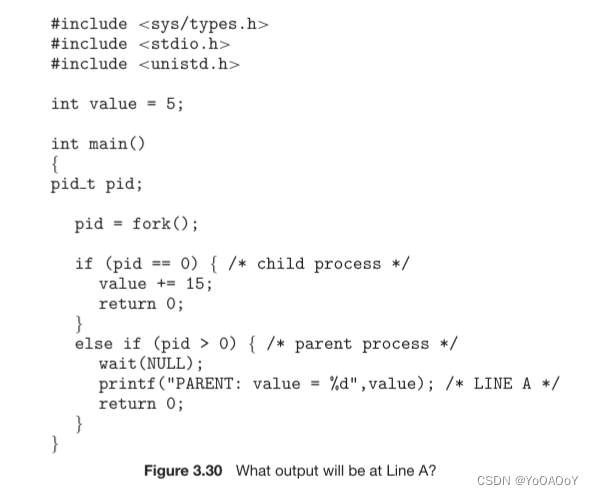

使用fork()创建子进程后，子进程拥有自己的内存地址，在子进程中返回值为0，即pid=0，修改value为20，因为子进程中value和父进程的value内存地址不一样，所以父进程的value仍为5；而在父进程中，fork()返回的是子进程的进程id>0，直接打印PARENT: value = 5

**2.包括初始父进程，图显示的程序创建了多少进程?**

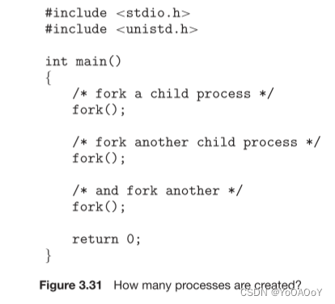

总共创建了8个进程。

**3.Sun UltraSPARC****处理器具有多个寄存器集。描述如果新上下文已加载到其中一个寄存器集中，则发生上下文切换时会发生什么情况。如果新上下文在内存中而不是在寄存器集中，并且所有寄存器集都在使用中，会发生什么情况？**

CPU当前寄存器集指针更改为指向包含新上下文的集，这只需很少的时间。如果上下文在内存中，则必须选择寄存器集中的一个上下文并将其移动到内存中，并且必须将新上下文从内存加载到该集合中。这一过程比使用一组寄存器的系统花费的时间稍多，具体取决于如何选择替换受害者。

**4.当一个进程使用fork()操作创建一个新进程时，父进程和子进程共享下列哪个状态? a栈 b堆 c共享内存段**

有共享内存段在父进程和新分叉的子进程之间共享。为新创建的进程复制堆栈。

**5.关于RPC机制，请考虑“恰好一次”语义。即使返回给客户端的ACK消息由于网络问题丢失，实现此语义的算法是否也能正确执行？描述消息的顺序，并讨论是否仍保留“仅一次”。**

“恰好一次”语义确保remore过程只执行一次。确保这一点的通用算法将确认（ACK）方案与时间戳（或允许服务器区分重复消息的其他增量计数器）相结合。

一般策略是客户端将RPC与时间戳一起发送到服务器。客户端还将启动超时时钟。然后，客户端将等待两次事件中的一次：（1）它将从服务器收到一个ACK，指示远程过程已执行，或者（2）它将超时。如果客户端超时，它将假定服务器无法执行远程过程，因此客户端将再次调用RPC，并发送稍后的时间戳。客户端可能由于以下两个原因之一而未接收到ACK：（1）服务器从未接收到原始RPC，或（2）服务器已正确接收并执行RPC，但ACK丢失。在情况（1）中，使用ACK允许服务器最终接收并执行RPC。在情况（2）中，服务器将接收到一个重复的RPC，并将使用时间戳将其标识为重复的，以避免再次执行RPC。需要注意的是，服务器必须向客户端发送第二个ACK，以通知客户端已执行RPC。

**6.假设分布式系统容易发生服务器故障。需要什么机制来保证“恰好一次”RPC执行的语义？**

服务器应在稳定的存储（如磁盘日志）中跟踪有关接收到哪些RPC操作、是否成功执行这些操作以及与这些操作相关的结果的信息。当发生服务器崩溃并收到RPC消息时，服务器可以检查之前是否执行过RPC，从而保证执行RPC的语义“只执行一次”。

**8.描述短期调度程序、中期调度程序和长期调度程序之间的区别。**

在批处理系统中：

短期调度程序(CPU调度程序)——从准备执行的进程中选择进程，并分配CPU。

长期调度程序(作业调度程序)——从进程缓冲池中选择进程加到内存中，以便执行。

他们主要的区别在于执行的频率。短期调度程序必须经常为CPU选择新的进程。长期调度程序并不频繁，因为长期调度程序控制多道程序进程，必须保证多道程序进程的稳定，为此创建创建程序的平均速度必须等于进程离开系统的平均速度。所以只有在进程离开系统时才会需要长期调用程序的调度。

在分时系统中：

中期调度程序，将进程从内存（或从CPU竞争）中移出，从而降低多道程序程度。之后进程看重新被调入内存，并从中断出继续执行。实现一种交换方案。

**9.描述内核在进程之间进行上下文切换时所采取的动作**

内核会将旧进程状态保存在其PCB中，然后加载经调度后的要执行的新进程的上下文。上下文切换的工作量与硬件支持密切相关，例如有的处理器提供了多个寄存器组，上下文切换只需简单改变寄存器组的指针，但如果活动进程数超过寄存器组数，系统就需要在寄存器和内存之间进行数据复制。

**12.包括初始父进程，图中显示的程序创建了多少个进程?**

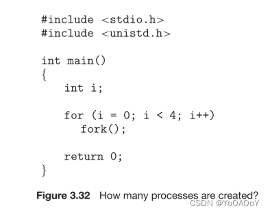

16个进程

**13.解释在什么情况下会到达图中标记为printf(“line J”)的代码行。**

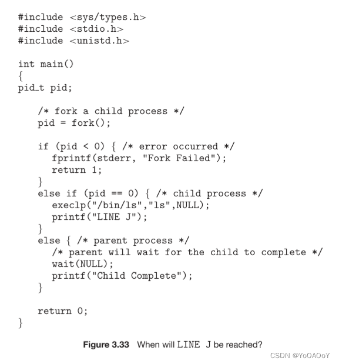

 当子进程创建成功后，调用execlp()加载/bin/ls程序的代码和静态数据，若调用成功，则永远不会执行printf(“line J”)；若调用失败（如不存在/bin/ls这样的可执行程序），才会执行printf(“line J”)。

**14.使用图中的程序，确定A、B、C和D行的pid值(假设父进程和子进程的实际pid分别为2600和2603)。**

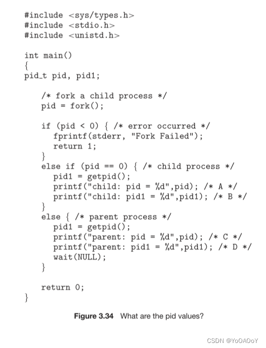

A: pid=0  
B: pid1 = 2603  
C: pid = 2603  
D: pid = 2600

**知识点：**

1.多道程序设计的目标：最大化CPU的利用率；

分时系统的目的是：在进程间快速切换CPU，以便用户在程序运行时能与其交互；

2.对于**批处理系统：**

长期调度程序：从缓冲池中选择进程，加到内存，以便执行（控制多道程序程度）。
    
短期调度程序：从准备执行的进程中选择进程，并分配CPU。
    
区别：执行频率；

对于**分时系统：**

中期调度程序的核心思想：**交换（swap）:**可将进程从内存中移出，从而降低多道程序程度。之后，进程可被重新调入内存，并从中断处继续执行。

**3.客户机/服务器通信**

套接字（socket）：只允许在进程间教化无结构的字节流
    
远程过程调用（RPC）：可用于实现分布式文件系统
    
管道（pipe）：普通管道：通信是单向的，只允许单向通信，进程间有父子关系，只可用于同一机器。
    
命名管道：通信可以双向，并且父子关系不是必须的，通信进程完成后，命名管道依然存在。

4.PCB由OS创建和管理。

5.执行上下文切换的时候：时钟中断、I/O中断、陷阱、管理调度

___

# Chap04 线程

**1.提供三个编程示例，在这些示例中，多线程比单线程解决方案提供更好的性能。**

1、一个Web服务器，需要接受有关网页、图像、声音的请求，同时处理上千个用户的访问请求。  
2、一个并行的应用程序，如矩阵乘法，其中矩阵的不同部分可以并行处理。  
3、一种交互式的字处理器，一个线程用于显示图形，一个线程用于响应用户键盘输入，还有一个线程用于在后台进行拼写和语法检查。

**2.用户线程和内核线程之间的两个区别是什么?在什么情况下，一种比另一种好?**

1、用户线程位于内核之上，它的管理无需内核支持，而内核线程由操作系统来直接支持与管理。

2、在使用一对一模型或多对多模型的系统上，用户线程由线程库调度，而内核调度内核线程。

内核线程不需要与一个进程相关联，而每个用户线程都属于一个进程。内核线程通常比用户线程的维护成本更高，因为它们必须用内核数据结构表示。

**3.描述内核在内核级线程之间进行上下文切换时所采取的动作。**

内核线程之间的上下文切换通常需要保存被切换出去的线程的CPU寄存器的值，并恢复被调度的新线程的CPU寄存器。

**4.创建线程时使用哪些资源?它们与创建进程时使用的方法有何不同?**

因为线程比进程小，所以创建线程通常比创建进程使用更少的资源。创建一个进程需要分配一个进程控制块(PCB)，这是一个相当大的数据结构。PCB包括内存映射、打开的文件列表和环境变量。分配和管理内存映射通常是最耗时的活动。创建用户或内核线程都需要分配一个小数据结构来保存寄存器集、堆栈和优先级。

**5.假设操作系统使用多对多模型将用户级线程映射到内核，并且映射是通过LWP完成的。此外，该系统允许开发人员创建用于实时系统的实时线程。是否需要将实时线程绑定到LWP？解释**

是的。定时对于实时应用程序至关重要。如果线程标记为实时，但未绑定到LWP，则该线程可能必须等待连接到LWP后才能运行。考虑实时线程是否正在运行（连接到LWP），然后继续阻塞（即必须执行i/O，已被更高优先级的实时线程抢占，正在等待互斥锁等），而实时线程被阻塞时，它所连接的LWP已分配给另一个线程。

当实时线程计划再次运行时，它必须首先等待连接到LWP。通过将LWP绑定到实时线程，可以确保线程在调度后能够以最小的延迟运行。

**6.提供两个编程示例，在这些示例中，多线程并不比单线程解决方案提供更好的性能。**

顺序程序不适合多线程编程。例子：  
1、一个计算个人纳税申报单的程序。  
2、“shell”程序，如C-shell或Korn shell。这样的程序必须密切监视自己的工作空间，如打开的文件、环境变量和当前工作目录。

**7.在什么情况下，使用多个内核线程的多线程解决方案比单处理器系统中的单线程解决方案提供更好的性能?**

当内核线程发生页面错误时，可以切换到另一个内核线程，以一种有用的方式使用交错时间。另一方面，当发生页面错误时，单线程进程将无法执行有用的工作。因此，在程序可能出现频繁的页面错误或必须等待其他系统事件的情况下，多线程解决方案甚至在单处理器系统上也能执行得更好。

**8.在多线程进程中，程序状态的下列哪些组件是跨线程共享的?a寄存器值 b堆内存 c全局变量 d栈内存**

多线程进程的线程共享堆内存和全局变量。每个线程都有其独立的寄存器值集和独立的栈。

**9.使用多个用户级线程的多线程解决方案能否在多处理器系统上比在单处理器系统上获得更好的性能?**

由多个用户级线程组成的多线程系统不能在多处理器系统中同时使用不同的处理器。操作系统只看到一个进程，不会将该进程的不同线程调度到不同的处理器上。因此，在多处理器系统上执行多个用户级线程不会带来性能上的好处。

**11.是否可能有并发性但没有并行性?解释一下**

可能。系统的并行性（parallelism）是指在同一时间执行多个任务，并发性（concurrency）是指系统能够支持多个任务，允许所有任务都能取得进展。因此没有并行，通过系统的调度也可以实现并发。

**15.考虑下面的代码段**

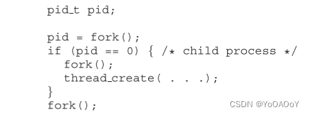

 **(1)创建了多少个独特的进程?（2）创建了多少个独特的线程?**

（1）6个进程

（2）8个线程

**知识点：**

1.  每个线程是CPU使用的一个基本单元：它包括线程ID、程序计数器、寄存器组、堆栈。它与同一进程的其他线程共享代码段、数据段、和其他OS资源。
2.  多线程编程的优点：响应性、资源共享、经济、可伸缩性。
3.  多核系统编程挑战：识别任务、平衡、数据分割、数据依赖、测试和调试。
4.  数据并行：注重将数据分布于多个计算核上，并在每个核上执行相同的操作；

任务并行：涉及将任务（线程）而不是数据分配到多个计算核。每个线程都执行一个独特的操作。

___

# Chap05 同步（Synchronization）

**1.在第5.4节中，我们提到频繁禁用中断可能会影响系统的时钟。解释为什么会发生这种情况，以及如何将这种影响降至最低。**

系统时钟在每次时钟中断时更新。如果中断被禁用，特别是长时间禁用，则系统时钟可能很容易丢失正确的时间。系统时钟也用于调度目的。例如，进程的时间量表示为时钟滴答数。在每个时钟中断时，调度器确定当前正在运行的进程的时间量是否已过期。如果时钟中断被禁用，调度程序将无法准确分配时间量。通过仅在很短的时间内禁用时钟中断，可以将这种影响降至最低。

**2.解释Windows、Linux和Solaris实现多种锁定机制的原因。描述他们使用自旋锁、互斥锁、信号量、自适应互斥锁和条件变量的情况。在每种情况下，解释为什么需要该机制。**

这些操作系统根据应用程序开发人员的需要提供不同的锁定机制。自旋锁对于多处理器系统非常有用，因为在多处理器系统中，线程可以在繁忙的循环中运行（在短时间内），而不会产生放入睡眠队列的开销。互斥锁对于锁定资源很有用。Solaris 2使用自适应互斥锁，这意味着互斥锁在多处理器机器上通过自旋锁实现。信号量和条件变量是同步的更合适的工具，因为旋转在很长的时间内效率很低，所以当资源必须保持很长一段时间。

**3.忙等待这个词是什么意思？操作系统中还有哪些其他类型的等待？可以完全避免忙碌的等待吗？解释你的答案。**

忙等待是指进程在不放弃处理器的情况下，在循环中等待条件得到满足。或者，进程可以通过放弃处理器来等待，并阻塞某个条件，等待在将来的某个适当时间被唤醒。可以避免繁忙的等待，但会产生与将进程置于睡眠状态以及在达到适当的程序状态时必须将其唤醒相关的开销。

**4.解释为什么自旋锁不适用于单处理器系统，但通常用于多处理器系统。**

自旋锁不适用于单处理器系统，因为只有通过执行不同的进程才能获得将进程从自旋锁中断的条件。如果进程没有放弃处理器，其他进程就没有机会设置第一个进程取得进展所需的程序条件。在多处理器系统中，其他进程在其他处理器上执行，从而修改程序状态，以便从自旋锁释放第一个进程。

**5.说明如果wait（）和signal（）信号量操作没有原子化执行，那么可能会违反互斥。**

等待操作以原子方式递减与信号量关联的值。如果在信号量的值为1时对其执行两个等待操作，如果这两个操作不是原子地执行的，那么这两个操作可能会继续递减信号量值，从而违反互斥。

**6.说明如何使用二进制信号量实现n个进程之间的互斥。**

n个进程共享一个信号量mutex，该信号量初始化为1。每个过程Pi的组织如下：

```c
do {
    wait(mutex);
    /* critical section */
    signal(mutex);
    /* remainder section */
} while (true)；
```

**10.请解释：为什么在单处理器系统上通过禁止中断来实现同步原语的方法不适用于用户级程序.**

如果用户级程序具有禁用中断的能力，那么它可以禁用计时器中断并防止发生上下文切换，从而不让其他进程执行，达到独占处理器的目的。

**11.请解释为什么禁止中断不适合在多处理器系统来实现同步原语.**

如果多个进程运行在不同的CPU上，每个进程都试图进入一个临界区，即使禁止中断，其他进程依旧能够在其他处理器上进入临界区。

**13.请描述可能存在竞争条件的两个内核数据结构。一定要有如何可能发生竞争条件的描述。**

1.  两个数据结构/进程正在等待的资源被释放，并且两个进程都试图访问它；
2.  处理 必须为 两个同时创建的进程创建对应的ID时。

**23.展示如何在多处理器环境中使用test\_and\_set()指令实现wait()和signal()信号量操作。方案应该表现最小的忙等待。**

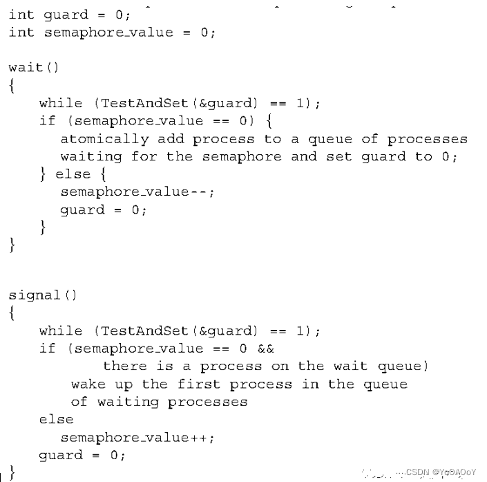

**25.请解释：管程和信号量是等价的，因为它们可以用来实现对相同类型的同步问题的解决方案。**

可以使用下面的管程代码实现信号量：

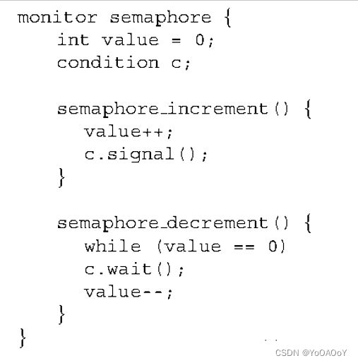

 管程可以通过以下方式使用信号量来实现。每个条件变量都由一个等待条件的线程队列表示。每个线程都有一个与其队列条目相关联的信号量。当线程执行等待操作时，它会创建一个新的信号量(初始化为0)，将该信号量添加到与条件变量相关的队列中，并对新创建的信号量执行阻塞信号量递减操作。当一个线程在一个条件变量上执行一个信号时，队列中的第一个进程将通过对相应的信号量执行递增操作而被唤醒。

**32.一个文件在不同的进程之间共享，每个进程都有一个唯一的编号。该文件可以被多个进程同时访问，但有如下约束:当前访问该文件的所有进程关联的所有唯一编号之和必须小于n。通过写管程来协调对该文件的访问。**

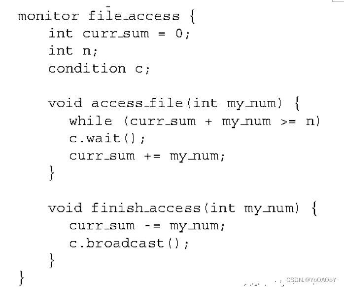

 **知识点：**

1.  管程（monitor）：属于抽象数据类型（ADT），
2.  信号量（Semaphore），自旋锁（spinlock）；
3.  竞争条件（race condition）：多个进程并发访问和操作同一数据并且执行结果与特定访问顺序有关。

___

# Chap06 CPU调度

**1.CPU****调度算法确定其调度进程的执行顺序。如果在一个处理器上调度n个进程，那么可能有多少个不同的调度？给出一个n的公式。**

n！

**2.解释抢占式和非抢占式调度之间的区别。**

抢占式调度允许进程在执行过程中被中断，将CPU带走并分配给另一个进程。

非抢占式调度确保进程只有在完成当前CPU事件时才放弃对CPU的控制。

**3.假设以下进程在指定的时间到达执行。每个进程将在列出的时间内运行。在回答问题时，请使用非强制性计划，并根据您在做出决策时掌握的信息做出所有决策。**

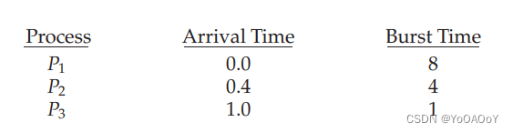

a.**使用FCFS调度算法，这些进程的平均周转时间是多少？**

**b.使用SJF调度算法，这些流程的平均周转时间是多少？**

**c.SJF****算法应该可以提高性能，但请注意，我们选择在时间0运行进程P1，因为我们不知道两个较短的过程很快就会到来。如果CPU在第一个单元处于空闲状态，然后使用SJF调度，计算平均周转时间。请记住，进程P1和P2在此空闲时间内正在等待，因此它们的等待时间可能会增加。该算法可称为未来知识调度。**

a.10.53

b.9.53

c.6.86

请记住，周转时间是完工时间减去到达时间，因此您必须减去到达时间来计算周转时间。如果忘记减去到达时间，则FCFS为11。

**4.在多级队列的不同层次上具有不同的时间片大小有什么优势？**

需要更频繁服务的进程(例如，编辑器等交互进程)可以在一个时间量较小的队列中。不需要频繁服务的进程可以在一个具有更大时间片的队列中，需要更少的上下文切换来完成处理，从而更有效地利用计算机。

**5.许多CPU调度算法都是参数化的。例如，RR算法需要一个参数来指示时间片。多级反馈队列需要参数来定义队列的数量、每个队列的调度算法、用于在队列之间移动进程的标准等。**

**因此，这些算法实际上是一组算法（例如，所有时间片的RR算法集，等等）。一组算法可能包括另一组算法（例如，FCFS算法是具有无限时间量的RR算法）。以下算法集对之间存在什么关系（如果有）**

**a.****优先级和SJF**

**b.****多级反馈队列和FCFS**

**c.****优先级和FCFS**

**d.RR****和SJF**

a、 最短的作业具有最高优先级。

b、 MLFQ的最低级别是FCFS。

c、 FCFS对存在时间最长的作业给予最高优先级。

d、 无

**6.假设一个调度算法（在短期CPU调度级别上）支持最近使用最少处理器时间的进程。为什么这个算法会支持I/O密集型的程序，而不会永久性地饥饿CPU密集型的程序？**

它将有利于I/O密集型的程序，因为它们的CPU突发请求相对较短；然而，CPU密集型的程序不会饿死，因为I/O密集型的程序会相对频繁地放弃CPU来执行其I/O

**7.区分PCS和SCS调度。**

PCS调度在进程本地完成。这就是线程库如何将线程调度到可用的LWP上。SCS调度是操作系统调度内核线程的情况。在使用多对一或多对多的系统上，这两种调度模型有着根本的不同。在使用一对一的系统上，PCS和SCS是相同的。

**8.假设操作系统使用多对多模型将用户级线程映射到内核，并且映射是通过使用LWP完成的。此外，该系统允许程序开发人员创建实时线程。是否需要将实时线程绑定到LWP？**

是的，否则用户线程可能必须在实际调度之前竞争可用的LWP。通过将用户线程绑定到LWP，在等待可用LWP时没有延迟；可以立即调度实时用户线程。

**9.传统的UNIX调度程序强制执行优先级数字和优先级之间的反向关系：数字越高，优先级越低。调度器使用以下功能每秒重新计算一次进程优先级：**

**优先级=（最近的CPU使用率/2）+基数，**

**其中基数=60，最近的CPU使用率指的是一个值，该值指示自上次重新计算优先级以来，进程使用CPU的频率。**

**假设进程P1的最近CPU使用率为40，进程P2为18，进程P3为10。重新计算优先级时，这三个流程的新优先级是什么？基于此信息，传统的UNIX调度程序是否会提高或降低CPU受限进程的相对优先级。**

分配给流程的优先级分别为80、69和65。

调度器降低了CPU绑定进程的相对优先级。

**10.为什么区分CPU密集型程序和I/O密集型程序对调用程序很重要?**

I/O密集型程序具有在执行IO之前只执行少量计算的特性。这类程序通常不会使用它们的全部CPU量。另一方面，CPU密集型程序使用它们的整个CPU，而不执行任何IO阻塞操作。因此，通过赋予I/O密集型程序更高的优先级，并允许它们在CPU密集型程序之前执行，可以更好地利用计算机资源。

**11.讨论以下几对调度标准在某些情况下如何冲突。**

**a. CPU****利用率和响应时间**  
**b.****平均周转时间和最小等待时间**  
**c. I/O****设备利用率和****CPU****利用率**

a. CPU利用率和响应时间:如果最小化与上下文切换相关的开销，CPU利用率就会增加。通过不频繁地执行上下文切换，可以降低上下文切换的开销。然而，这可能会增加流程的响应时间。

b. 平均周转时间和最小等待时间:通过先执行最短的任务来最小化平均周转时间。然而，这样的调度策略可能会饥饿长时间运行的任务，从而增加它们的等待时间。

c. I/O设备利用率和CPU利用率:在不进行上下文切换的情况下，运行长时间CPU密集型的任务，可以最大化CPU利用率。在I/O密集型程序准备好运行时立即进行调度，可以最大化I/O设备利用率，但会因此增加上下文切换造成的开销。

**14.假设采用指数平均公式来预测下一个CPU执行的长度。当采用如下参数数值时，该算法的含义是：**

α.为0，则最近信息对预测没有影响，公式总是预测为100ms。

b.α为0.99，则赋予最近信息很大的权重，几乎无需考虑过去历史，只用前一个CPU执行长度简单的预测下一个CPU执行。

**15.循环调度程序的一个变体是回归轮转调度程序。这个调度器为每个进程分配一个时间片和优先级。时间片的初始值为50ms。但是，每当一个进程获得CPU并用完它的整个时间片(不会因为I/O而阻塞)时，它的时间片就会增加10ms，它的优先级也会提高。(进程的时间片最多可以增加到100ms)当一个进程在用完它的整个时间片之前阻塞，它的时间片会降低5ms，而它的优先级保持不变。回归轮转调度程序偏爱哪种类型的进程(cpu密集型或I/ o密集型程序)?解释一下。**

偏爱I/O密集型程序，因为它总是能在时间片结束之前发生I/O阻塞，优先级不变，那么他就可以长期处于CPU的高优先级队列中，长期霸占CPU.

**16.假设有如下一组进程，其CPU执行的时间以毫秒为单位：**


**假设进程以P1、P2、P3、P4、P5的顺序到达，都是在时刻0到达。**

**a****、画出4个Gantt图,分别演示采用每种调度算法（FCFS、SJF、非抢占优先级（一个较大优先级意味着更高优先级）和RR（时间片=2））的进程执行。**

**b****、每个进程在a里的每种调度算法下的周转时间是多少？**

**c****、每个进程在a里的每种调度算法下的等待时间是多少？**

**d****、哪一种调度算法的平均等待时间（对所有进程）最小？**

a.

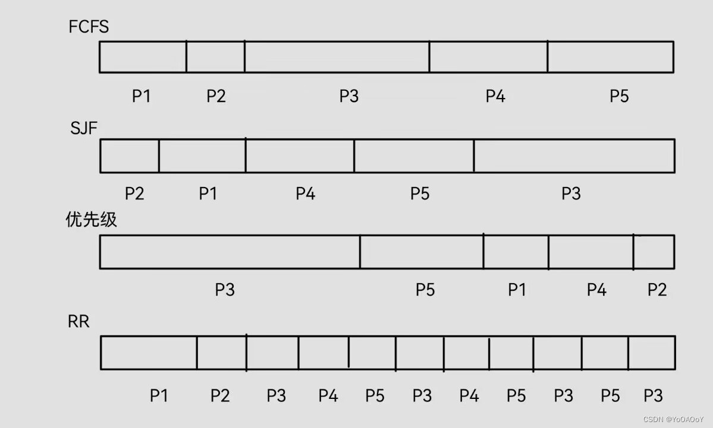

 b.

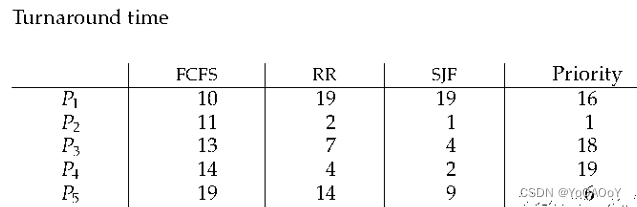

c.

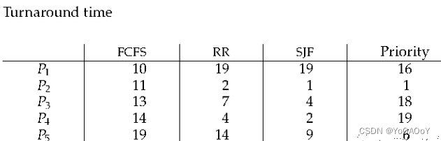

d.SJF的平均等待时间最小

**17.下面的进程正在使用一种抢占轮转调度算法进行调度。每个进程都被分配了一个优先级数值，较高的数字表示较高的相对优先级。除了下面列出的进程之外，系统还有一个空闲任务(它不消耗CPU资源，被标识为Pidle)。此任务的优先级为0，当系统没有其他可用进程可运行时，将调度该任务。时间片的长度是10个单位。如果一个进程被高优先级的进程抢占，则被抢占的进程被放置在队列的末尾。**

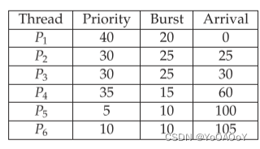

**a****、采用****Gantt****图，演示进程的调度顺序**  
**b****、每个进程的周转时间是多少？**  
**c****、每个进程的等待时间是多少？**  
**d****、****CPU****使用率是多少****？**

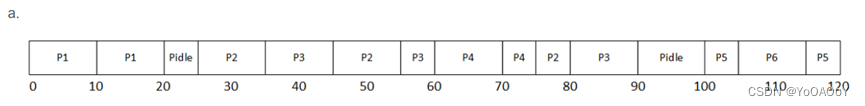

b. 


 c.


d.105/120 = 87.5%

**19.下面哪个调度算法会导致饥饿？**


b、SJF d、priority

**24.解释下列调度算法在偏好短进程方面的区别：**


a、FCFS不偏好短进程，位于长进程之后的短进程将会等待很长时间  
b、RR对长短进程一视同仁都执行相同的时间片，短周期能够最早的完成执行  
c、多级反馈队列类似于RR，赋予短进程较高的优先级，而长进程优先级会逐渐降低，最先完成短进程

**知识点：**

周转时间（turnaround time）：从进程提交到完成的时间；

等待时间：在就绪队列中等待所花时间之和；

响应时间：从提交到产生第一次响应的时间；

FCFS：平均等待时间很长，非抢占；

最短作业优先调度（SJF）：会饥饿

指数平均（exponential average）：设tn为第n个CPU突发的长度，_τ_n+1为下一个CPU突发的预测值。然后，对于a，0≤a ≤ 1，定义

 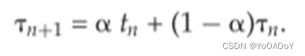

tn包括最近信息，_τ_n存储了过去历史

最短剩余时间调度（SRTF）

优先级调度（priority）：一般低数字代表高优先级，会饥饿；

轮转调度（RR）：

时间量（time quantum）或时间片（time slice）；

多级队列调度

多级反馈队列调度

Lottery scheduling (彩票调度) 是一种解决公平性问题的自适应调度方法

❑每个进程都有一些票证
    
❑在每个时间片上，随机挑选一张票
    
❑平均而言，分配的CPU时间与分配给每个作业的票证数量成比例

线程调度：

多对多、多对一模型，线程库调度用户级线程在LWP上运行，这种方案称为**进程竞争范围（PCS）**，因为竞争CPU是在同一进程的不同线程之间；

为了决定那个内核级线程调度到可用CPU上，内核采用是**系统竞争范围（SCS）**–系统中所有线程之间的竞争，采用一对一模型的系统，只采用SCS；

___

# Chap07 死锁

**1.列出三个与计算机系统环境无关的死锁示例。**

两辆车从相反方向穿过一座单行道桥。

一个人从梯子上下来，而另一个人在爬梯子。

两列列车在同一轨道上相互靠近。

**2.假设系统处于不安全状态。表明进程可以在不进入死锁状态的情况下完成其执行。**

不安全状态不一定会导致死锁，它只是意味着我们不能保证死锁不会发生。因此，处于不安全状态的系统可能仍然允许完成所有进程而不发生死锁。考虑这样一种情况，即系统在进程P0、P1和P2之间分配了12个资源。资源按照以下策略分配:

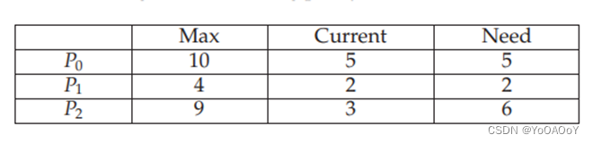

目前有两种可用资源。由于进程P1可能完成，此系统处于不安全状态，因此总共释放了四个资源。但我们不能保证P0和P2过程能够完成。然而，流程可能会在请求任何进一步的资源之前释放资源。例如，进程P2可以释放一个资源，从而将资源总数增加到五个。这允许进程P0完成，这将释放总共九个资源，从而允许进程P2也完成.

**3.请考虑以下系统：**


 **使用银行家算法回答以下问题：**

**a****、 矩阵Need内容？**

**b****、 系统是否处于安全状态？**

**c****、 如果来自流程P1的请求到达（0,4,2,0），能否立即批准该请求.**

a、 过程P0到P4的需求值分别为（0、0、0、0）、（0、7、5、0）、（1、0、0、2）、（0、0、2、0）和（0、6、4、2）。

b、对当可用值等于（1、5、2、0）时，可以运行进程P0或P3。一旦流程P3运行，它就会释放其资源，从而允许所有其他现有流程运行。

c、这将导致可用的值为（1、1、0、0）。可以完成的进程的一个顺序是P0、P2、P3、P1和P4.

**4.防止死锁的一种可能的方法是，在请求任何其他资源之前，必须先请求单个高阶资源。例如，如果多个线程尝试访问同步对象A···E，则可能会出现死锁。（此类同步对象可以包括互斥锁、信号量、条件变量等。）我们可以通过添加第六个对象F来防止死锁。每当线程想要获取任何对象A··E的同步锁时，它必须首先获取对象F的锁。这种解决方案称为包含：对象A···E的锁包含在对象F的锁中.** **将此方案与第7.4.4节的循环等待方案进行比较.**

这可能不是一个好的解决方案，因为它产生的范围太大。最好定义一个范围尽可能窄的锁定策略

**5.证明第7.5.3节中提出的安全算法需要m×n2操作顺序.**

图7.1提供了实现银行家算法安全算法的Java代码（银行家算法的完整实现可通过源代码下载获得）。

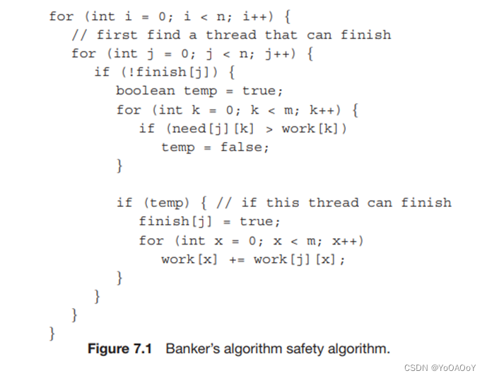

 可以看出，嵌套的外部循环都通过n次循环提供n2性能。在这些外循环中有两个连续的内循环，循环m次。因此，该算法的为O（m×n2）。

**6.考虑一个每月运行5000个作业的计算机系统，它没有死锁预防或死锁避免方案。死锁大约每月发生两次，每个死锁操作员必须终止并重新运行大约10个作业。每个作业的价值约为2美元（以CPU时间计算），而终止的作业在中止时往往只完成了一半左右。**

**一位系统程序员估计，可以在系统中安装死锁避免算法（如银行家算法），使每个作业的平均执行时间增加约10%。**

**由于机器目前有30%的空闲时间，每月5000个作业仍然可以运行，尽管周转时间平均会增加20%左右。**

**a****、 安装死锁避免算法的理由是什么？**

**b****、 反对安装死锁避免算法的理由是什么?**

在系统中安装死锁避免的一个理由是，我们可以确保死锁永远不会发生。此外，尽管周转时间有所增加，但所有5000个工作岗位仍然可以运行。

反对安装死锁避免软件的一个理由是，死锁很少发生，而且发生时成本很低。

**7.系统是否可以检测到其某些进程处于饥饿状态？如果你回答“是的，”解释它是如何做到的。如果您回答“否”，请解释系统如何处理饥饿问题.**

饥饿是一个很难定义的话题，因为它对于不同的系统可能意味着不同的事情。为了这个问题的目的，我们将饥饿定义为一种情况，即一个进程在收到请求的资源之前必须等待一段合理的时间，可能是无限期的。检测饥饿的一种方法是首先确定一段时间T，这被认为是不合理的。当进程请求资源时，计时器启动。如果经过的时间超过T，则认为该进程已饥饿。

应对饥饿的一个战略是采取一项政策，只将资源分配给等待时间最长的进程。例如，如果进程Pa等待资源X的时间比进程Pb长，那么来自进程Pb的请求将被延迟，直到进程Pa的请求得到满足。

另一种策略将没有刚才提到的那么严格。在这种情况下，可以将资源授予等待时间少于另一个进程的进程，前提是另一个进程没有饥饿。

然而，如果另一个进程被认为是饥饿的，那么它的请求将首先得到满足。

**8.考虑以下资源分配策略。允许随时请求和释放资源。如果由于资源不可用而无法满足对资源的请求，那么我们将检查所有被阻止等待资源的进程。如果一个被阻止的进程具有所需的资源，那么这些资源将从该进程中移除并提供给请求进程。阻塞进程正在等待的资源向量将增加，以包括被带走的资源。**

**例如，考虑一个具有三种资源类型的系统，可用向量初始化为（4,2,2）。如果进程P0要求（2,2,1），它就会得到它们。如果P1请求（1,0,1），它将得到它们。然后，如果P0请求（0,0,1），它将被阻止（资源不可用）。如果P2现在请求（2,0,0），它将获得可用的一个（1,0,0）和分配给P0的一个（因为P0被阻止）。P0的分配向量下降到（1,2,1），其需求向量上升到（1,0,1）。**

**a****、 是否会发生死锁？如果你回答“是”，请举例说明。如果回答“否”，请指定无法发生的必要条件。**

**b****、 是否会发生无限阻塞？解释你的答案**

a、 无法发生死锁，因为存在抢占。

b、 是的。如果一系列请求（如进程C的请求）持续抢占了进程所需的所有资源，那么进程可能永远无法获得它所需的所有资源。

**9.假设您已经编写了死锁避免安全算法，现在被要求实现死锁检测算法。您是否可以简单地使用安全算法代码并重新定义Max\[i\] =Waiting\[i\]+ Allocation\[i\]，其中等待\[i\]是一个向量，指定进程i正在等待的资源，分配\[i\]如第7.5节所定义？解释你的答案.**

对Max向量表示进程可能发出的最大请求。在计算安全算法时，我们使用表示最大分配的需求矩阵。另一种想法是Max=Need+Allocation。根据这个问题，等待矩阵的作用类似于需求矩阵，因此Max=Waiting+ Allocation。

**10.是否可能只涉及一个单线程进程的死锁？解释你的答案**

否。保持和等待条件不满足

**17.考虑一个由四个相同类型的资源组成的系统，它们由三个进程共享，每个进程最多需要两个资源。显示系统是无死锁的。**

系统要想成为死锁，则必须每个进程占有并请求资源，假设三个进程都占有一个资源，每个进程恰好都请求一个资源，而系统刚好能为其中一个进程提供一个资源，当该进程完成后释放全部资源，并不会造成死锁的情况。

**19.考虑哲学家就餐的问题，把筷子放在桌子中央，哲学家可以使用任意两根筷子。假设一次对筷子的请求只能拿一根筷子。请描述一个简单的规则，用于判断一个请求是否可以被满足且不会导致死锁。**

只有当所有哲学家都没有两支筷子且只剩一直筷子时，若哲学家请求的是他第一支筷子，该请求会被拒绝。

**23.**

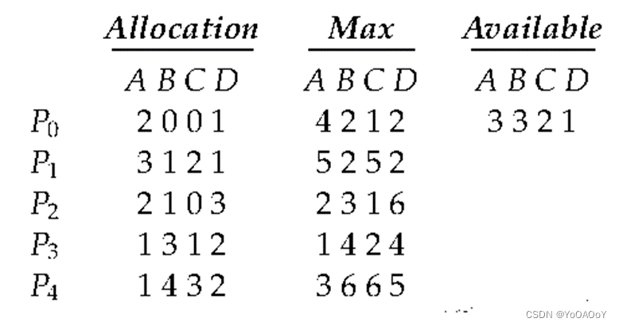

 **问：a、通过演示可能的安全序列来说明系统处于安全状态。**

**b.****如果来自进程P1的请求到达(1,1,0,0)，请求可以立即被批准吗?**

**c.****如果来自进程P4的请求到达(0,0,2,0)，可以立即批准该请求吗？**

a、安全序列可以是：p0、p3、p1、p2、p4处于安全状态

b、可以立即批准，当批准p1的请求后，依旧存在安全序列p0、p3、p1、p2、p4处于安全状态

c、不可以，若批准p4（0，0，2，0）的请求，则Available变为（3，3，0，1）其中c资源不满足任意进程的需求量，系统不安全

**25.一座单车道的桥连接着两个佛蒙特州的村庄北滕布里奇和南滕布里奇。这两个村庄的农民用这座桥把农产品运到邻近的城镇。如果一个向北行驶的农民和一个向南行驶的农民同时上桥，大桥就会陷入僵局。(佛蒙特州的农民很固执，不会放弃过桥)，请使用信号量和/或互斥锁，在伪代码中设计一个防止死锁的算法。不必担心饥饿(北行农民阻止南行农民使用桥梁的情况，反之亦然)。**

```c
semaphore bridge = 1;
void cross()
{
    while(true)
    {
        wait(bridge);
        //过桥并离开后
        signal(bridge);
  }
```

**知识点：**

**死锁的必要条件：**

互斥（mutual exclusion）；

占有并等待（hold and wait）；

非抢占（no preemption）；

循环等待（circular wait）。

**死锁预防（deadlock prevention）：使上述条件至少一个不成立；**

**死锁避免（deadlock avoidance）：通过分析进程所需最大资源数量和系统所拥有的资源数量来判断系统是否是安全的。**

___

# Chap08 内存管理策略

**1.说出逻辑地址和物理地址之间的两个区别。**

逻辑地址不是指实际的现有地址；相反，它指的是抽象地址空间中的抽象地址。将其与引用内存中实际物理地址的物理地址进行对比。逻辑地址由CPU生成，并由内存管理单元（MMU）转换为物理地址。因此，MMU生成物理地址。

**2.考虑一个系统，其中一个程序可以分为两部分：代码和数据。CPU知道它想要的是指令（指令提取）还是数据（数据提取或存储）。因此，提供了两个基地址-界限寄存器：一个用于指令，一个用于数据。基地址-界限寄存器对是自动只读的，因此程序可以在不同的用户之间共享。讨论此方案的优缺点。**

该方案的主要优点是它是一种有效的代码和数据共享机制。例如，只需要在内存中保存编辑器或编译器的一个副本，并且需要访问编辑器或编译器代码的所有进程都可以共享此代码。

另一个优点是保护代码免受错误修改。

唯一的缺点是代码和数据必须分开，这通常是在编译器生成的代码中遵守的。

**3.为什么页面大小总是2的幂？**

分页是通过将地址拆分为页和偏移量来实现的。最有效的方法是将地址分解为X页位和Y偏移位，而不是对地址执行算术运算来计算页码和偏移量。因为每个位位置代表2的幂，所以在位之间拆分地址会导致页面大小为2的幂

**4.考虑64页的逻辑地址空间，每个页1024个字，映射到32帧的物理内存上。**

**a、 逻辑地址中有多少位？**

**b、 物理地址中有多少位？**

a. 16

b. 15

**5.允许页表中的两个条目指向内存中的同一页帧有什么效果？解释如何使用此效果减少将大量内存从一个位置复制到另一个位置所需的时间。更新一个页面上的某些字节会对另一个页面产生什么影响？**

通过允许页表中的两个条目指向内存中的同一页帧，用户可以共享代码和数据。如果代码是可重入的，那么通过共享文本编辑器、编译器和数据库系统等大型程序可以节省大量内存空间。通过让不同的页表指向相同的内存位置，可以“复制”大量内存。

然而，共享非进入代码或数据意味着任何有权访问代码的用户都可以修改它，这些修改将反映在其他用户的“副本”中。

**6.描述一种机制，通过该机制，一个段可以属于两个不同进程的地址空间。**

由于段表是基地址-界限寄存器的集合，当两个不同作业的段表中的条目指向相同的物理位置时，可以共享段。两个段表必须具有相同的基指针，并且两个进程中的共享段号必须相同

**7.在动态链接的分段系统中，可以在进程之间共享分段，而无需它们具有相同的分段编号。**

**a****、 定义一个允许静态链接和共享段的系统，而不要求段编号相同。**

**b****、 描述一种分页方案，该方案允许在不要求页码相同的情况下共享页面。**

这两个问题都导致程序能够引用自己的代码和数据，而不知道与地址相关的段或页码。MULTICS通过将四个寄存器与每个进程关联来解决此问题。一个寄存器有当前程序段的地址，另一个寄存器有堆栈的基址，另一个寄存器有全局数据的基址，依此类推。

所有引用都必须通过映射到当前段或页码的寄存器进行间接引用。通过更改这些寄存器，相同的代码可以在没有相同页码或段号的情况下为不同的进程执行。

**8.在IBM/370中，通过使用密钥提供内存保护。**

**键是一个4位的量。每个2K内存块都有一个与其关联的密钥（存储密钥）。CPU还有一个与之关联的密钥（保护密钥）。仅当两个键相等或其中一个键为零时，才允许进行存储操作。以下哪种内存管理方案可以成功用于此硬件。**

**a.****裸机**

**b.****单用户系统**

**c.****具有固定进程数的多道程序设计**

**d.****具有可变进程数的多道程序设计**

**e.****分页**

**f.****分段**

a、 无需保护，将系统密钥设置为0。

b、 在管理员模式下，将系统键设置为0。

c、 区域大小必须以2k字节的增量固定，并使用内存块分配密钥。

d、 同上。

e、 帧大小必须以2k字节为增量，为页分配键。

f、 段大小必须以2k字节为增量，为键分配段

**12.大多数系统允许程序在执行期间为其地址空间分配更多的内存。在程序的堆段中分配的数据就是这种分配内存的一个例子。在以下方案中，支持动态内存分配需要什么:a.连续内存分配b.纯分段c.纯分页**

连续内存分配:可能需要重新定位整个程序，因为没有足够的空间让程序增长其分配的内存空间。  
纯分段:也可能需要重新定位需要扩展的段，因为没有足够的空间让段增长其分配的内存空间。  
纯分页:在这种方案中，新页面的增量分配是可能的，而不需要重新定位程序的地址空间。

**13.比较连续内存分配、纯分段和纯分页的主要内存组织方案，可以考虑以下问题:a.外部碎片b.内部碎片c.跨进程共享代码的能力**

由于地址空间是连续分配的，并且随着旧进程的死亡和新进程的启动，孔就会出现，因此相邻的内存分配方案存在外部碎片问题。它也不允许进程共享代码，因为进程的虚拟内存段没有分解成非连续的细粒度段。

纯分段会受到外部碎片的影响，因为进程的一个段是连续地放置在物理内存中，当死进程的段被新进程的段取代时，就会出现碎片。然而，分段使进程能够共享代码;例如，两个不同的进程可以共享一个代码段，但有不同的数据段。

纯分页不会受到外部碎片的影响，而是会受到内部碎片的影响。进程是按页粒度分配的，如果没有完全利用页，就会导致内部碎片化和相应的空间浪费。分页还允许进程以页面的粒度共享代码。

**14.在有分页功能的系统上，进程不能访问不属于它的内存;为什么?操作系统如何允许访问其他内存?为什么它应该或不应该**

分页系统中的地址是一个逻辑页码和一个偏移量。通过根据逻辑页码搜索表来生成物理页码，从而找到物理页。因为操作系统控制该表的内容，所以它可以限制一个进程只能访问那些分配给该进程的物理页。进程无法引用它不拥有的页，因为该页不在页表中。为了允许这样的访问，操作系统只需要允许将非进程内存的条目添加到进程的页表中。当两个或多个进程需要交换它们刚刚读和写到相同物理地址(可能位于不同的逻辑地址)的数据时，这很有用。这使得进程间通信非常高效。

**17.从将虚拟地址转换为物理地址的地址转换结构所需的内存数量方面，比较分页和分段**

分页需要更多的内存开销来维护转换结构。

每个段只需要两个寄存器:一个维护段的基址，另一个维护段的范围。

另一方面，分页要求每页有一个条目，这个条目提供了页面所在的物理地址。

**19.在许多系统中，程序二进制文件的结构通常如下所示。代码以一个小的固定虚拟地址(如0)开始存储。代码段后面是用于存储程序变量的数据段。当程序开始执行时，堆栈被分配到虚拟地址空间的另一端，并允许向较低的虚拟地址增长。上述结构在以下方案中有什么意义:a.连续内存分配b.纯分段c.纯分页**

1)连续内存分配要求操作系统在程序开始执行时将整个虚拟地址空间分配给程序。这可能比进程的实际内存需求高得多。

2)纯分段给操作系统灵活性，在每个程序启动时分配一个小范围的段，如果需要则扩展段。

3)纯分页不需要操作系统在启动时为进程分配最大范围的虚拟地址空间，但它仍然需要操作系统分配一个大的页表，跨越程序的所有虚拟地址空间。当一个程序需要扩展栈或堆时，它需要分配一个新页，但相应的页表条目是预先分配的。

**20.假设页面大小为1 kb，以下地址引用的页码和偏移量是多少(以十进制数提供):a. 3085 b. 42095 c. 215201 d. 650000 e. 2000001**

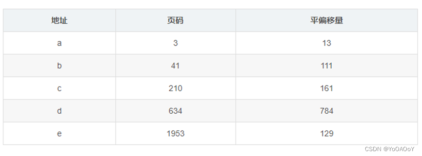

22. **物理内存的最大容量是多少？**

若地址空间为x位，则物理内存最大容量为2^x byte

**24.考虑一个具有32位逻辑地址和4 kb页面大小的计算机系统。系统最大支持512mb的物理内存。则页表中有多少个条目**

2^20个

**25.考虑一个分页系统，其中的页表存储在内存中。a.如果一个内存引用需要50纳秒，那么一个分页的内存引用需要多长时间?b.如果我们添加tlb，并且75%的页表引用都在tlb中，那么有效的内存引用时间是多少?(假设在tlb中查找页表条目需要2纳秒，如果存在该条目的话。)**

a、100ns,其中50ns用于引用页表，50ns用引用物理内存

b、0.75\*(50ns + 2ns) + 0.25\*100ns = 64ns

**27.解释为什么使用分段比使用纯分页更容易共享可重入模块**

由于分段是基于内存的逻辑划分而不是物理划分，因此每个用户的段表中只能有一个条目共享任何大小的段。对于分页，对于每个共享的页，页表中必须有一个公共条目。

**28.考虑下面段表：**

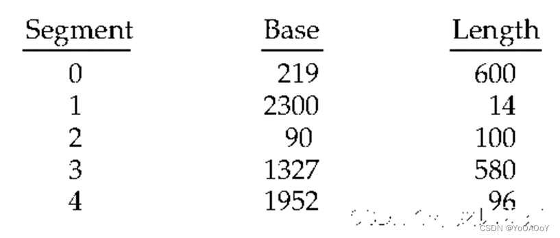

 **以下逻辑地址的物理地址是什么**

**a. 0,430**  
**b. 1,10  
c. 2,500  
d. 3,400  
e. 4,112**

a. 219 + 430 = 649

b. 2300 + 10 = 2310

c. illegal reference, trap to operating system

d. 1327 + 400 = 1727

e. illegal reference, trap to operating system

**29.页表分页的目的是什么?**

在某些情况下分页的页表可以变得足够大的页表,可以简化内存分配问题(通过确保所有分配固定大小的页而不是可变大小的块),也可以交换目前不使用的页表部分。

**31.比较用于处理大地址空间的分段分页方案与散列页表方案。在什么情况下，一种方案比另一种更可取**

当一个程序只占用其大虚拟地址空间的一小部分时，可能会首选散列页表，因为它的大小更小。然而，散列页表的缺点是，将多个页映射到相同的散列页表条目时会产生冲突。如果许多页映射到相同的表项，那么遍历对应于该哈希表项的列表可能会引起很大的开销;在分段分页方案中，这种开销是最小的，因为每个页表条目只维护关于一个页的信息。

**知识点：**

1.  **内存分配：**
    1.  **多分区方法（multiple-partition method）：**当一个分区空闲时，可以从输入队列中选择一个进程，以调入空闲分区。
    2.  **可变分区方案（variable-partition）：**OS有一个表，用于记录哪些内存可用和哪些内存已用。开始，所有内存都可用于用户进程，因此可以作为一大块的可用内存，称为**孔（hole）**。
2.  **动态存储分配问题（dynamic storage-allocation problem）：**
    1.  **首次适应（first-fit）：**分配首个足够大的孔；
    2.  **最优适应（best-fit）：**分配最小的足够大的孔；
    3.  **最差适应（worst-fit）：**分配最大的孔；
3.  **碎片（fragmentation）：**
    1.  首次适应和最优适应都有**外部碎片（external fragmentation）：**存储被分成了大量的小孔
    2.  50%规则：N个可分配块，可能有0.5个外部碎片块，1/3的内存不可用
    3.  **内部碎片（internal fragmentation）：**按固定大小的块分配给进程而产生的剩余空间；
    4.  **解决外部碎片的方法：**
        1.  **紧缩（compaction）：**移动内存内容，将所有空闲空间合并，只有重定位是动态的，且在运行时进行的，才能采用紧缩；
        2.  允许进程的逻辑地址空间不连续。
4.  **分段（segmentation）：**

**逻辑地址空间的操作，段基址+段界限；**

**5. 分页（paging）：**

**页（page）：**将逻辑内存分为大小相同的块；
**帧（frame）：**将物理内存分为固定大小的块；
**页码（p）：**页表的索引，页偏移（page offset，d）；
分页增加了上下文切换的时间；

**TLB（转换缓冲表）：**类似于cash；

___

# Chap09 虚拟内存管理

**1.在什么情况下会出现页面错误？描述发生页面错误时操作系统采取的操作。**

当进程试图访问尚未调入主存中的页面时，就会发生缺页错误。此时进程会被陷阱中断，操作系统检查进程的内部表，确认该引用是否为有效引用，若为无效引用，则终止该进程，若为有效引用，则将该页从磁盘读取到主存中。

**2.假设您有一个页面引用字符串，用于具有m个帧（最初全部为空）的进程。页面引用字符串的长度为p；其中有n个不同的页码。对于任何页面替换算法，请回答以下问题：**

**a、 页面错误数的下限是多少？**

**b、 页面错误数的上限是多少？**

a、因为每种页码都必须被读入内存一次，所以缺页错误至少有n次；

b、当每次要引用的页面都不在内存中时，缺页错误数最大为p次。

**3.对于具有12位虚拟和物理地址以及256字节页面的系统，请考虑图中所示的页面表。空闲页帧的列表是D、E、F（也就是说，D在列表的最前面，E是第二个，F是最后一个）。**


 **将以下虚拟地址转换为十六进制的等效物理地址。所有数字都是十六进制的。（页框的破折号表示该页不在内存中。）**

-   **9EF**
-   **111**
-   **700**
-   **0FF**

• 9E F - 0E F

• 111 - 211

• 700 - D00

• 0F F - EFF

**4.考虑以下页面替换算法。根据页面错误率，将这些算法按从“糟糕”到“完美”的五分制进行排名。将那些受到Belady异常影响的算法与那些没有受到Belady异常影响的算法分开。**

**a.LRU b.FIFO c.****最佳置换d.二次机会置换**


 **5.讨论支持请求分页所需的硬件支持。**

对于每个内存访问操作，都需要查阅页表，以检查相应的页是否驻留，以及程序是否具有访问页的读写权限。这些检查必须在硬件中执行。TLB可以用作缓存并提高查找操作的性能

**6.考虑二维数组A：**

int A\[\]\[\] = new int\[100\]\[100\];

**其中，A\[0\]\[0\]位于页面大小为200的分页内存系统中的位置200处。处理矩阵的进程位于第0页（位置0到199）。因此，每个指令提取都将来自第0页。**

**对于三个页面帧，使用LRU替换并假设页面帧1包含进程，而其他两个最初为空，以下数组初始化循环会生成多少页面错误？**

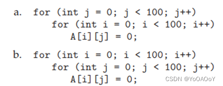

 **a.5000**

**b.50**

**7.考虑以下页面引用字符串：**

**1, 2, 3, 4, 2, 1, 5, 6, 2, 1, 2, 3, 7, 6, 3, 2, 1, 2, 3, 6.**

**假设有一帧、二帧、三帧、四帧、五帧、六帧或七帧，以下替换算法会出现多少页面错误？请记住，所有帧最初都是空的，因此您的第一个唯一页面都将花费一个错误。**

**•LRU更换**

**•FIFO更换**

**•最佳更换**

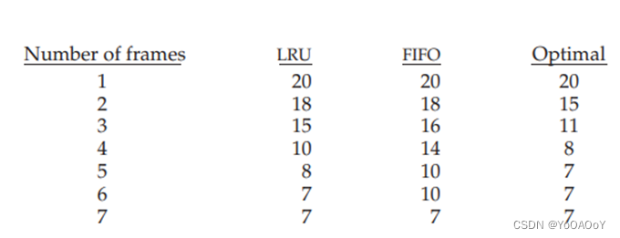

 **8.假设您想要使用需要参考位的分页算法（例如二次机会替换或工作集模型），但硬件不提供参考位。简述如何在硬件未提供参考位的情况下模拟参考位，或者解释为什么不可能这样做。如果可能，请计算成本**

可以使用硬件中支持的有效/无效位来模拟参考位。最初将位设置为无效。在第一次引用时，将生成操作系统的陷阱。操作系统将软件位设置为1，并将有效/无效位重置为有效

**9.您已经设计了一种新的页面替换算法，您认为该算法可能是最佳的。在一些测试用例中，Belady的异常会发生。新算法是最优的吗？解释你的答案。**

不。优化算法不会受到Belady异常的影响，因为根据定义，一个最佳算法将替换在最长时间内不会使用的页面。Belady的异常现象发生在页面替换算法逐出近期需要的页面时。最佳算法不会选择这样的页面。

**10.分段与分页类似，但使用大小可变的“页面”定义两种基于FIFO和LRU页面替换方案的段替换算法。请记住，由于段的大小不同，因此选择要替换的段可能不够大，无法为所需的段保留足够的连续位置。考虑无法重新定位段的系统的策略，以及可以重新定位段的系统的策略.**

a.先进先出。找到第一个足够大的段以容纳传入段。如果无法重新定位，并且没有一个段足够大，请选择内存连续的段组合，这些段“最接近列表中的第一个”，并且可以容纳新段。

如果可以重新定位，重新排列内存，使足够大的前N个段在内存中连续，以供传入段使用。在这两种情况下，将剩余空间添加到可用空间列表中。

b.LRU。选择时间最长且足够大的段，将剩余空间添加到可用空间列表中。如果没有一个段足够大，请选择在内存中连续（如果无法重新定位）且足够大的“最旧”段的组合。

如果可以重新定位，请将最旧的N段重新排列为在内存中连续，并用新段替换这些段。

**11.考虑一个按需分页的计算机系统，其中multi programming的程度目前固定为4。最近对系统进行了测量，以确定CPU和分页磁盘的利用率。结果是以下备选方案之一。对于每种情况，发生了什么？多道程序设计的程度是否可以提高CPU利用率？请求分页有帮助吗？**

**a.CPU****利用率13%；磁盘利用率97%**

**b.CPU****利用率87%；磁盘利用率为3%，**

**c.CPU****利用率为13%；磁盘利用率3%.**

a、 正在发生抖动。

b、 CPU利用率足够高，可以让事情不受影响，并提高多道程序设计的程度。

c、 提高多道程序设计的程度

**12.我们有一个使用基址和限制寄存器的机器操作系统，但我们修改了机器以提供页表。页表是否可以设置为模拟基寄存器和限制寄存器？他们怎么可能，或者为什么不能？**

如果内存分配在固定大小的段中，则可以设置页表来模拟基寄存器和限制寄存器。这样，段的基可以输入到页表中，有效/无效位用于指示该段的该部分驻留在内存中。将出现一些内部碎片问题.

**15.线程状态的简化视图是Ready、Running和blocked，在这些视图中，线程要么就绪并等待调度，要么正在处理器上运行，要么被阻塞(例如，等待I/O)。**

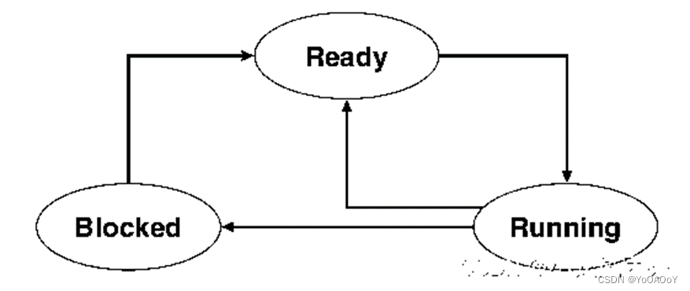

 **假设一个线程处于运行状态，回答以下问题，并解释你的答案:**

**a.****如果发生缺页错误，线程会改变状态吗?如果是，它会变成什么状态?**

**b.****如果在页表中解决了一个TLB miss，线程会改变状态吗?如果是，它会变成什么状态?**

**c.****如果在页表中解决了队列地址引用，线程会改变状态吗?如果是这样，它会变成什么状态？**

a.会，变成blocked以等待I/O的完成，再变为Ready

b.不一定，如果该页以再内存，则继续running，否则变成blocked以等待I/O的完成，再变为Ready

c.不会

**17.什么是write -on- copy特性，在什么情况下使用它是有益的?实现这个特性需要什么样的硬件支持**

a.当两个进程要访问相同的页面时，如父进程与其创建的子进程，一般的方式是直接复制该页面，而采用写时复制的方式时，在一开始两进程共享该页面，并将页面标记为写时复制，则无需在起初就复制全部页面，只有当进程向共享页面写入时，才创建该页面副本供进程写入，未被修改的页面依旧共享。

b.硬件支持：对标记为写时复制的页面进行写入保护，一旦进程对该页面发起写入，操作系统需要查看页表确认该页面是否写入保护，若是，则发起对该进程的陷阱中断，操作系统再进行对该页面的复制，让进程向页面副本写入。

**18.某台计算机为其用户提供232字节的虚拟内存空间。这台计算机有222字节的物理内存。虚拟内存通过分页实现，页面大小为4,096字节。用户进程生成虚拟地址11123456。解释系统如何建立相应的物理位置。区分软件和硬件操作。**

该虚拟地址的二进制共有32位，则其中高20位为虚拟地址在页表中的偏移量，低12位为虚拟地址在页面中的偏移量

**21.考虑下面的页面引用串 7, 2, 3, 1, 2, 5, 3, 4, 6, 7, 7, 1, 0, 5, 4, 6, 2, 3, 0 , 1 假设使用三个帧进行分页，那么对于以下替换算法，会发生多少个页面错误 LRU replacement**

**FIFO replacement**

**Optimal replacement**

LRU 18

FIFO 17

Optimal 13

**22.如图所示的页表是一个包含16位虚拟地址和物理地址以及4,096字节页的系统。当页面被引用时，引用位被设置为1。线程周期性地清除引用位的所有值。页帧的破折号表示该页不在内存中。页面替换算法是本地化的LRU，所有数字都是十进制的。**

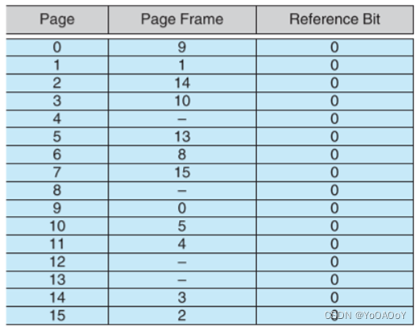

**a.将以下虚拟地址(十六进制)转换为等效的物理地址。您可以提供十六进制或十进制的答案。还要为页表中条目设置正确引用位。**

 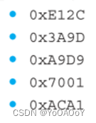

 b.**以上述地址为指导，提供一个导致页面错误的逻辑地址（十六进制）示例。**

**c.在解决页面错误时，LRU页面替换算法将从哪组页面帧中选择？**

a.• 0xE12C ->312C  
• 0x3A9D->AA9D  
• 0xA9D9->59D9  
• 0x7001->E001  
• 0xACA1->5CA1

b.0x4A9D

c.会选择替换掉最近最少使用的页面帧

**27.考虑一个请求分页系统，其时间测量利用率如下：**


**对于以下各项，请指出是否会（或可能）提高CPU利用率。解释你的答案。**

**a****、 安装更快的CPU。**

**b****、 安装一个更大的分页磁盘。**

**c****、 提高多道程序设计的程度。**

**d****、 降低多道程序设计的程度。**

**e****、 安装更多主内存。**

**f****、 安装速度更快的硬盘或具有多个硬盘的多个控制器。**

**g****、 将预分页添加到页面获取算法中。**

**h****、 增加页面大小。**

a.安装速度较快的CPU。–no

b.安装更大的分页磁盘。 --no

c.增加多道编程的度。–no

d.降低多道程序程度。–yes 减少不断调用不同分页的操作

e.增加主存。–yes，更多的也能够驻留在主存中，减少请求调页操作

f.安装较快硬盘或多控制器多硬盘。 --yes，更快的磁盘响应能够减少请求调页操作的时间

g.在取页算法中增加预处理。–yes，CPU将更快地获得更多数据，所以它将被更多地使用。只有在分页操作可以预取的情况下才会出现这种情况(即，一些访问是顺序的)。

h.增大页面大小 --不一定，因为当页面增加后，若程序是按顺序读取磁盘，那么就会减少页面调用的操作，若程序随机读取，则因为页面变大，所以和在内存驻留的页面减少，需要缺页错误也就越多。

**30.页面替换算法应该最小化页面错误的数量。我们可以通过将大量使用的页面均匀地分布在所有内存中，而不是让它们竞争少量的页面帧来实现这一最小化。我们可以将记录与每个页面帧相关联的页面数量的计数器与该页面帧相关联。然后，要替换一个页面，我们可以搜索带有最小计数器的页面帧。**

**a****、 使用此基本思想定义页面替换算法。具体解决这些问题：**

**i****、 计数器的初始值是多少？**

**ii****、何时增加计数器？**

**iii****、计数器何时减少？**

**iv.****如何选择要替换的页面？**

**b****、 对于以下具有四个页面框架的引用字符串，您的算法会出现多少页面错误？**

**1, 2, 3, 4, 5, 3, 4, 1, 6, 7, 8, 7, 8, 9, 7, 8, 9, 5, 4, 5, 4, 2.**

**c****、 对于具有四个页面框架的第b部分中的引用字符串，最佳页面替换策略的最小页面错误数是多少？**

1.   
    1.  1.  0
        2.  当一个新页面与该页帧相关联时
        3.  当该页帧其中一个关联页面不再被需要时
        4.  选择计数器最小的页帧，当计数器相同时，使用FIFO
2.  12
3.  11

**32.系统抖动的原因是什么?系统如何检测抖动?一旦检测到抖动，系统可以做什么来消除这个问题?**

抖动是由进程所需的最小页面数分配不足引起的，这会导致进程出现连续的缺页错误。

系统可以通过评估CPU利用率水平与多道编程水平的比较来检测抖动。

它可以通过降低多道程序的程度来消除。

**33.        一个进程是否可能有两个工作集，一个代表数据，另一个代表代码?解释一下。**

可能,事实上许多处理器都为此提供了两个TLB。例如，进程访问的代码可能在很长一段时间内保持相同的工作集。然而，代码访问的数据可能会改变，因此反映了数据访问工作集中的变化。

**_知识点：_**

1.  **Belady****异常：**对于有些页面置换算法，随着分配帧数量的增加，缺页错误率可能会增加。
2.  **FIFO****：**会有belady异常
3.  **最优页面置换（optimal page-replacement algorithm）：**置换最长时间不会使用的页面，对于给定数量的帧会产生最低的可能的缺页错误率；
4.  **LRU****（Least-Recent-Used algorithm）最近最少使用算法：**置换最长时间没有使用的页；
5.  **第二次机会算法（时钟算法）：**最近被使用的页将标记位修改为1，当需要页面置换时，向一个方向循环查找第一个标记位为0的页置换，同时所经过的页标记位改为0；
6.  **基于计数的页面置换**
    1.  **最不经常使用（LFU）：**置换计数最小的页面，但当一个页面在最开始获得了极大的计数，之后却不再使用，这会占用不少内存，因此可以定期将计数右移一位，进行指数衰减；
    2.  **最经常使用（MFU）：**最小计数的页面可能刚刚被引入并尚未使用；
7.  **系统抖动（thrashing）：**低优先级的进程所分配的帧数低于计算机体系结构所需的最小数量。

**解决办法：**降低多道程序程度；

**工作集模型（working-set model）**

___

# Chap10 大容量[存储结构](https://so.csdn.net/so/search?q=%E5%AD%98%E5%82%A8%E7%BB%93%E6%9E%84&spm=1001.2101.3001.7020)

**1.除了FCFS调度之外，磁盘调度在单用户环境中是否有用？解释你的答案。**

在单用户环境中，I/O队列通常为空。对于一个块或一系列连续块，请求通常来自单个进程。在这些情况下，FCFS是一种经济的磁盘调度方法。但LOOK几乎同样易于编程，并且在多个进程执行并发I/O时，会提供更好的性能，例如当Web浏览器在后台检索数据，而操作系统正在分页，而另一个应用程序在前台处于活动状态时。

**2.解释为什么SSTF调度倾向于使用中间磁道而不是最内侧和最外侧磁道。**

磁盘的中心是到所有其他磁道的平均距离最小的位置。因此，磁头倾向于远离磁盘边缘。这是另一种思考方式。缸盖的当前位置将磁道分为两组。如果磁头不在磁盘的中心，并且新请求到达，则新请求更有可能位于包含磁盘中心的组中；因此，头部更有可能朝该方向移动。

**3.为什么在磁盘调度中通常不考虑旋转延迟？您将如何修改SSTF、SCAN和C-SCAN以包括延迟优化？**

大多数磁盘不会将其旋转位置信息导出到主机。即使他们这样做了，这些信息到达调度器的时间也不精确，并且调度器消耗的时间是可变的，因此旋转位置信息将变得不正确。此外，磁盘请求通常以术语形式给出逻辑块编号，并且逻辑块和物理位置之间的映射非常复杂。

**4.为什么在多任务环境中，在系统上的磁盘和控制器之间平衡文件系统I/O很重要？**

系统只能以其最慢瓶颈的速度执行。磁盘或磁盘控制器通常是现代系统中的瓶颈，因为它们的性能无法与CPU和系统总线的性能相媲美。通过平衡磁盘和控制器之间的I/O，单个磁盘和控制器都不会被淹没，从而避免了瓶颈。

**5.从文件系统中重新读取代码页与使用交换空间存储代码页有哪些权衡？**

如果代码页存储在交换空间中，则可以更快地将其传输到主存（因为交换空间分配的性能比一般的文件系统分配更快）。如果页面是在进程调用时复制到那里的，而不仅仅是按需调出以交换空间，那么使用交换空间可能需要启动时间。

此外，如果交换空间同时用于代码页和数据页，则必须分配更多的交换空间

**6.有没有办法实现真正稳定的存储？解释你的答案。**

真正稳定的存储永远不会丢失数据。稳定存储的基本技术是维护数据的多个副本，这样，如果一个副本被销毁，另一个副本仍然可以使用。但对于任何计划，我们都可以想象一场大到足以摧毁所有副本的灾难。

**7.有时有人说，磁带是一种顺序存取介质，而磁盘是一种随机存取介质。事实上，存储设备是否适合随机访问取决于传输大小。**

**术语流传输速率表示正在进行的数据传输速率，不包括访问延迟的影响。相比之下，有效传输速率是每秒钟总字节数的比率，包括访问延迟等开销时间。**

**假设在计算机中，二级缓存的访问延迟为8纳秒，流传输速率为800兆字节/秒，主存的访问延迟为60纳秒，流传输速率为80兆字节/秒，磁盘的访问延迟为15毫秒，流传输速率为5兆字节/秒，磁带驱动器的访问延迟为60秒，流传输速率为每秒2 MB。**

-   **随机访问导致设备的有效传输速率降低，因为在访问期间没有传输数据。对于所描述的磁盘，如果平均访问之后是（1）512字节、（2）8 KB、（3）1 MB和（4）16 MB的流式传输，那么有效传输速率是多少？**
-   **设备的利用率是有效传输速率与流传输速率的比率。计算a部分中给出的四种传输大小中每种大小的磁盘驱动器利用率。**
-   **假设25%（或更高）的利用率是可以接受的。使用给定的性能数据，计算出能够提供可接受利用率的磁盘的最小传输大小。**
-   **完成以下句子：磁盘是用于大于（   ）字节传输的随机访问设备，是用于较小传输的顺序访问设备。**
-   **计算可为缓存、内存和磁带提供可接受利用率的最小传输大小。**
-   **磁带何时是随机存取设备，何时是顺序存取设备？**

a、 对于512字节，有效传输速率计算如下。

ETR=传输大小/传输时间。

如果X是传输大小，则传输时间是（（X/STR）+延迟）。

传输时间为15ms+（每秒512B/5MB）=15.0097ms。

因此，有效传输速率为512B/15.0097ms=33.12 KB/s。

8KB的ETR=.47MB/秒。

1MB的ETR=4.65MB/sec。

16MB的ETR=4.98MB/sec。

b、 512B的设备利用率=33.12 KB/s / 5MB/s=

.0064 = .8KB为64=9.4%。

对于1MB=93%。

对于16MB=99.6%。

c、 计算。25=ETR/STR，求解传输大小X。

STR=5MB，因此1.25MB/S=ETR。

1.25MB/S\*（（X/5）+。015）=X。

.25倍以上。01875=X。

X=。025MB。

d、 磁盘是用于大于K字节（其中K>磁盘块大小）传输的随机访问设备，也是用于较小传输的顺序访问设备。

e、 计算可接受的缓存利用率的最小传输大小：

STR=800MB，ETR=200，延迟=8\*10−9

200（XMB/800+8 X 10−9） =XMB。

.25XMB+1600\*10−9=XMB。

X=2.24字节。

计算内存：

STR=80MB，ETR=20，L=60\*10-9。

20（XMB/80+60\*10-9）=XMB。

.25XMB+1200\*10−9=XMB。

X=1.68字节。

计算磁带：

STR=2MB，ETR=。5，L=60。

.5（XMB/2+60）=XMB。

.25XMB+30=XMB。

X=40MB。

**8.RAID****级别1组织能否比RAID级别0组织（具有非冗余数据条带化）在读取请求方面实现更好的性能？如果是，如何？**

是的，RAID级别1组织可以实现更好的读取请求性能。执行读取操作时，RAID级别1系统可以决定应访问块的两个副本中的哪一个以满足请求。此选择可能基于磁头的当前位置，因此可以通过选择更接近目标数据的磁头来实现性能优化.

**9.除了FCFS，没有任何磁盘调度规则是真正公平的(饥饿可能发生)a.解释为什么这个断言是正确的。b.描述一种修改SCAN等算法以确保公平性的方法。c.解释为什么公平是分时系统的一个重要目标。d.给出三个或更多的例子，说明操作系统在处理I/O请求时不公平是很重要的。**

a.除了FCFS其他调度算法都是抢占式的调度算法，当不断有新的靠近磁头的调度请求出现时，远离磁头的调度请求就会饥饿。

b.设置一个定时器，所有超过固定时长的调度请求被安排到等待队列队首。c.分时系统要求计算机能够快速响应所有用户的请求，所以要避免某些用户的进程因为不公布导致长时间等待。

d.内核的IO请求优先于用户的IO请求；高优先级进程的IO请求优先于低优先级的进程IO请求；分页和交换优先于用户IO请求

**11.假设一个磁盘驱动器有5000个磁道，编号为0到4999。驱动器目前正在为2150磁道的请求提供服务，而之前的请求是1805磁道。等待请求的队列，按照FIFO的顺序是2, 069 , 1 , 212 , 2 , 296 , 2 , 800 , 544 , 1 , 618 , 356 , 1, 523 , 4, 965 , 3681 从当前头部位置开始，对于下面的每个磁盘调度算法，磁盘臂为满足所有未决请求所移动的总距离(以磁道为单位)是多少**

a. FCFS  
b. SSTF  
c. SCAN  
d. LOOK  
e. C-SCAN  
f. C-LOOK

分别是13011 、7586、7492、9205、7424、9137

___

# Chap11 文件系统

**1.某些系统在用户注销或作业终止时自动删除所有用户文件，除非用户明确要求保留这些文件。其他系统保留所有文件，除非用户明确删除它们。讨论每种方法的相对优点。**

删除用户未专门保存的所有文件的优点是，通过不保存不需要的或不必要的文件，可以最大限度地减少每个用户所需的文件空间。除非特别删除，否则保存所有文件对用户来说更安全，因为不可能因为忘记保存而意外丢失文件。

**2.为什么有些系统会跟踪文件的类型，而其他系统则将其留给用户，而其他系统则不实现多种文件类型？哪个系统“更好”.**

一些系统允许基于文件类型的不同文件操作（例如，ascii文件可以作为流读取，而数据库文件可以通过块索引读取）。其他系统将对文件数据的这种解释留给进程处理，在访问数据时不提供任何帮助。“更好”的方法取决于系统上进程的需要以及用户对操作系统的要求。如果系统主要运行数据库应用程序，那么操作系统实现数据库类型文件并提供操作可能会更有效，而不是让每个程序实现相同的东西（可能以不同的方式）。对于通用系统，最好只实现基本的文件类型，以保持操作系统的大小较小，并允许系统上的进程具有最大的自由度。

**3.类似地，一些系统支持文件数据的多种类型的结构，而另一些系统只支持字节流。每种方法的优缺点是什么？**

系统支持不同文件结构的一个优点是，支持来自系统；不需要个别应用程序提供支持。此外，如果系统提供对不同文件结构的支持，那么它可能比应用程序更有效地实现支持。

让系统支持定义的文件类型的缺点是它会增加系统的大小。此外，可能需要不同文件类型（系统提供的文件类型除外）的应用程序可能无法在此类系统上运行。

另一种策略是，操作系统不定义对文件结构的支持，而是将所有文件视为一系列字节。这是UNIX系统采用的方法。这种方法的优点是简化了操作系统对文件系统的支持，因为系统不再需要为不同的文件类型提供结构。此外，它允许应用程序定义文件结构，从而缓解系统可能无法提供特定应用程序所需的文件定义的情况。

**4.您能用一个可以使用任意长名称的单级目录结构来模拟多级目录结构吗？如果您的答案是肯定的，请解释如何做到这一点，并将此方案与多级目录方案进行对比。如果您的答案是否定的，请解释是什么阻碍了模拟的成功。如果文件名限制为7个字符，您的答案会有什么变化？**

如果可以使用任意长的名称，则可以模拟多级目录结构。例如，可以使用字符“.”来完成此操作指示子目录的结尾。例如，吉姆这个名字。Java语言F1指定F1是子目录java中的文件，而子目录java又位于根目录jim中。

如果文件名限制为7个字符，则无法使用上述方案，因此，通常情况下，答案是否定的。在这种情况下，下一个最佳方法是使用特定文件作为符号表（目录），将任意长的名称（如jim.java.F1）映射为较短的任意名称（如XX00743），然后用于实际的文件访问。

**5.解释open（）和close（）操作的目的。**

•open（）操作通知系统命名文件即将激活。

•close（）操作通知系统，发出close操作的用户不再使用指定文件。

**6.在某些系统中，授权用户可以读取和写入子目录，就像普通文件一样。**

-   **描述可能出现的保护问题。**
-   **建议解决这些保护问题的方案。**

a、 目录条目中保存的一条信息是文件位置。如果用户可以修改此位置，则可以访问其他文件，从而破坏访问保护方案。

b、 不允许用户直接写入子目录。相反，提供系统操作来实现这一点。

**7.考虑一个支持5000个用户的系统。假设您希望允许这些用户中的4990人能够访问一个文件。**

**a****、 您将如何在UNIX中指定此保护方案？**

**b****、 您能否建议另一种保护方案，该方案可以比UNIX提供的方案更有效地用于此目的？**

a、 实现这一点有两种方法：

i、 创建一个包含所有4990个用户名称的访问控制列表。

ii、将这4990个用户放在一个组中，并相应地设置组访问权限。由于用户组受系统限制，因此无法始终实施此方案。

b、 对文件的通用访问适用于所有用户，除非其名称以不同的访问权限出现在访问控制列表中。使用此方案，您只需将其余十个用户的名称放入访问控制列表中，但不允许访问权限。

**8.研究人员建议，与其让访问列表与每个文件关联（指定哪些用户可以访问该文件以及如何访问），不如让用户控制列表与每个用户关联（指定用户可以访问哪些文件以及如何访问）。讨论这两种方案的相对优点。**

•文件控制列表。由于访问控制信息集中在一个地方，因此更容易更改访问控制信息，这需要更少的空间。

•用户控制列表。这在打开文件时需要较少的开销

**10.打开文件表用于维护关于当前打开文件的信息。操作系统应该为每个用户维护一个单独的表，还是只维护一个包含当前所有用户访问的文件的引用的表?如果同一个文件被两个不同的程序或用户访问，那么open-file表中应该有单独的条目吗?解释一下。**

只维护一个包含所有用户访问文件的表。当首次访问某文件时，将其添加在打开文件表中，后面的进程在访问该文件时通过表中条目指定文件。同样只有在所有进程都不在使用改文件时才将其从系统文件表中删除。另一方面，如果两个进程正在访问该文件，则需要维护单独的状态，以跟踪两个进程正在访问文件的哪些部分的当前位置。这需要操作系统为两个进程维护单独的条目。

**11.提供强制锁而不是由用户自行决定使用的建议锁的优点和缺点是什么?**

操作系统强制阻止其他进程访问已加锁的文件，能够最大限度的保证互斥，而在许多情况下，不需要如此严格的方法保证互斥，降低了系统的并行性。可以通过其他程序结构来保证互斥，比如内存锁。而且强制锁将限制访问文件的灵活性，还可能导致死锁，并可能增加与访问文件相关的开销。

**12.提供典型的应用程序的例子，根据以下方法访问文件:**

**•顺序访问**

**•随机访问**

顺序访问：编辑器和编译器；

随机访问：大型数据库计算

**15.给出一个应用程序的例子，该应用程序可以受益于操作系统对索引文件的随机访问。**

维护条目数据库的应用程序可以从这种支持中受益。例如，如果一个程序正在维护一个学生数据库，那么对数据库的访问就不能用任何预先确定的访问模式来建模。对记录的访问是随机的，如果操作系统提供某种形式的基于树的索引，那么定位记录将更加有效。

**17.有些系统通过维护一个文件的单一副本来提供文件共享。其他系统维护多个副本，每个共享文件的用户都有一个副本。讨论每种方法的相对优点。**

对于单个副本，对一个文件的多个并发更新可能会导致用户获取不正确的信息，并使文件处于不正确的状态。如果有多个副本，就会产生存储浪费，而且多个副本之间可能不一致。

___

# Chap12 文件系统的实现

**2 如果一个系统允许在多个位置同时挂载一个文件系统，会发生什么问题?**

导致相同的文件会有不同的文件路径，会导致一致性问题

**3 为什么文件分配的位图必须保存在大容量存储中，而不是在主存中?**

当位图存储在主存中，如系统崩溃，则位图会丢失，而存储在大容量存储设备上时，位图不会丢失

**4 考虑一个支持连续、链接和索引分配策略的系统。在决定哪种策略最适合特定文件时，应该使用什么标准?**

当文件较小且常被顺序访问时，可采用连续分配策略，当文件较大且常被连续访问时，可采用索引分配的策略，当文件较大且常被随机访问时可采用索引分配策略

**6 缓存如何帮助提高性能?既然缓存如此有用，为什么系统不使用更多或更大的缓存呢?**

缓存可以进行高速数据交换，由局部性原理实现将经常使用的数据读取到缓存中，提高将数据从低速存储设备传输到高速计算设备的效率，然而缓存的成本十分昂贵。

**7 为什么操作系统动态分配内部表对用户有利?操作系统这样做的惩罚是什么?**

动态分配内部表使得用户不会使用超过内部表的大小，提高了灵活性。然而动态改变内部表会增加内核结构的复杂性，使操作系统变得更复杂，增大开销。

**9 考虑一个文件系统，它使用修改后的连续分配模式，并支持区段。文件是区段的集合，每个区段对应于一组连续的块。在这样的系统中一个关键问题是区段大小的可变性程度。以下方案的优缺点是什么:**

**a.所有区段的大小是相同的，大小是预先确定的。**

**b.区段可以是任意大小的，并且是动态分配的。**

**c.区段可以有几个固定的大小，这些大小是预先确定的。**

对于区段大小相同的方案，则其为简化后的连续分配，使用较小的空闲空间列表，结构简单，灵活性低。对于区段大小自由的方案，可根据文件大小调整区段大小，同时存在外部碎片的可能，需要更复杂的结构来实现动态的区段，但是可以提高分配的灵活性，复杂度较大。对于最后一种，不同大小的区段需要不同的空闲空间列表，复杂度和灵活性介于ab之间。

**10 对比为顺序和随机文件访问分配磁盘块(连续、链接和索引)的三种技术的性能。**

连续分配对于两种访问方式都只需访问一次即可获得磁盘块；链接分配可以在内存中保留下一块的地址，实现顺序访问，而在随机访问时，若要访问第i块，则需访问i次磁盘访问性能较差。而在索引分配时，若索引块在内存中，则可直接访问，若由多级索引结构，则在访问文件末尾的块时，需要读取所有的索引块，其性能取决于索引的结构。

**12 考虑这样一个系统，空闲空间保存在空闲空间列表中。**

a.假设指向空闲列表的指针丢失。系统能否重建空闲空间列表?解释你的答案。

b.考虑一个类似于UNIX使用索引分配的文件系统。在/a/b/c读取一个小的本地文件的内容可能需要多少磁盘I/O操作?假设当前没有磁盘块被缓存。

c.提出一个方案，确保指针不会因为内存故障而丢失。

a要重建空闲空间列表，需要遍历目录结构，确定磁盘空间中未被文件或目录使用的空间，将其链接在空闲空间列表中。b c

为了重建空闲列表，需要执行“垃圾收集”。这将需要搜索整个目录结构，以确定哪些页面已经分配给了作业。那些剩余未分配的页可以作为空闲空间列表重新链接。

**14 讨论在计算机崩溃的情况下，对文件系统的性能优化如何导致难以维护系统的一致性。**

当采用延迟更新来优化系统性能，如果系统在没有提交延迟更新的情况下崩溃，那么文件系统的一致性就会被破坏。

___

# Chap13 I/O系统

**1.** **说明将功能放置在设备控制器而不是内核中的三个优点。陈述三个缺点。**

       优点：

1.  bug不太可能导致系统崩溃；
2.  通过使用专用硬件和硬编码算法可以提高性能；
3.  通过将算法移出内核可以简化内核

缺点：

1.  bug更难修复
2.  改进算法也需要硬件更新
3.  嵌入式算法可能郁APP对设备的使用冲突，影响性能

**3.为什么系统可以使用中断驱动的I/O来管理单个串行端口，并使用轮询I/O来管理前端处理器，如终端集中器？**

当I/O频繁且短暂是轮询比中断驱动更有效。大量的I/O使用轮询可以减少资源的浪费

**5.DMA如何提高系统并发性？它如何使硬件设计复杂化？**

DMA系统通过系统和内存总线传输数据时，允许CPU执行任务，从而提高系统并发性。硬件设计很复杂，因为DMA控制器必须集成到系统中，并且系统必须允许DMA控制器成为总线主机。为了允许CPU和DMA控制器共享内存总线的使用，可能还需要进行周期窃取

**8.当来自不同设备的多个中断几乎同时出现时，可以使用优先级方案来确定中断的服务顺序。讨论在为不同中断分配优先级时需要考虑的问题。**

1.  设备引发的中断比用户产生的陷阱有更高的优先权，因此，设备中断可以用于处理器系统调用的代码；
2.  控制设备的中断可以被赋予更高的优先级
3.  有时间限制的设备，优先级更高
4.  没有数据缓冲的设备优先级更高

**9.支持内存映射I/O到设备控制寄存器的优点和缺点是什么？**

优点：

不需要指令集中的特殊指令，因此不需要执行保护规则；

缺点：

内存转换单元需确保郁设备控制寄存器相关的内存地址不被用户程序访问

**11.在大多数多道程序系统中，用户程序通过虚拟地址访问内存，而操作系统使用原始物理地址访问内存。这种设计对用户程序启动I/O操作以及操作系统执行I/O操作有何影响？**

用户程序通常指定一个缓冲区，用于向设备传输或从设备读取数据。这个缓冲区存在于用户空间，有一个虚拟地址指定。内核需要发出I/O操作，并在I/O之前或之后在用户缓冲区和它自己的内核缓冲区之间复制数据。为了访问用户缓冲区，内核需要将用户提供的虚拟地址转换为相应的物理地址。

**12.与中断服务相关的各种性能开销是什么？**

上下文切换开销

程序重启开销