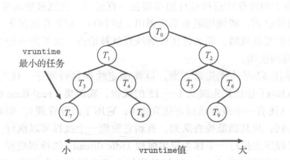
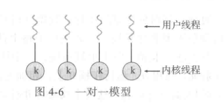
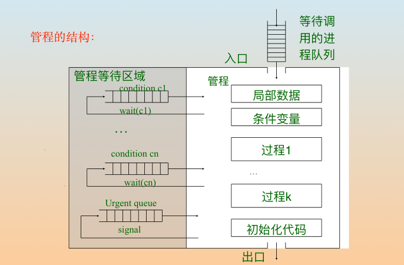
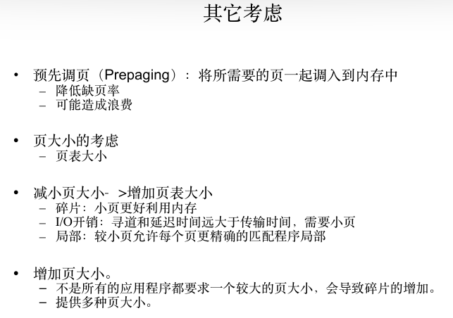
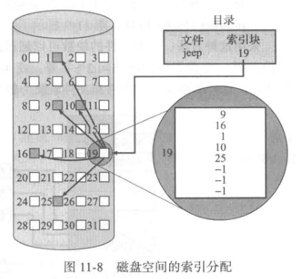
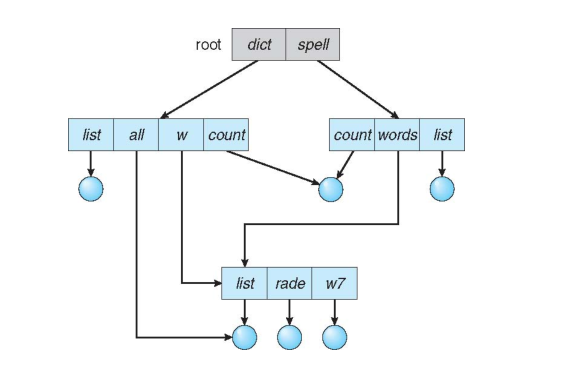
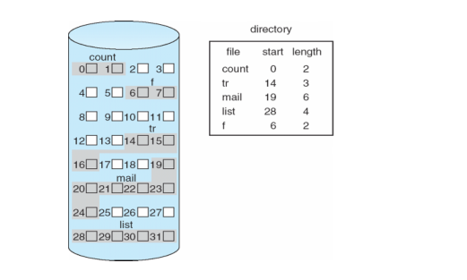
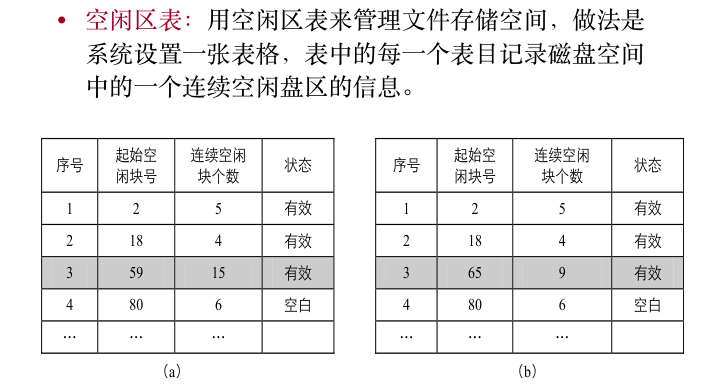
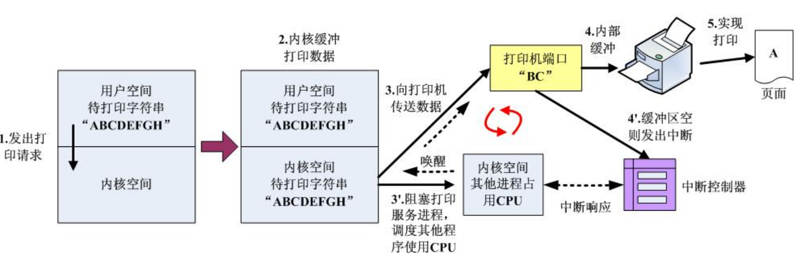

2023春-OSH-xk

*By Asteria*

[TOC]


# 考点（xk）

ppt2 操作系统特点优缺点

操作系统架构

不同架构的分析 分层 简单架构

调度 进程切换

os如何运行和管理一个任务（进程）

中断切换

必考 *同步互斥

- 临界区处理
- 归类 三类
- 实现方式——socket 管程 信号量
- 伪代码

必考 *死锁

- 必要条件
- 预防
- 避免
- 银行家算法

*内存管理

- 内存变换
- 分页、分段、段页
- 虚存
- 内存一致性不考
- 局部性
- 存储空间分配——首次适应……
- 分析 ：连续存储空间管理不可克服的缺陷——>优化思路
- 三个问题
- 分页式存储
- 算地址变换：逻辑->物理
- 请求分页：算访存时间
- 帧分配、页替换算法
- LRU LRU近似 数据结构 时钟算法……
- 增强型二次进位算法不考

ssd

- 写放大 延长寿命
- 磨损平均化

硬盘

- 寻道延迟、旋转延迟、数据传播
- RAID

文件系统


I/O设备


重点 *询问/…/DMA/通道


# 操作系统

## 导论

### 计算机处理器体系结构

#### 单处理器系统

只有一个通用CPU，有其他专用处理器，执行专用指令集，而不执行用户进程。

专用处理器由操作系统管理/不与操作系统通信自主完成任务。

#### 多处理器系统


## 进程管理

### 进程

#### 进程概念

进程：执行的程序

- 进程是系统中资源分配和运行调度的单位

- 进程 ≠ 程序：程序是被动实体，进程是活动实体，是动态过程，每个进程有自己的生命期

  

#### 进程状态

- 新的

- 运行：一个进程只能跑在一个核上（减少复杂性），且一次只有一个进程可以在一个处理器上运行

- 等待：等待发生某个事件（I/O完成、收到信号……）

- 就绪

- 终止

  

#### 进程控制块PCB/任务控制块

用于表示进程


> **Linux的进程表示**
>
> 采用C语言结构task_struct表示，位于内核源代码目录内的头文件<linux/sched.h>。

#### 进程的特征

- 并发性：对应程序轮流占用cpu资源
- 进程之间相互制约

#### Linux进程表示

结构体 task_struct，位于C头文件<linux/sched.h>


Linux内核中采用task_struct双向链表表示所有进程


修改当前运行进程

`current->state = new_state;`

### 进程调度：cpu管理

#### 调度队列

> eg. 中断
>
> 用户进程A --> 系统调用（进入内核态），用户进程被挂起 --> 发出硬盘数据读取请求（调用设备驱动程序）| 中断 --> cpu使用权交还用户-->A is blocked，进入用户态进程B-->…-->disk:done!发出中断信号，B is stopped-->数据给进程A-->A is ready；B is blocked；B is ready --> 进入进程调度


#### CPU-I/O执行周期

进程执行周期包括cpu执行区间和I/O等待，进程在这两个状态之间不断交替。

#### 调度程序

- module，用来将cpu控制交给交给短周期调度程序选择的进程
- 功能：
  - 切换上下文
  - 切换到用户模式
  - 跳转到用户程序的合适位置，以便重新启动程序
- 应尽可能快

#### cpu调度主要任务

1. 按什么原则分配cpu——进程调度算法
2. 何时分配cpu——进程调度时机
3. 如何分配cpu——进程切换（eg. 中断）

#### 两种占用cpu方式

- 可剥夺式/抢占式（preemptive）：优先级更高进程就绪时，系统可以剥夺正在运行的进程
- 不可剥夺式/非抢占式（nonpreemptive）/协作的（cooperative）：除非当前进程因自身原因无法运行，否则运行完自己的时间片

#### 进程调度出现的情况

- 运行态->等待态（等待系统调用完成、等待信息……）【非抢占式】

- 运行态->就绪态（时间片用完）

- 等待态->就绪态（中断，系统调用完成、文件就绪……）

- 终止【非抢占式】

#### 进程调度算法原则

1. 公平性

2. CPU使用率：使CPU尽可能忙碌，一般40%（轻负荷系统）~60%（重负荷系统）

3. 吞吐量：**批处理系统**，单位时间内进程完成数量

4. 周转时间：进程提交到进程完成的时间——等待进入内存+在就绪队列中等待+在CPU中执行+I/O执行

   *通常受输出设备传输速度的限制*

5. 等待时间：在就绪队列中等待时间之和

6. 响应时间：**交互系统**，从提交请求到产生第一响应的时间。

   **最大化2、3，最小化4、5、6**

#### 经典进程调度算法

##### 先进先出调度 FCFS

- FIFO队列
- 非抢占式，不适合分时系统（每个用户需要定时得到一定的CPU时间）
- O(1)
- y：简单
- n：未考虑进程优先级；一个CPU密集型进程和多个I/O密集型进程运行时，出现护航效果，等待大进程释放CPU

##### 短作业优先调度 Shortest-Job-First

- 需排序
- 更恰当表示：最短下次CPU执行算法

  下次CPU执行通常预测为以前CPU执行的测量长度的指数平均；不适用于短期CPU调度（无法知道下次CPU执行的长度）
- 新来的任务比当前任务更短时——
  - 抢占式——执行新的
  - 非抢占式——执行当前的
- 变形（描述更精确）：**最短剩余时间优先 SRTF**（抢占式/非抢占式）（至少和SJF一样好）
- y：平均等待时间最优；
- n：难以确定下⼀个CPU区间的⻓度；长作业饥饿现象，未必满足公平性
- 所有任务等长时=FIFO；不等长时SRTF和RR都能保证短时间作业不被长时间作业困住

##### 优先级调度 Priority-F

- O(1)
- SJF是其一个特例
- 静态优先数：进程运行中优先级不变
  - 饥饿问题：高优先级不断插队导致低优先级进程迟迟无法被执行👇
- 动态优先数：进程创建时给出一个优先级，生命周期内优先级可变（给等待时间长的进程提高优先级，执行完一次后再降低）
- 抢占式/非抢占式
- 优先级影响因素
  - 内部因素
    - 时限
    - 内存
    - 打开文件数量
    - 平均I/O时间区间与平均cpu时间区间之比
  - 外部因素
    - 进程重要性（用户定义）
    - cost
    - ……

##### 时间片轮转调度 Round-Robin

- 满足公平性，抢占式

- 为分时系统设计

- 时间片：10-100ms

  - 10ms：考虑切换的成本
  - 100ms：人眨眼时间

- 切换机制：循环FIFO队列，新进程放在就绪队列末尾；分配时间片为执行完的进程被中断，放在就绪队列末尾

- eg. 就绪队列中有n个进程，时间片长度为q，则每个进程得到1/n cpu时间，每次分配时间≤q；每个进程必须等待的cpu时间不超过（n-1)*q

- 划分方式：固定时间片/可变时间片

- 时间片影响因素：系统响应时间、就绪进程个数、cpu能力

- 平均等待时间通常较长

- 性能很大程度取决于时间片大小

  - 很大——>FCFS

  - 过小——>切换成本大

    > 时间片100ms，切换开销1ms——1%，10个进程并发/s
    >
    > 时间片10ms，切换开销1ms——10%
    >
    > 时间片2ms，切换开销20us，500个进程并发/s
    >
    > ==切换开销越小，能支持的并发性能越大==
  
- 时间片大小影响周转时间：若大多数进程可在一个时间片内完成，周转时间得到改善

##### 多级队列反馈调度

- 划分队列，每个队列一种算法——常用时间片调度、先进先出调度；队列间固定优先级调度

- 允许进程在队列间切换

- 根据不同cpu执行的特点来区分进程：将I/O密集型和交互进程放在优先级更高的队列中，CPU占用时间过多的进程移到优先级低的队列

- 例子：从上到下依次记为Q0、Q1、Q2

  > 
  >
  > 1. 依次执行Q0（RR）、Q1（RR）、Q2（FCFS）中所有进程；到达Q0进程会抢占Q1、Q2进程，到达Q1进程会抢占Q2进程
  > 2. 新就绪进程添加到Q0
  > 3. 若Q0中进程未能在一个时间片（8ms）内完成，则**剩余部分**被移到Q1末尾；Q1中任务同理。最终长进程自动沉入Q2（降级过程）
  > 4. 升级过程：eg. UNIX中：等待时间长的升级直到被执行。

- 参数

  

#### 例——作业调度

1. 短作业优先平均等待时间最短
2. 对于可以完成的任务，**截止日期优先（EDF）**一定可以完成
3. 问题：实际操作系统中，很多时候不知道任务长度和截止时间

### 算法评估

1. 考虑因素与权重
   - CPU利用率、响应时间、吞吐量……
   - 加权平均
2. 确定性建模：系统负荷确定，考虑确定场景下的性能
3. 排队模型（近似模拟）：系统负荷时刻变化，CPU和I/O区间的分布可以确定，根据到达率和服务率计算使用率、平均队列长度、平均等待时间等
4. 模拟：根据概率分布⽣成进程、CPU区间时间、到达时间、离开时间等
5. 实现

#### 作业周转时间

$$
作业周转时间=作业到来到完成的时间=在外存后备队列等待调度+就绪队列上等待调度+CPU执行+等待I/O\\
平均作业周转时间=\frac{1}n\sum T_i\\
平均带权作业周转时间=\frac{1}{n} \sum_{i=1}^n \frac{周转时间}{服务时间}
$$

#### 如何判断策略是否可行

- 可调度性

  EDF通常可以给出可调度作业的可行调度。

- 可调度性测试
  $$
  U=\sum_{i=1}^{n} \frac{T_{\operatorname{cost}}(i)}{T_{\text {remains }}(i)}
  $$
  ​	U≤1 => 作业集可调度，反之未必

### Process

- 执行步骤

  

  - 写操作一般不写回内存或硬盘（太慢），而是放在cache中/寄存器中，但交替进行的多个进程可以同时访问cache，有可能出现泄露。即中间结果可能出现泄露。

    x86一二级缓存一般是私有的，三级缓存公有

- Simple multiprogramming
  - All virtual CPUs share same non-CPU resources
    - I/O设备
    - 存储器
  - Consequence of sharing
    - Each thread can access the data of every other thread (good for sharing, bad for protection)
    - Threads can share instructions (good for sharing, bad for protection)

- OS在运行过程中对资源的管理

  一个cpu多个进程

  - 时分复用：把时间分成时间片发给进程，给用户造成**并行**的错觉，实际是**并发**
  - 不是**时间片轮转**，时间片轮转划分好时间片，而时分复用的时间片切换时机可能由各种方式确定——时间/中断/……
  - 进程的切换需要时间开销，保存上一个进程的状态
  - 一个进程只能跑在一个核上

- 程序地址空间

  

  地址转换与映射

  逻辑地址空间和物理地址空间

  逻辑上地址联系，物理上可能是分散的

  为了更高效的利用物理地址空间

  

#### CPU进程切换/上下文切换

- Process Control Block：

  - CPU资源管理和非CPU资源管理的主要途径
  - 主要作用：对非CPU资源的防控
  - 只是控制，不存储

  

- PCB保存和载入

  上下文切换的时间是纯粹的开销，系统没有做任何有用的工作。


#### 调度程序

进程在整个生命周期中，会在各种调度队列之间迁移。

- 缓冲池

  批处理系统提交的进程多于可以立即执行的，这些进程被保存到磁盘的缓冲池。

- I/O密集型进程：I/O执行时间 >> 计算时间

- CPU密集型进程：反之

- 长期调度程序/作业调度程序

  - 从缓冲池中选择进程，加到内存以便执行。

  - 控制多道程序程度（内存中的进程数量），创建进程平均速度=进程离开系统的平均速度时多道程序程度稳定-->只有在进程离开时才需长期程序调度--->执行频率较低-->可以负担更多的选择时间

  - I/O密集型和CPU密集型合理组合

    全I/O：就绪序列空，短期调度程序没什么可做的

    全CPU：I/O等待序列空，设备利用率低

- 短期调度程序/CPU调度程序

  - 从准备执行的进程中选择进程并分配CPU。
  - 每100ms至少执行一次-->调度必须快速

- 区别：执行频率

- 中期调度程序（有的系统）：可将进程从内存/CPU竞争中移出，降低多道程序程度。（换出）

  

### 中断

- 中断现行程序，引出处理发生事件的程序执行

- 提高系统适应不确定性的能力、实时处理能力

- 分类

  - 强迫中断：事故或外部请求引起——机器故障中断事件；程序性中断事件；外部中断事件；输⼊输出中断事件。
  - 自愿中断：源于正在运⾏的程序对操作系统的需求。

    ------

  - 硬中断：中断和异常要通过硬件设施产生中断请求，可看作硬中断。

  - 软中断：不必由硬件发出信号，实际为用软件方式模拟硬件中断，实现宏观上的异步执行效果。

    软中断是由内核或进程对某个进程发出的中断信号，可看作内核与进程或进程与进程之间模拟硬中断的⼀种信号通信⽅式。

  -----

  - （外）中断：来⾃处理器和主存之外的中断。

    包括：电源故障中断、时钟中断、控制台中断、它机中断和I/O中断等。

    处理优先级较高的中断时，往往屏蔽部分或全部低级中断。

  - 内中断/异常：来⾃处理器和主存内部的中断。

    包括：通路校验错、主存奇偶错、⾮法操作码、地址越界、⻚⾯失效、调试指令、访管中断、算术操作溢出等各种程序性中断。

  ==中断可以被屏蔽（可控的），异常不可屏蔽，一旦出现必须响应（不可控因素）==

- 中断与异常

  - 中断
    - 由与现⾏指令⽆关的中断信号触发(异步)
    - 中断处理程序提供的服务不是为当前进程所需的，如时钟中断、硬盘读写服务请求中断；
    - 中断的发⽣与CPU处在⽤户模式或内核模式⽆关
    - 两条机器指令之间才可以响应中断
  - 异常
    - 由处理器正在执⾏现⾏指令⽽引起
    - 异常处理程序提供的服务是为当前进程所⽤的
    - ⼀条指令执⾏期间允许响应异常
    - 包括trap、fault等

- 中断处理——PCB

  - 机器故障中断事件的处理：

    保护现场，防⽌故障蔓延，报告给操作员并提供故障信息以便维修和校正，对程序中所造成的破坏进⾏估价和恢复

  - 程序性中断事件的处理：

    采⽤中断续元处理来进⾏程序性中断事件的处理

  - 外部中断事件的处理：

    时钟是操作系统进⾏调度⼯作的重要⼯具，例如让分时进程作时间⽚轮转、让实时进程

  - 控制台中断事件的处理：

    操作员可以利⽤控制台开关请求操作系统⼯作，当使⽤控制台开关后，就产⽣⼀个控制台中断事件通知操作系统。操作系统处理这种中断就如同接受⼀条操作命令⼀样，转向处理操作命令的程序执⾏

  - I/O中断的处理

- 进一步优化——中断优先级

  - 高优先级的中断优先被响应，低优先级的被屏蔽

  - 中断的屏蔽

    主机可允许或禁⽌某类中断的响应，如允许或禁⽌所有的I/O中断、外部中断、及某些程序性中断。

    有些中断是不能被禁⽌的，如计算机中的⾃愿性访管中断。

  - 多重中断/中断嵌套
  
    - 有限制
    - 可能导致os不稳定
    - 每次嵌套要消耗资源，无限嵌套会导致中断处理单元资源耗尽，系统不响应
  

### 实时操作系统

  - 软实时系统（soft real-time system）

    只保证关键实时进程优先于非关键进程，但不保证会调度关键实时进程

  - 硬实时系统（hard real-time system）

    每个人任务在ddl之前完成（EDF一定可以满足）

#### 最小化延迟

事件延迟：事件发生到得到服务经过的时间


##### 中断延迟


ISR：中断服务程序

- 影响因素
  - 更新内核数据结构时中断可能被禁用的时间量

##### 调度延迟

- 停止上一个进程到启动新进程的时间

  

  冲突：抢占在内核中运行的任何进程+释放高优先级进程所需、低优先级占有的资源

- 有效缩短技术：提供抢占式内核

#### 优先权调度

为实时进程分配最高优先级

> win 16-31优先级专门用于实时进程

#### 硬实时操作系统调度

**抢占式+优先级调度仅能满足软实时**

硬实时系统需附加的调度特征

- 进程周期性

  固定处理时间t、截止期限d、周期p、速率1/p

  

- 准入控制技术

  进程应向调度器公布截至日期要求

  调度程序：

  - 承认进程并保证进程完成
  - 不能保证按时完成，拒绝请求

##### 单调速率调度

- 抢占式、静态优先级调度周期性任务
- 优先级与周期成反比——越频繁优先级越高
- 内含假定：周期性进程每次执行需要时间相同

- 单调速率算法可以认为最优的，不能由它调度的也不能由其他**分配静态优先级的算法**调度

- 限制：CPU利用率有限，未必最大化利用CPU资源

  > 调度N个进程的最坏CPU利用率
  > $$
  > N(2^{\frac{1}{N}}-1)
  > $$


##### 最早截止期限优先调度（EDF）

- 根据ddl**动态**分配优先级

- 不要求进程是周期性的，也不要求进程的CPU执行长度固定
- 进程变成可运行时公布ddl
- 理论上最佳

##### 比例分享调度

- 按比例分配时间
- 采用准入控制策略：只有客户请求股数小于可用股数时，才允许客户进入

##### POSIX实时调度

- SCHED_FIDO
  - 同等优先级的线程间没有分时，得到CPU则一直占有直到被终止或阻塞
- SCHED_RR
  - 同等优先级线程之间分时

### Linux调度

基于调度类，每个类有特定优先级，内核针对不同调度类采用不同调度算法。

Linux标准内核实现两个调度类

1. 默认调度类——CFS调度算法
2. 实时调度类

#### Completely Fair Schedule  (CFS)

- 希望O(1)时间调度算法（==选择某个任务执行那一步要求O(1)==）

- RR-时间片均分-->优化：考虑将同一任务的多个分散的时间片聚合起来，减小上下文切换的开销

- 基本思路：规定最小时间片尺度（minimum granularity），加权分配时间片（一种权重定义为：$ \frac{某个进程所需时间}{总允许时间}$（按虚拟CPU时间 virtual runtime），时间片为最细尺度整数倍

- 实现任务消耗时间上的公平共享

  ------

- 按友好值分配CPU时间比例

- 友好值（-20~+19）：友好值小的优先级高，分配CPU时间比例高（默认为0）

- 友好值增加，优先级降低

- 目标延迟：每个可运行任务应当运行一次的时间间隔

- 衰减因子：优先级低衰减率高

- 虚拟运行时间（virtual run time）：每个任务的vruntime变量维护，记录每任务运行多久（*线程在处理器上花费的时间*）；与衰减因子有关-->==优先级低vruntime高==

- 友好值为0的任务，虚拟运行时间=实际物理运行时间

- 选择vruntime最小的作为下个任务

- 高优先级可抢占低优先级

  ------

- 下个任务选择：以vruntime值构造红黑树（平衡二叉树）

  

  - 插入新结点需重新平衡->O(log N)*——在就绪队列之间进行，不影响当前选择下一个任务所需时间*

  - 最左侧的结点值最小，希望平均等待时间最小->每次从最左侧选下一个任务，将该节点删去，重新置平衡
  - 红黑树搜索时间 O(log N)
  - 查找最左侧结点O(log N)，高效起见，Linux调度程序将该值缓存在rb_leftmost
  
- I/O密集型的vruntime小于CPU密集型-->I/O密集型优先级高-->I/O准备好时，I/O密集型进程抢占CPU密集型任务。

#### 实时性调度

采用POSIX标准

- 采用SCHED_FIFO和SCHED_RR调度的任何任务比非实时任务优先级高
- 实时任务与普通任务优先级分开
  - 实时任务静态优先级0-99
  - 正常任务100-139，依据友好值

### 不同需求下调度算法的选择

## 线程

### 线程概念

- CPU使用的一个基本单元
- 包括：线程ID，程序计数器，寄存器组，堆栈
- 与同一进程的其他线程共享代码段、数据段和其他操作系统资源-->*同步、互斥问题*
- 支持线程的系统中，PCB被扩展到包括每个线程的信息
- 调度：进程对其线程调度，每个时间片可以抽象为“微CPU”

### 线程与进程

- 进程：==资源拥有者、调度单位==**资源分配的基本单位**

- 线程也被称为“轻量级进程”，生命期同进程，**CPU使用的基本单位**

- 

  单线程：与进程1v1

  多线程：并发性

  - 优点：**响应性高**（交互式程序部分线阻塞时仍可继续进行）、**资源共享**（并行性和资源利用效率提高）、**经济**（os为进程分配好了资源，创建线程时直接用就好，不用重新分配；用户态线程由用户态进程自己调度和分配资源，os不干预-->线程创建和切换比进程快、代价低）、**可伸缩性**（线程可以在多处理器核上并行，单线程进程只能运行在一个CPU上）

    

  - 将一个任务分成多个进程多核并行存在的问题：不同核的1、2级cache独立，多进程之间相互配合完成任务需要数据拷贝->时间成本

- 每个进程被创建时，至少需要同时为其创建一个线程，线程可以

- 对CPU做线程操作，对其他资源可不可以、有没有必要做这种操作？

  *资源利用效率和当前os什么资源最浪费角度思考*

  1. 必要性-->思考CPU为什么需要线程？

     **CPU存在浪费**，CPU主频太高，其他器件远远跟不上CPU主频（进程ms级别，CPU ns级别）需要更细的抽象；线程更多的是CPU相关资源的分配（寄存器、PC、栈等），而不涉及存储空间分配

- 线程属性

  - 轻型进程
  - 独立调度和分配的基本单位
  - 并发
  - 共享基本资源

- 线程vs进程

  ​	1. 调度：线程

  ​	2. 并发性：线程优于进程

  ​	3. 拥有资源：进程

  ​	4. 系统开销：线程<进程

### 用户态线程和内核态线程

| 用户态线程 ULT                                               | 内核态线程 KLT(淡化进程概念)                                 |
| ------------------------------------------------------------ | ------------------------------------------------------------ |
| 应用程序（进程）完成管理                                     | 所有线程管理由内核完成                                       |
|                                                              | 没有线程库但对线程工具提供API                                |
| 内核不需知道，线程切换不需经过内核->调度算法用户选择         | 内核维护进程和线程切换->线程创建、切换速度下降；操作系统以线程为单位调度 |
| 与内核交互：（1内核-1用户进程-多用户线程）当线程调用系统调用时（大多数系统调用是阻塞式的），整个进程被阻塞->该进程下所有线程被阻塞 | 阻塞在线程级别完成（线程之间阻塞相对独立）                   |
| 体系结构不允许同一进程的多个线程跑在多核上                   | 内核态线程可以跑在多核上，更好支持多CPU体系架构-->多处理器下，内核可以同时调用同一进程的多个线程 |

### 多线程模型——用户线程和内核线程之间

#### 多对一模型

一个线程执行阻塞系统调用，所有线程被阻塞。

无法并发。


#### 一对一模型

比多对一更好的并发性能。

允许多线程并行在多处理器系统上。

阻塞在线程级别发生。

但创建内核线程开销大。

资源利用效率低。

特定场景：用户线程不多且需要最好的并发



#### 多对多模型

内核线程数 ≤ 用户线程数

可以利用匹配覆盖知识，将不可能同时调用的用户态线程分配给同一个内核态线程。

**核心思想：复用**

| 内核态线程 | 用户态线程 |                                                              |
| :--------: | :--------: | ------------------------------------------------------------ |
|     1      |     1      | 用户态线程成千上万，而内核态线程是有限的                     |
|     1      |     多     | 用户态线程执行系统调用时，内核态线程执行系统调用且发出block，阻塞原进程（其所有线程被阻塞） |
|     多     |     多     | 多个用户态线程可以同时执行                                   |

> Solaris中以上三种对应关系都有

### 基于多线程的问题

#### 线程取消

在线程完成之前终止进程。


eg. 搜索引擎通常后面几页不要求实时的结果

- 异步取消：立即终止目标线程。（将终止命令告诉线程，之后操作系统/进程可以处理其他任务，**线程到自己可以取消的点即取消**）≠线程即刻取消！！
- 延迟取消：目标线程不断检查它是否应终止。（操作系统需要不断问询线程是否可以安全终止）

撤销线程需要：os收回其系统资源，但**不回收所有资源**，可能

#### 线程特定数据/线程本地存储（Tread-Local Storage）

- 当前线程所有（多函数可见）
- ≠局部变量（单个函数可见）

## 同步与竞争

——共享数据并发访问下数据一致性的维护

线程级别管理数据太粗糙。

事实上，一个进程在它的指令流上任何一点都可能会被中断，处理器可能被用于执行其他进程指令。

Intel：指令乱序发射。

不同任务的执行片段之间乱序执行可能会导致与预期不一致的问题。

同步的性能影响操作系统效率。

### 竞争

多个进程并发访问并操作共享数据（对同一位置进行写入操作）——共享变量的值取决于最后完成的进程。

eg. 共享变量counter--内存某一位置上的内容

> A线程：`counter=counter+1;`
>
> 执行过程：
>
> > register1 = counter;
> >
> > register1 = register1 + 1;
> >
> > counter = register1;
>
> B线程：`counter=counter-1;`
>
> 执行过程：
>
> > register2 = counter;
> >
> > register2 = register2 - 1;
> >
> > counter = register2;
>
> 乱序执行：六条指令混在一起乱序执行
>
> eg. 
>
> > register1 = counter;
> >
> > register2 = counter;
> >
> > register1 = register1 + 1;——6
> >
> > register2 = register2 - 1;——4
> >
> > ？//取决于最后一条指令，不确定
>
> （reg1和reg2可以相同——中断处理程序会保存和恢复寄存器内容）

eg. 买牛奶问题

> 建模：冰箱只有一个位置可以放一个牛奶，每个同学看作一个线程
>
> 问题：
>
> ==买重==
>
> 解决：
>
> 查询可以同时进行，修改不允许
>
> - LOCK 给冰箱上锁
>
>   新的问题：冰箱其他资源不可用；买牛奶进程被意外中止，返回时间不定——忙等待
>
> - leave a note
>
> - 检查是否有牛奶、是否有条
>
>   - 先查看有无note再放note
>
>     若各自在对方留条前完成了检查——买重
>
>     
>
>   - 先leave note，再检查——不认识自己的note——没有人买
>
>     
>
>   - note+label 各自都先放note再查看有没有其他人的note
>
>     
>     
>     若第一个时间片都在各自放完自己note结束（即在检查别人的条之前各自都留了自己的条）进入互相等待死锁
>
> - A、B分开处理（单方等待）——不同个体操作不同，多个体无法实现
>   - A：
>   
>     leave noteA; while (noteB) { };//B没发现或等B把自己的条拿走 
>   
>     if (no milk) buy milk;
>   
>      remove noteA;
>   
>   - B：
>   
>     leave noteB; 
>   
>     if (no noteA) if (no milk)  { buy milk ; } 
>   
>     remove noteB;

为防止竞争，并发进程必须同步。

### 共享内存区域

共享内存的进程间通信需要建立共享内存区

eg. 生产者消费者问题

#### 缓冲区

1. 无界缓冲区

   没有限制缓冲区大小，生产者总是可以产生新项

2. 有界缓冲区

   固定缓冲区大小-->有界缓冲问题

### 临界区问题

#### 临界区


每个进程有一段代码，称为临界区，**通过它访问共享数据**。

临界区的代码是os定义的规则。

不允许多个进程在他们的临界区内共同执行。

#### 临界资源

- 进程间资源访问冲突

  一次只允许一个进程访问

- 进程间制约关系

  - 同步：直接制约，协作（知道对方存在，等待来自其他进程的信息）


  - 互斥：间接制约，竞争（不知道对方存在，独占分配到的部分或全部共享资源）；进程间相互排斥的使用临界资源


  - 需要多个某种资源但只抢到了一个无法完成任务？
    - 资源释放
    - wait


#### 处理临界区问题方案要求


#### 两种常用方法

1. 抢占式内核——响应快，适于实时编程
2. 非抢占式内核——基本不导致竞争

#### 三个典型问题

1. 有界缓存（生产者-消费者）问题
2. 读者-作者问题
3. 哲学家就餐问题

### 互斥锁

获取锁：acquire()

释放锁：release()

**必须原子执行**

每个锁有一个bool available变量——锁是否可用

锁不可用也即资源不可用

试图获取不可用锁的进程被阻塞直到锁被释放


- 也被称为自旋锁
- 缺点：忙等待
- 优点：进程等待锁时没有上下文切换，所以在锁使用时间较短时自旋锁有用。通常用于多处理器系统，一个线程在一个处理器上旋转，其他线程在其他处理器上执行临界区。

###  Priority and Lock

有lock的资源不允许新到来的高优先级任务抢占正在执行的低优先级任务的资源。

高优先级被阻塞，可能发生**优先级反转**（中优先级先于高优先级执行）。

**解决方式：**优先级继承协议

- 所有正在访问资源的进程获得需要该资源的更高优先级进程的优先级，直到它用完有关资源
- 用完资源恢复初始优先级

eg.

>L < M < H，H需要资源R时L正在使用。
>
>若不对优先级处理，H被block，M因不需要R而可以运行，抢占L，导致L释放R时间受到M影响，即H等待时间受到优先级比他低的M影响——发生优先级反转。
>
>而优先级继承协议使得L临时继承H的优先级，M无法抢占执行，L使用完R即放弃继承的优先级，H可以执行，而不是M。

### 有界缓冲（生产者-消费者）问题

- 缓冲池
- 生产者
- 消费者
- 生产者、消费者以异步的形式执行（互不干扰），但各自之间又需保持同步（缓冲区满->生产者不可放，缓冲区空->消费者不可取）

#### 可能解决方案

解决临界缓冲区问题原则

- 空闲让进

- 忙则等待（互斥）

- 有限等待

- 让权等待

  进程无法进入自己的临界区时，应立即释放处理机

##### 缓冲区满/空问题——counter变量

数据结构：循环数组，in-放入下标（尾），out-取出下标（头）

生产者进程


消费者进程


- 缺陷：缓冲区最大值为BUFFER_SIZE-1
- 问题：能否正确并发执行？--> 见4.1 竞争

##### 信号量机制

- 信号量S：整型变量

- 二进制信号量：0/1

- 计数信号量：整型信号量，定义可用资源数

- 数据结构
  - 整数值S.value
  - 进程等待队列S.L

###### 整型信号量

除初始化外，只能通过两个标准**原子操作** *（不可分割）*：`wait()`（P）和`signal()`(V)访问。


存在问题：忙等

###### 二进制信号量——利用信号量实现互斥

- 互斥信号量mutex，初值为1

- 临界区结构

  > wait——进入临界区
  >
  > /* */临界区代码
  >
  > signal——退出临界区
  >
  > 剩余代码

  ```c
  semaphore mutex = 1;//初始化
  process P1;
  do
  {
  	wait(mutex);//申请互斥信号量
  	critical section;//进入临界区
  	signal(mutex);//退出临界区
  	remainder section;
  }while (1);
  ```

###### 计数信号量

计数信号量初始化为可用资源数

使用资源——wait()，减少计数

释放资源——signal()，增加计数

信号量为0阻塞相关进程

- 实现同步

  

###### 记录型信号量——避免忙等，满足让权等待

==等待-->阻塞==，wakeup()重新添加到就绪队列

- 信号量定义：


- 进程链表L——PCB指针链表

  通过PCB的链接字段实现，可以采用任何排队策略

  *采用LIFO可能发生无线阻塞/饥饿，即进程无限等待信号量*

  wait时，若没有资源，加入链表

  

  signal时，取出一个进程并wakeup

  

  初始值小于0，隐含等待队列非空-->wakeup，同时等待进程数-1

- value可以为负——反映等待它的进程数

等待队列非空->分配资源

- 两次分支判断化为一次分支判断，效率提高

###### AND型信号量

> 两个进程都包含对Dmutex和Emutex的操作-->各自拿到了其中一个会发生死锁-相互等待

- D、E已经封装，不能再把多个临界资源打包成原语操作（要求最细密度），D、E的申请中间可能还有其他代码，顺序也不一定

- AND型同步机制-Swait (Simultaneous wait) 
  - 进程运行中所需全部资源一次性分配，否则一个也不分配
  - 适用范围：多个进程所需资源完全一样

  ```c
  Swait(S1, S2, …, Sn)
  if Si≥1 and … and Sn≥1 then
  	for i ∶ = 1 to n do
  		Si ∶= Si-1;
  	endfor
  else
  	place the process in the waiting queue associated with the first Si found with Si＜1, and set the program count of this process to the beginning of Swait operation
  endif
  Ssignal(S1, S2, …, Sn)
  	for i∶ = 1 to n do
  		Si=Si+1;
  	Remove all the process waiting in the queue associated with Si into the ready queue.
  	endfor;
  ```
  
- 信号量集

  S——资源数目

  t——判断条件

  d——申请数目

  ==**Swait**==

  ```c
  Swait(S1, t1, d1, …, Sn, tn, dn)
  if Si≥t1 and … and Sn≥tn then
  	for i∶=1 to n do
  		Si∶=Si-di;
  	endfor
  else
  	Place the executing process in the waiting queue of the first Si with Si＜ti and set its program counter to the beginning of the Swait Operation.
  endif
  ```

  - $S_i \geq t_i$时，分配$d_i$个资源
  - 特殊用法：d = 0 --> 准入信号，需要进入临界区但不需要临界资源

  ==**SSignal**==

  ```c
  Ssignal(S1, d1, …, Sn, dn)
  for i ∶=1 to n do
  	Si ∶= Si+di;
  	Remove all the process waiting in the queue associated with Si into the ready queue
  endfor;
  ```

- 信号量集的几种情况
  - Swait(S, d, d)

    信号量集中只有一个信号量S，每次申请d个资源

  - Swait(S, 1, 1)

    记录型信号量(S > 1)或互斥信号量(S = 1)

  - Swait(S, 1, 0) / Swait(S, t, 0)

    准入信号量
    
    当S≥1时，允许多个进程进⼊某特定区；当S变为0后，将阻⽌任何进程进⼊特定区。

###### 信号量的使用——用标准化方式解决同步互斥问题

利用信号量实现进程互斥

```c
Var mutex:semaphore ∶ = 1;
begin
parbegin
	process 1:
	begin
		repeat
			wait(mutex);
			critical section
			signal(mutex);
			remainder seetion
		until false;
	end
        
    process 2:
	begin
		repeat
			wait(mutex);
			critical section
			signal(mutex);
			remainder section
		until false;
	end
parend
```

###### wait & signal讨论

- 必须成对出现

- 互斥操作中，处于同一进程

  > A wait; //A拿起
  >
  > A signal; //A放回

- 同步操作中，不处于同一进程

  eg1. 筷子

  > A signal; //A放回
  >
  > B wait; //B同时在等筷子

  eg2. 生产者-消费者

  > 产品：
  >
  > 生产者 signal -- 放产品
  >
  > 消费者 wait -- 等产品
  >
  > 空位：
  >
  > 消费者 signal -- 有空位
  >
  > 生产者 wait -- 有空位

- wait相邻，关心先后顺序

- signal相邻，不关心先后顺序

- ==？同步wait在互斥wait之前==

  两个角度考虑 

  - 若反过来 先互斥wait，自己阻塞自己，也阻塞和自己同步的别的进程（拿到互斥wait的资源但不用，别人也没法用） --相互等待

    *同步的wait在前，接收到别的的信号后可以立即响应， 可能阻塞自己，但不阻塞别人

  - 正向考虑 先解决依赖于别的进程的资源问题，再考虑自己的，不会造成死锁

- 优点：可以解决任何同步互斥问题

- 缺点：不安全（使用不当易死锁，不易调试）

### 解决经典同步互斥问题

#### 生产者-消费者问题

##### wait-signal操作

```c
Semaphore fullBuffer = 0; //Initially, no milk
Semaphore emptyBuffers = numBuffers; //Initially, num empty slots
Semaphore mutex = 1; //No one using machine
//生产者
Producer(item) {
	emptyBuffers.P(); // Wait until space
	wait(mutex); // Wait until buffer free
	Enqueue(item);
	signal(mutex);
	fullBuffers.V(); // Tell consumers there is more milk
}

Consumer() {
	fullBuffers.P(); // Check if there’s milk
	wait(mutex); // Wait until machine free
	item = Dequeue();
	signal(mutex);
	emptyBuffers.V(); // tell producer need more
	return item;
}
```

##### 记录型信号量

- 在生产者和消费者之间的公用缓冲池有n个缓冲区时，可利用互斥信号量mutex实现各进程对缓冲池的互斥使用

- 信号量empty和full分别表⽰缓冲池中空缓冲区和满缓冲区的数量
- 只要缓冲池未满，⽣产者便可将消息送⼊缓冲池；只要缓冲池未空，消费者便可从缓冲池中取⾛⼀个消息。

```c
Var mutex, empty, full:semaphore ∶= 1,n,0;
buffer:array［0, …, n-1］ of item;
in, out: integer ∶= 0, 0;
begin
parbegin
	proceducer:begin
		repeat
            …
            producer an item nextp;
            …
            wait(empty); //先拿到空位--同步wait
            wait(mutex); //申请缓冲区（为了放产品）--互斥wait
            buffer(in) ∶= nextp;
            in ∶= (in+1) mod n;
            signal(mutex);
            signal(full);
		until false;
	end
        
    consumer:begin
        repeat
            wait(full);
            wait(mutex);
            nextc ∶ = buffer(out);
            out ∶ = (out+1) mod n;
            signal(mutex);
            signal(empty);
            consume the item in nextc;
        until false;
    end
        
parend
end
```

- 对mutex（互斥信号量）、full、empty（资源信号量）信号量，wait和signal都应成对出现
- 每个程序中的多个wait操作顺序不能颠倒。应先执⾏对资源信号量的wait操作，然后再执⾏对互斥信号量的wait操作，否则可能引起进程死锁。


**多个生产者/消费者**--> 等待队列（链表empty.L……）

优化

- 一个缓冲区：缓冲区细分-更细密度的互斥

  表级并发-->行级并发，每个进程可以对不同行操作

  缓冲区分为n个空位-->每个空位单独作为信号量

- 多个进程互斥的使用**多个缓冲区**
  - 进一步优化方式：寻址代替数据拷贝
- 应用场景-网络IO

##### AND型信号量

互斥信号量和资源信号量同步申请和释放

```c
var mutex, empty, full:semaphore ∶ = 1, n, 0;
buffer:array［0, …, n-1］ of item;
in out:integer ∶ = 0, 0;
begin
    parbegin
        producer:begin
            repeat
                …
                produce an item in nextp;
                …
                Swait(empty, mutex);
                buffer(in) ∶ = nextp;
                in ∶ = (in+1)mod n;
                Ssignal(mutex, full);
            until false;
		end
        
   		consumer:begin
            repeat
                Swait(full, mutex);
                nextc ∶ = buffer(out);
                out ∶ = (out+1) mod n;
                Ssignal(mutex, empty);
                consumer the item in nextc;
            until false;
		end
    parend
end
```

#### 哲学家进餐问题

--> 5只筷子

两个互斥信号量——容易死锁（循环等待）

信号量数组：Var chopstick: array［0, …, 4］ of semaphore;

所有信号量均被初始化为1，第i位哲学家的活动可描述为：

```c
repeat
    wait(chopstick［i］);
    wait(chopstick［(i+1) mod 5］);
    …
    eat;
    …
    signal(chopstick［i］);
    signal(chopstick［(i+1) mod 5］);
    …
    think;
until false;
```

##### AND型信号量

```c
Var chopsiick array ［0, …, 4］ of semaphore ∶ = (1,1,1,1,1);

process i
repeat
    think;
	Sswait(chopstick［(i+1) mod 5, chopstick ［i］);
eat;
	Ssignat(chopstick ［(i+1) mod 5, chopstick ［i］);
until false;
```

**可能导致问题**

分布式一致性问题

- 协同——消息传递沟通（消息传递的顺序不能错）

- 数据一致性

多个进程需要保证最终结果没有二义性。

##### 一致性算法

###### 数据一致性（多副本一致性）

1. 主从同步方式：主副本先修改，然后同步更新到其他副本后返回。但可用性差，任意从副本写失败将返回失败。

2. 主从异步方式：采⽤异步复制的⽅式，主副本写成功后
   ⽴即返回，然后在后台异步的更新其它副本

   风险：主服务器更新成功即和用户确认，不能保证副本更新成功；且写成功返回之后从各个副本读取到的数据不保证⼀致，只有主副本上是最新的数据，其它副本上的数据落后，不能保证强一致性；但能保证最终一致性（一次写不成功写第二次）。**主服务器在和用户确认期间不能宕机，否则用户将去找副本服务器，此时并不能保证一致性**。

> CAP问题：
>
> Consistancy（强一致性）：从主服务器和副本服务器读取数据一致
>
> Available：主服务器失效仍可以从副本服务器相应服务
>
> Partition Tolerance（分区容错性）：网络断开时，分隔节点仍可以对外提供服务
>
> 认为三者没法同时满足通常放弃P，保证C和A。

- 多副本状态机

  解决容错问题：少数服从多数。

- 日志系统：每个副本上有相同的日志，崩溃后按日志再执行一遍恢复状态。

#### 读者-写者问题

共享数据库

- 写者和读者之间互斥

- 写者和写者之前互斥

第一读者-作者问题：要求读者不会因为写者的等待而等待（即使它来的比写者晚）。 -->写者可能饥饿

第二读者-作者问题：一旦有作者需要写，尽快使其写（不可有新的读者进入）。 -->读者可能饥饿

##### 记录型信号量

- 读和写互斥——互斥信号量wmutex（共享数据库）

- 整型变量readcount，记录当前在读的读者数量

  有新的读者进入读，readcount+1

  有读者退出，readcount-1

  readcount=0：写者可以申请数据库使用权（wmutex）

- readcount是可以被多个读者访问的临界资源，为其设置一个互斥信号量rmutex

- readcount > 0时，有读者读，不可申请写(wmutex=0)；当且仅当readcount < 1时，读者signal(wmutex)，写者wait(wmutex)成功；

- 第一个读者申请wmutex使用权，最后一个读者释放wmutex，未必是同一个人，**但总的来说成对出现**

  ```c
  Var rmutex, wmutex:semaphore ∶ = 1,1;
  Readcount:integer ∶ = 0;
  begin
  parbegin
  	Reader:begin
  		repeat
  			wait (rmutex);
  			if (readcount == 0) wait (wmutex); //第一个读者申请wmutex
  			readcount = readcount + 1；
              signal(rmutex);
              // if I am the first reader tell all others that the database is being read
              …
              perform read operation;
              …
  			wait(rmutex);
  			readcount ∶ = readcount-1;
  			if (readcount == 0) signal (wmutex); //最后一个读者释放wmutex
  			signal(rmutex);
  		until false;
  	end
          
      writer:begin
          repeat
              wait(wmutex);
              perform write operation;
              signal(wmutex);
  		until false;
  	end
          
  parend
  end
  ```

  **当有一个作者在临界区内，n个读者处于等待，则第一个读者在wmutex上等待，剩下 (n-1) 个读者在rmutex上等待**

  > wait (rmutex);
  >
  > readcount = readcount - 1;
  >
  > if(readcount == 0) signal (wmutex); //最后一个读者释放wmutex
  >
  > signal (rmutex);

- 写者

  > wait(wmutex);
  >
  > //执行写操作
  >
  > signal(wmutex);

- 有读者signal (wmutex)时，接着启动等待读者还是作者的执行由调度程序决定

##### 信号量集

```c
var RN integer; //空位数
L, mx:semaphore: =RN, 1;
begin
    parbegin
        reader: begin
        repeat
            Swait(L, 1, 1); //申请空位进入图书馆
            Swait(mx, 1, 0); //里面有读者，即可进入，0表示不需修改
            ……
            //读操作
            Ssignal(L, 1); //mx是准入信号量，不需释放
        end
            
        writer:begin
            repeat
                Swait(mx, 1, 1; L, RN, 0); //括号依次为信号量，判断条件，加减数；即申请数据库互斥访问权，对互斥信号量-1，mx=0，其他人无法申请；L>=RN，全空时，没有读者和其他写者才可以进入，不需修改L（准入信号量——不需释放）
                //写操作
                Ssignal(mx, 1);
            until false
        end
    parend
end		
```

读者：L空位数，需要申请和释放；mx对于读者是准入信号量，不需释放

Swait (mx, 1, 0); //排队进入图书馆

写者：申请mx互斥信号量，L对于写者是准入信号量 （不需释放）

### 管程 (monitor)

管理临界资源


存在必要性：

（1）P.V操作的缺点：

- 易读性差：因为要了解对于⼀组共享变量及信号量的操作是否正确，则必须通读整个系统或者并发程序。
- 不利于修改和维护：因为程序的局部性很差，所以任⼀组变量或⼀段代码的修改都可能影响全局。
- 正确性难以保证：因为操作系统或并发程序通常很⼤，⽽P, V操作代码都是由⽤户编写的，系统⽆法有效地控制和管理这些P，V操作，要保证这样⼀个复杂的系统没有逻辑错误是很难的，它将导致死锁现象的产⽣。

基于信号量的临界资源问题使用起来不安全，易出错。

（2）引⼊管程的优势

- 把分散在各进程中的临界区集中起来进⾏管理；
- 防⽌进程有意或⽆意的违法同步操作；
- 便于⽤⾼级语⾔来书写程序，也便于程序正确性验证。

#### 管程的属性

- 共享性（不同于进程）
- 安全性
- 互斥性

#### 管程结构

- 名称

- 数据结构

- 对数据结构的一组操作/函数
- 初始化语句

#### 管程的形式

`define`：管程内定义，管程外调用

`use`：管程外定义管程内使用

```c
TYPE monitor_name = MONITOR;
//共享变量说明
define ……
use ……
    
PROCEDURE 过程名（形参表）；
	//过程局部变量说明
	BEGIN
		语句序列；
	END;
……
    
FUNCTION 函数名（形参表）：值类型；
	//函数局部变量说明
	BEGIN
		语句序列；
	END;
……
    
BEGIN
	共享变量初始化语句序列；
END;
```

#### 管程特征

- 模块化：一个程序基本单位，可以单独编译
- 抽象数据类型：数据+操作（函数）
- 信息掩蔽：半透明

#### 管程要义

- 管程中的共享变量对外不可见，只能通过外部接口使用
- 管程互斥进入

- 多方申请——排队（condition）



#### 实例

生产者消费者只需调用require和return即可。

```c
TYPE SSU = MONITOR
var busy : boolean;
	nobusy : semaphore;//信号量
define require, return;
use wait, signal；
    
procedure require;
	begin
		if busy then wait(nobusy); //调⽤进程加⼊等待队列
		busy := true；
	end;

procedure return;
	begin
		busy := false；
		signal(nobusy); //从等待队列中释放进程
	end;

begin //管程变量初始化
	busy := false；
end;
```

#### 管程的条件变量

- 条件变量：当调用管程的进程无法继续运行时，管程在条件变量condition上执行（同步原语）wait，引起进程阻塞；等待另一个进程signal(condition)唤醒该进程。

**条件变量与P.V操作中信号量的区别**

使用signal释放等待进程时，可能有两个进程同时留在管程内，解决方法：

1. 执行signal的进程等待，直到被释放的进程退出管程或等待另一个条件；
2. 被释放的进程等待，执行signal的进程退出管程或等待另一个条件；

折衷（汉森）：规定管程中的进程执行的signal操作是过程体的最后一个操作。

==eg.==

若return先signal(nobusy)，进程执行return，则busy还没=false，别的进程就被nobusy唤醒了。

（busy并不是互斥信号量，不能使进程拿到资源）

**管程与进程异同**

（1）管程定义的是**公⽤数据结构**，⽽进程定义的是**私有数据结构**；
（2）管程把共享变量上的同步操作集中起来，⽽**临界区却分散**在每个进程中；
（3）管程是为管理共享资源⽽建⽴的，进程主要是为占有系统资源和实现系统并发性⽽引⼊的；

#### 解决生产者-消费者问题

1. 建模

   建立管程producer-customer

   定义

   - put(item)

     count记录数量，检查缓冲区满问题

   - get(item)操作

     检查缓冲区空

   ```c
   type producer-consumer=monitor
   Var in,out,count:integer;
   buffer:array［0,…,n-1］ of item; //缓冲区
   notfull, notempty:condition; //条件变量
   
   procedure entry put(item)
   	……
   procedure entry get(item)
   	……
   //初始化
   begin
   	in ∶= out ∶= 0;
   	count ∶= 0
   end
   ```

2. 生产者-消费者操作

   ```c
   producer:begin
   	repeat
   		produce an item in nextp;
   		PC.put(item);
   	until false;
   end
   ```

   ```c
   consumer:begin
   	repeat
   		PC.get(item);
   		consume the item in nextc;
   	until false;
   end
   ```

3. 函数实现

   **put**

   ```c
   procedure entry put(item)
   	begin
   		if (count ≥ n) notfull.wait;//缓冲区满，等待缓冲区有空位
   		buffer(in) ∶ = nextp;
   		in ∶ = (in+1) mod n;
   		count ∶ = count+1; //更新记录型信号量
   		if (notempty.queue) notempty.signal; //告知消费者**等待队列**（若非空）缓冲区有产品
   	end
   ```

   **get**

   ```c
   procedure entry get(item)
   	begin
   		if (count ≤ 0) notempty.wait; //缓冲区空，插入等待队列
   		nextc ∶ = buffer(out); //取产品
   		out ∶ = (out+1) mod n;
   		count ∶ = count-1;
   		if (notfull.quene) notfull.signal; //告知生产者**等待队列**（若非空）缓冲区有空位
   end
   ```

#### java

数据结构不是等待队列而是集合。

若需要指定某个等待进程执行，notifyall，然后把指定的一个放到就绪集合，其余的放回等待集合。

### 死锁

目的：破坏死锁的条件

eg1. 过桥问题——对临界资源的互斥使用

> 红绿灯、扩宽道路、一方后退

eg2. 对资源的使用关系成环——循环等待

eg3. 科学家就餐

——> **与资源的需求与分配相关**——> **建模成二分图**

#### 死锁产生的四个必要条件

1. 互斥条件（Mutual exclusion）进程互斥使⽤资源

   破坏：信号量

2. 部分分配条件（Hold and wait）申请新资源时不释放已占
   有资源

   破坏：AND型信号量

3. 不剥夺条件（No preemption）⼀个进程不能抢夺其他进
   程占有的资源

   破坏：按优先级抢夺资源

4. 环路条件（Circlular wait）存在⼀组进程循环等待资源

   未很好解决（操作系统要求O(1)）

#### 避免死锁

1. 死锁的预防
2. 死锁的避免
3. 死锁的检测与恢复
   - 允许进入死锁状态
   - 检测死锁
   - 恢复策略

#### 资源分配模型

- 节点集合V

  两类节点

  - P：进程集合
  - R：资源集合

- 资源申请边 $P_i \to R_j$

- 资源分配边 $R_j \to P_i$

##### 建模

资源分配图：有向二分图


##### 死锁判断

1. 无环一定不会死锁

2. 有环不一定死锁

   eg.

   > 
   >
   > 有环，死锁。
   >
   > 
   >
   > 有环，不死锁。
   >
   > 原因：$P_2$一定能顺利执行完，释放资源，$P_1$、$P_4$执行完->$P_3$

   有环的情况下：

   - 若每种资源只有一个实例，则死锁
   - 否则不一定

3. 死锁的充分条件（死锁定理）

   当且仅当状态的进程-资源分配不可完全简化

##### 资源分配图化简

1. 找到一个只有分配边的非孤立节点，删去分配边，变为孤立节点
2. 基于现有的空闲资源，使某个节点只有分配边（申请边变成分配边），同上操作
3. 若最后无边->完全化简

#### OS如何对待死锁？

1. 允许发生死锁

   检测、恢复

2. 不允许发生死锁

   破坏死锁产生的四个必要条件

3. 忽略死锁

#### 死锁的预防

##### 思路

- 破坏第⼀个条件：使资源可同时访问⽽不是互斥使⽤，这是个简单的办法，磁盘可⽤这种办法管理,但有许多资源往往是不能同时访问，所以这种做法许多场合⾏不通。

- 破坏第三个条件：采⽤剥夺式调度⽅法可破坏第三个条件，但只适⽤于对主存资源和处理器资源的分配，当进程在申请资源未获准许的情况下，如果主动释放资源(⼀种剥夺式)，然后才去等待，以后再⼀起向系统提出申请,也能防⽌死锁。

- 破坏第⼆个条件或第四个条件：种种死锁防⽌办法施加于资源的限制条件太严格,会造成资源利⽤率和吞吐率低。

  两种⽐较实⽤的死锁防⽌⽅法，它们能破坏第⼆个条件或第四个条件：

  - 执⾏前⼀次申请全部资源
  - 没有占有资源时才能分配资源

##### 预防措施

- 静态分配

  要求进程在执行前申请并拿到所有需要资源

- 层次分配策略

  - 资源被分成多个层次


  - 进程得到某层资源后，只能申请更高层次资源；

  - 释放某层资源时，先释放较高层次资源；

  - 申请同层另一个资源时，先释放该层中已占有资源。

- 按序分配策略（偏序关系）

  - 系统中所有资源排序
  - 进程不得在占用$r_i$后申请$r_j$，(j<i)
  - 不会发生死锁

  但不同进程对资源的考量不同，难以高效实现。


#### 死锁的避免

每次进⾏资源分配时，通过判断系统状态来决定这次分配后，是否仍存在不安全状态，否则不予分配。

- 每个进程声明所需每种资源最大数目
- 动态检查当前资源分配状态

**资源分配状态**

取决于当前可用资源、已分配资源、所需最大资源数

- 安全状态

  存在安全序列（即资源分配图化简）

  没有死锁

#### 死锁的检测与恢复

- os的措施

1）⽴即结束所有进程的执⾏，并重新启动操作系统。⽅法简单，但以前⼯作全部作废,损失可能很⼤
2）撤销陷于死锁的所有进程,解除死锁继续运⾏
3）逐个撤销陷于死锁的进程,回收其资源,直⾄死锁解除
4）剥夺陷于死锁的进程占⽤的资源，但并不撤销它, 直⾄死锁解除
5）根据系统保存的checkpoint,让所有进程回退,直到⾜以解除死锁
6）当检测到死锁时，如果存在某些未卷⼊死锁的进程，⽽这些进程随着建⽴⼀些新的抑制进程能执⾏到结束，则它们可能释放⾜够的资源来解除死锁

- 检测时机：**系统资源利用率下降时**√；进程等待时（系统开销大）；定时检测

- 检测算法：

  （1）每个进程和资源指定唯⼀编号；
  （2）设置⼀张资源分配表；
  （3）记录各进程与其占⽤资源之间的关系；
  （4）设置⼀张进程等待表；
  （5）记录各进程与要申请资源之间的关系。

  即：进程资源分配图化简

  
  
  左：进程资源分配图
  
  右：进程等待图

#### 银行家算法

操作系统——银行

进程——客户

周转资金——空闲资源

##### 单种资源银行家算法避免死锁

- 银行有足够资源——全给任意一个人
- 银行没有足够资源——找安全序列
- 没有安全序列——剥夺式调度

**问题模型**

- 4个客户都有一个贷款额度；

  

1. 对每个请求进行检查，是否会导致不安全状态。若是则不满足该请求，否则满足。
2. 安全状态条件：存在一个状态序列能够使所有客户得到其所有贷款。
3. 检查状态是否安全的方法：是否有足够资源满足一个距最大需求最近的客户。
4. 如果所有客户忽然都申请，希望得到最大贷款额，而银行家无法满足任何一个要求，则发生死锁。

##### 多种资源的银行家算法

eg.

> 
>
> 依次找可满足行。
>
> D->A->……

##### 基本思想

1. 系统中所有进程进入进程集合

2. 试探性分配：安全状态下将空闲资源试探性分给请求的进程

   用剩下可用资源和需要资源比较，找到可满足进程，使其运行完成并归还全部资源

3. 安全性判断：判断模拟分配执行后是否为安全状态

   把该进程从进程中去掉，反复执行上面步骤

4. 检查最后进程集合是否为空；若不是，则本次资源暂不分配，让申请进程等待

##### 数据结构

- 资源向量 m*1
- Available 可利用资源向量 m*1
- Max/Claim 最大需求矩阵 n*m（n个进程对m种资源的最大需求数目）
- Allocation 分配矩阵 n*m
- Need/Request 需求矩阵 n*m

##### 实现

定义数据结构

```c
type state= record /*全局数据结构*/
	resource,available:array[0…m-1]of integer;
	claim,allocated:array[0…n-1,0…m-1]of integer;
end /*资源分配算法*/
```

对进程集合i循环

```c
if alloc[i,*]+request[i,*]>claim[i,*] <error> /*申请量超过最⼤需求量*/
else
	if request[i,*]>available[*] <suspend process> //无法满足需求
	else //模拟分配
    {
	//define newstate by:
        allocated[i,*]:=allocated[i,*]+request[i,*]；
        available[*]:=available[*]-request[i,*]；
    	if safe(newstate) <carry out allocation>
		else
    	{
            <restore original state>
            <suspend process>
        }
    }
end
```

安全状态判断

```c
function safe(state:s):boolean; /*banker’s algorithm*/
    var currentavail:array{0…m-1} of integer;//当前可用资源数
    rest:set of process; //剩余进程
    begin
        currentavail:=available;
        rest:={all process};
        possible:=true;
        while possible do
            for(k)//在一次判断中，这个for循环会执行多次
                if(claim[k,*]-alloc[k,*]≤currentavail){
                    currentavail[*]:=currentavail[*]+allocation[k,*]; //模拟分配
        			rest:=rest-[Pk]; //删去该进程
             end
             if(no such k) //unsafe
                 possible:=false;
        end
    end
    safe:=(rest=null)
end
```

##### 示例


### 思考题

1. 20个进程，竞争使用65个同类资源，申请方式为逐个申请和释放（即不能使用AND型信号量），⼀旦某个进程获得它所需要的全部资源，则⽴即归还所有资源，每个进程最多需要3个资源。

   ——无死锁

2. 在某系统中，三个进程共享四台同类型的设备资源，这些资源⼀次只能⼀台地为进程服务和释放，每个进程最多需要2个资源。

   ——无死锁，最坏情况是每个进程都占有一个资源，申请第二个资源。

3. n个进程，m个同类资源，逐个申请和释放，每个进程最多同时需要m个资源；若n个进程同时使用资源总数小于m+n，是否可能发生死锁？——不会死锁

   - **系统内有n个进程，每个进程都需要R个资源，那么其发生死锁的最大资源数为n\*（R-1）。其不发生死锁的最小资源数为n*（R-1）+1。**

   - **假设一个系统有m个相同类型的资源被n个进程共享，进程每次只请求或释放一个资源。试证明只要符合下面两个条件，系统就不会发生死锁**

     - **a、每个进程需要资源的最大值在1~m之间**
     - **b、所有进程需要资源的最大值的和小于m+n**

     $$
     need[i]=max[i]-alloc[i];\\
     由题：\sum_{i=1}^{n} max[i]=\sum_{i=1}^n(alloc[i]+need[i])\\
     \lt m+n\\
     发生死锁时，应有
     \sum_{i=1}^n alloc[i]=m\\
     由max[i]=\sum_{i=1}^n(alloc[i]+need[i])\\
     \lt m+n\\
     有\sum_{i=1}^nneed[i]\lt n\\
     
     与死锁发生条件\\
     need[1]，…need[n]>0\\
     即\sum_{i=1}^nneed[i]\geq n矛盾
     $$

4. 仅涉及一个进程的死锁存在吗？

   ——没有,不满足必要条件中的环路等待条件

5. 某系统有同类资源m个，供n个进程共享。如果每个进程最多申请x个资源（其中1<=x<=m），请证明：当n(x-1)+1<=m时，系统不会发生死锁。

   由于每个进程的最大需要申请资源个数为 X ，在最坏的情况下，每个进程都申请了 (X-1)个资源，并且都需要申请最后一个资源，系统剩余的资源个数为 m - n(x-1) ，这个时候如果系统剩余的资源个数大于等于 1 ，那么这个资源就可以被其中一个进程使用。当这个进程使用完毕之后归还所有资源，这样其他的进程也都能得到满足，从而使整个系统不会发生死锁状态。所以 m - n(x-1) >= 1，即 x <= (m+n-1)/n时，系统不会发生死锁。

## 进程通信

**LINUX**进程通信类型

- 管道
- 命名管道
- 信号
- 信号量
- 共享内存
- 内存映射
- 消息队列
- 套接字


### 管道通信

#### 管道

- 半双工通信，数据单向流动

  管道文件看作临界资源，生产者放，消费者取，不能同时进行

- 只能在有亲缘关系的进程间使用（有相同祖先，一般为父子进程）


#### 管道通信

1. 发送进程(即写进程)：向管道(共享⽂件)提供输⼊，以字符流形式将⼤量的数据送⼊管道；
2. 接收进程(即读进程)：接受管道输出，从管道中接收(读)数据。

#### 流管道（s_pipe）

双向传递

#### 命名管道（name_pipe）

允许任意两个进程之间通信（有名字则可以索引）

#### 协调能力

1. 互斥

   当⼀个进程正在对pipe执⾏读/写操作时，其它(另⼀)进程
   必须等待。

2. 同步

   指当写(输⼊)进程把⼀定数量(如4 KB)的数据写⼊pipe，便
   去睡眠等待， 直到读(输出)进程取⾛数据后，再把他唤醒。当读进程读⼀空pipe时，也应睡眠等待，直⾄写进程将数据写⼊管道后，才将之唤醒。

3. 确定通信对象是否存在，存在才可以通信


管道允许两个进程进行通信。

问题：

- 单向通信 or 双向通信？
- 若允许双向通信，半双工（同一时间数据单向传输） or 全双工（数据同一时间可在两个方向上传播）？
- 通信进程之间是否应有一定关系？
- 网络 or 本地？

#### 普通管道

按标准生产者-消费者方式进行通信：生产者写，消费者读，管道单向通信。双向通信——两个管道。

##### UNIX系统

- 管道创建`pipe(int fd[])`

  创建管道，通过文件描述符`int fd[]`访问，fd[0]读出端，fd[1]写入端。

  UNIX将管道作为一种特殊类型的文件，可以采用普通的系统调用`read( )`和`write( )`。

  普通管道只能由创建进程访问。通常父进程创建一个管道，通过它与子进程通信，子进程由`fork( )`创建。子进程继承父进程的打开文件，也继承父进程的管道（特殊文件）。

  当管道的写入者关闭了管道的写入端时，从管道读取的进程能检测到end-of-file（ read( ) 返回0 ）。

  


### 消息队列通信

- 消息的链表，存放在内核中，由消息队列标识符标识

- 有权限进程可向队列添加消息 / 取走消息（生产者-消费者）

- 优点

  - 信号量承载信息量有限，消息长度可变

  - 管道信息只能是无格式字节流

  - 管道缓冲区有限

### 共享内存通信

- 允许多个进程间通信
- 针对消息缓冲的缺点改⽽利⽤内存缓冲区直接交换信息，进程把共享文件映射到自己的进程地址空间，不需拷贝（传数据地址不传数据）

- 共享内存由一个进程创建，多个进程可以访问

- 最快IPC方式

- 需要解决同步互斥问题，配合信号量使用  （send recieve原语
- 微内核做操作系统必然要共享内存通信
- 用户态共享内存需要自己设计

**其他分析**

- 通信⽅式是通过将共享的内存缓冲区直接附加到进程的虚拟地址空间中来实现的
- ⽤户态进程之间的读写操作的同步问题操作系统⽆法实现。必须由各进程利⽤其他同步⼯具解决。
- 由于内存实体存在于计算机系统中，所以只能由处于同⼀个计算机系统中的诸进程共享。不⽅便⽹络通信。

### socket通信

适合不同个体/不同机器通信

封装性更好

### 各种通信方式比较

- 管道：速度慢，容量有限，只有⽗⼦进程能通讯

- 命名管道（FIFO）：任何进程间都能通讯，但速度慢

- 消息队列：容量受到系统限制，且要注意第⼀次读的时候，要考虑上⼀次没有读完数据的问题

- 信号量：不能传递复杂消息，只能⽤来同步

- 共享内存：容量可控，速度快，但要保持同步

  ⽐如⼀个进程在写的时候，另⼀个进程要注意读写的问题，相当于线程中的线程安全。

  共享内存区同样可以⽤作线程间通讯，不过⼀般没这个必要，线程间本来就已经共享了同⼀进程内的⼀块内存

- 若⽤户传递的信息较少，需要通过信号来触发某些⾏为，软中断信号/信号量

- 若进程间要求传递的信息量⽐较⼤或者进程间存在交换数据的要求

  - ⽆名管道
    简单⽅便。但局限于单向通信的⼯作⽅式。并且只能在创建它的进程及其⼦孙进程之间实现管道的共享
  - 有名管道
    虽然可以提供给任意关系的进程使⽤。但是由于其⻓期存在于系统之中，使⽤不当容易出错。所以普通⽤户⼀般不建议使⽤。
  - 消息缓冲
    可以不再局限于⽗⼦进程，⽽允许任意进程通过共享消息队列来实现进程间通信，并由系统调⽤函数来实现消息发送和接收之间的同步，从⽽使得⽤户在使⽤消息缓冲进⾏通信时不再需要考虑同步问题，使⽤⽅便，但是信息的复制需要额外消耗CPU的时间，不适宜于信息量⼤或操作频繁的场合。

- 缓冲池、缓冲阵列（多个队列，循环缓冲队列）：优化一个缓冲区只有一个进程可以进入，提高并发性

- 高性能无锁并发：共享内存+循环缓冲队列+多队列

### 共享存储系统（Shared-Memory System）

#### 基于共享数据结构的通信方式

#### 基于共享存储区的通信方式

### 消息传递系统（Message passing system）

- 以**格式化**消息（message）为单位，称为报文
- 分为直接通信方式&间接通信方式
- 消息格式：定长/变长

eg. 微信（格式化做的好，对大包的分割）

#### 直接通信方式

发送进程利⽤OS所提供的发送命令，直接把消息发送给⽬标进程。此时，要求发送进程和接收进程都以显式⽅式提供对⽅的标识符。

原语：

`send(reciever, message);`

`recieve(sender, message);`

在某些情况下，接收进程可与多个发送进程通信，因此，它不可能事先指定发送进程。例如，⽤于提供打印服务的进程，它可以接收来⾃任何⼀个进程的“打印请求”消息。对于这样的应⽤，在接收进程接收消息的原语中的源进程参数，是完成通信后的返回值，接收原语可表⽰为：
Receive (id, message);

- 解决生产者-消费者问题

  ```c
  //生产者
  repeat
      produce an item in nextp;
  …
      send(consumer, nextp);
  until false;
  //消费者
  repeat
  	receive(producer, nextc);
  	…
  	consume the item in nextc;
  until false;
  ```

#### 间接通信方式

信箱

- 进程/os创建

- 属性
  - 共有：os创建，提供给系统中的所有核准进程使⽤。/双向通信链路
  - 私有：进程创建，伴随进程存在。/单向通信链路
  - 共享：进程创建，指定一些进程可用。/双向

原语

`send(mailbox, message);`

`recieve(mailbox, message);`

#### 消息传递系统中的若干问题


### 消息缓冲队列通信机制


#### 消息缓冲区——数据结构

```c
type message buffer=record
	sender; 发送者进程标识符
	size; 消息长度
	text; 消息正⽂
	next; 指向下⼀个消息缓冲区的指针
end
```

#### PCB中有关通信的数据项

增加⽤于对消息队列进⾏操作和实现同步的信号量，并将它们置⼊进程的PCB中。

```c
type processcontrol block=record
	…
	mq; 消息队列队⾸指针
	mutex; 消息队列互斥信号量
	sm; 消息队列资源信号量
	…
end
```

#### 发送原语

1. 根据消息长度申请缓冲区
2. 发送区消息复制到缓冲区中
3. 获得接收进程内部标识符，把消息挂在接收消息的message queue上（message queue是临界资源，调用wait & signal）

eg.

```c
procedure send(receiver, a)
begin
    getbuf(a.size,i); //根据a.size申请缓冲区；
    i.sender∶ = a.sender; //将发送区a中的信息复制到消息缓冲区之中；
    i.size∶ = a.size;
    i.text∶ = a.text;
    i.next∶ = 0;
    getid(PCB set, receiver.j); //获得接收进程内部标识符；
    wait(j.mutex);
    insert(j.mq, i); //将消息缓冲区插⼊消息队列；
    signal(j.mutex); //消息队列互斥信号量
    signal(j.sm); //消息队列资源信号量
end
```

#### 接收原语

```c
procedure receive(b)
begin
    j ∶ = internal name; //j为接收进程内部的标识符；
    wait(j.sm); //消息队列资源信号量
    wait(j.mutex); //消息队列互斥信号量
    remove(j.mq, i); //将消息队列中第⼀个消息移出；
    signal(j.mutex);
    b.sender ∶ = i.sender; //将消息缓冲区i中的信息复制到接收区b;
    b.size ∶ = i.size;
    b.text ∶ = i.text;
end
```

## 线程调度

### 竞争范围

#### 进程竞争范围（Process-Contention Scope）

- 竞争CPU发生在同一进程的线程之间
- 多对一、多对多模型采用，系统线程库调度用户级线程，以便在可用LWP上运行

#### 系统竞争范围（System-Contention Scope）

- 为了决定哪个内核级线程调度到一个处理器上
- 发生在系统内所有线程之间
- 一对一模型系统只采用SCS


## 内存管理

局部性原理—>虚拟存储管理—>内存一致性—>抽象

分页式存储管理——物理组织

分布式存储管理——逻辑组织

**局部性原理（时间/空间）**——概率分布

cache和硬盘差5-6个数量级

- 低端存储容量尽量大（硬盘）

- 高端存储速度尽量快（cache、内存）

——减少cache和内存miss的概率

*若文件存储时被打散，空间局部性不再满足->关机*

*不适合频繁的数据移动*

### 硬件

cpu可以直接访问的通用存储只有**内存**和处理器内置**寄存器**。

寄存器：一周期访问

内存：多个周期

#### 高速缓存


### 内存

由很大一组字/字节组成，每个字/字节都有自己的地址


$4GB=2^{35}bit$

操作系统的处理是，把8bit排成一组，每一组成为一个单位，大小为1byte，cpu每次只能访问1个byte，而不能单独去访问具体某一bit，**byte是内存最小的I/O单位**

因此不必为每个bit分配地址，而是为每个最小I/O单位分配地址，$4GB=2^{32}byte$，需要$2^{32}$个地址，需32位地址线。

- 输入队列：硬盘上等待进入内存并执行的进程的集合

### 存储管理的功能

**核心：高效率利用内存**

- 地址变换
- 主存分配
- 存储保护
- 虚拟存储

### 内存保护

#### 上下界保护（物理地址）

绝对地址，不能很好支持编译时动态链接确定的程序

#### 基址、限长寄存器保护（逻辑地址）

对于合法访问的地址，两者效率相同；对不合法的访问，上下界浪费CPU时间较多。

### 地址变换

- 物理地址空间：一维线性

- 逻辑地址/虚拟地址/程序地址：基本单位最好与物理地址空间相同
- 内存管理单元（MMU）：逻辑地址（0\~MAX）映射为内存地址（R+0~R+MAX）

==何时确定地址变换？==

1. 编程/编译时-按物理内存地址编程，内存位置已知，不可移动

2. 加载时（装入内存时逻辑地址->物理地址）（**静态地址变换**）——一旦装入内存不易移动

3. 执行时（**动态地址变换**）硬件支持——基址寄存器（重定位寄存器）

   - 动态加载/部分加载——子程序只有在被调用时才被加载

     -> 更好的空间利用率，支持更多的程序并发的执行

     -> 提高并发性（每个程序加载需要占用内存变小）

     -> 对需要大量代码处理不经常发生事件（异常）有用

     -> 不需操作系统支持

     -> 热加载（程序更新不需重启）

   - 动态链接

     - 链接推迟到执行阶段
   
     - 库程序替代存根
   
       > 二进制映像中对每个库程序的引用有一个存根，存根是小的代码片，用来定位合适的保留在内存中的库函数
   
     - 需要操作系统帮助
       - 检查子程序是否在进程的内存空间
       - 允许多个进程访问同一内存同一地址
   
   - 优点
   
     - 给用户程序任意分配内存区域能力（模块加载，动态链接库加载）
     - 虚拟存储
     - 重新分配能力
     - 一个用户程序可以分配到多个不同的存储区

### 连续内存分配

每个程序在内存中占据连续空间

> 背包问题
>
> 不可无限细分->无最优解

#### 主存

1. 驻留操作系统部分

   通常用中断向量保存在内存低端

2. 用户进程部分

   保存在内存高端

   每个程序占据主存中连续空间

#### 管理方式

##### 单用户连续存储空间/单分区

任何时候主存中至多一道程序

主存空间=系统区+用户区

==适用==：单道批处理操作系统

地址转换：物理地址=界限地址+逻辑地址

- 静态/动态地址变换

==缺点==：cpu & 内存利用率低

##### 固定分区存储管理/定长分区/静态分区

满足多道程序设计需要最简单方式——物理分区

每个进程一段连续存储区域

通过物理分区进行隔离，每个分区一道程序

**实现**

系统启动时系统操作员分割 多个连续区域，每个区域位置**固定**

每个分区任何时刻至多一道程序

==缺点==

- 分区大小固定且大小不连续，可能造成空间浪费/空间不足 -> 并发性受限制大

- 无法适应动态扩充内存

**地址转换与存储保护**

- 静态：地址转换时检查绝对地址是否位于相应分区内
- 动态：寄存器硬件支持

作业调度策略：最小可用分区

==适用==：已知程序大小和出现频率

##### 可变分区存储管理/变长分区

系统在作业进入主存前不建立分区

划分时间、大小、位置依据作业大小动态确定

**数据结构**

- 已分配区表

- 未分配区表：回收没有被分配的不连续分区+合并连续的空白分区

从未分配区表找大小相近的空闲分区：

排序：查找O(log n)+维护

乱序：查找O(n)

**常用分配方法**

==first fit（首次适应）==：空闲区按地址排序，分配找到的第一个可满足分区，尽可能利用低地址的空闲区

1. 计算机中大部分访存是小文件，首次适应把小文件集中在低地址，出现需要高地址的大任务概率小，且在小任务集中情况下，查找任务可以是O(1)的
2. 表尾保留连续的大空闲分区，保证大任务的并发性

回收：合并+首址升序插入

==best fit（最佳适应）==：空闲区按大小升序排列

分配可满足且大小最相近的空闲分区->切割后剩下的空闲分区最小->碎片、浪费

*若没有排序：查找：O(n)；排序后：查找O(log n)*

==worst fit（最坏适应）==

目的：为了避免最佳适配切割产生碎片问题

空闲分区按大小降序排列，每次取第一个。

- 查找：O(1)

- 维护：分割后剩下的插入到适当位置O(log n)

问题：分区越切越均匀->后期无法满足大作业

**存储速度和存储资源利用上12优于3**

==next fit==：起始同最佳适应，之后每次从上次分配处向后找

==quick fit==

#### 连续存储空间管理

##### 内存保护

进程有两个管理存储空间的寄存器

Memory base

Memory limit


上下文切换：需要内存装入装出，也需要base，limit registers

##### 问题

- 固定分区：并发数受限

- 可变分区：碎片

  - 外部碎片：未合并的空闲分区（固定分区）

  - 解决技术：移动

    只有在执行时期进行动态重分配才可能移动

    复杂度、开销高

  - 内部碎片：略大于进程的空间余下的碎片空间

- 进程都是整体装入装出，不能模块化加载（动态加载）
- 固定，一旦分好不能调整

==How to grow a process==

**某一进程所需要的空间应该是动态变化的**

- expand——静态分区可能√，可变分区X（后面连续的空间可能已将被占用）
- 内存整理（整个移动）-> 开销大

==产生碎片问题的原因==

程序不可切分（背包问题）

==解决方案==——使任务连续可分——按页管理

data heap stack+地址变换 

### 传统内存管理技术

- 分区技术

- 交换技术

  **内存中暂时不用的**程序及数据移到外存

  外存程序/数据移到内存并将控制权转交该程序

  目的：提高程序并发性

- 覆盖技术（图论）

  进程内划分覆盖

  执行时不需同时装入内存的为一个覆盖段，一个覆盖段共享同一存储区域，大小由覆盖段中最大的决定

### 三个挑战

- 进程空间变大

- 碎片

  更精细划分内存，任何页面可映射到任何帧

- 交换时间延迟

  只交换jin'cheng

### 分页式存储管理

- 没有外部碎片

- 有内部碎片

  > 最坏情况下，若一个进程需要n页加1B，则需要（n+1）个帧，几乎有一个帧的碎片。

#### 页表的实现

==逻辑地址中的页和物理空间中的帧一一对应==

##### 页表项

页表由多个页表项组成

页表项中信息包括：

- 页框号（帧号）——记录虚页面对应的物理页面
- valid bit
- 访问位
- 修改位
- 保护位

##### 页目录、多级目录

对于4G虚拟地址空间（32bit），设页大小4KB（12bit），页表项（PTEs）大小为4B

Ratio=1024 : 1（4KB/4B），即1页存1024项

==单级页表==

页数为$2^{32}/2^{12}=2^{20}（约100，0000）$，每一个页号对应一个4B页表项（PTEs），$4B\times2^{20}=4MB$，即每个进程需要4MB大小的全空间页表

其页表占用了1024个页面的大小（页表页——存放进程页表的页面）

*根据页号查询页表：K号页起始地址=页表起始地址+4K，只有页表连续存放才可以找到。*

由于以下原因：

1. 为了内存的高效使用，一般不把这么大的页表页放在连续的内存上，因此引入页表页的地址索引表——**页目录**。
2. 没有必要让整个页表常驻内存，因为进程在一段时间内可能只需要访问某几个特定的页面。

==二级页表==


索引过程：


1. 由高10bit在页目录中得到页表地址
2. 找到1.得到的页表，根据下面10bit得到页表项地址，在该页表中查找，得到帧号，访问物理内存

> core I7的4级页表
>
> 

**2级页表最大可以标识4G的虚拟地址空间**

由前，一级页表4MB，对其再进行分页，仍然每页4KB，需要$4MB/4KB=1024$页，即1024个页号，每一页号使用一个新页表进行索引，新页表一页存1024项，页内偏移量为$4KB=2^{12}bit$

则原来一个4MB的一级页表被分为——

一个4KB的新页（页目录表）和——

1024个大小为4KB的二级页表，*每个二级页表含1024个帧号，对应1024个物理块*，1024个二级页表共对应$2^{20}$个物理块。


P1、P2各10bit

总页表大小：4Mbyte+4Kbyte

**通常一个进程只需要**：一个页目录表 两三页页表——12-16K

大部分页目录都用不到，不需要存

**多级页表：**每级页表数小于页表项。

**总结**

- 页表放在内存中，用页表基址寄存器（PTBR）指向页表
- 页表限长寄存器表明页表的长度（PRLR）

- 单级页表：每次存取两次内存访问
  1. 访问页表（存在内存中）
  2. 根据页表中的地址访问数据

- n级页表：（n+1）次访存

- 优化：相联存储器可以解决两次存取问题

#### 相联存储器—TLB

- 专用的高速缓存存储器，用于存放最近被访问的部分页表

- 并行查找（硬件支持）

- 对其中的页表不排序（没有意义，并行查找O(1)）

- 快表

  存放在相联存储器中的部分页表内容

**没有分层TLB**

逻辑地址 ——TLB（一次访存）/内存页表（2级3次访存）——> 帧号

**单级页表**

保留逻辑地址的低位（偏移量）


**二级页表**


P1：查页目录

P2：查Page tables，得到帧号

##### 基于TLB的有效内存访问


（一级页表）

##### 存储保护

- 读写保护位

  与每个帧相关联，可定义读写权限

- valid位

  - 有效：相关的页属于进程的逻辑地址空间，且是一个valid页
  - 无效：不在进程的逻辑地址空间中，或valid但在外存中——**当前不可用**

- PTLR

  如果不加以限制，每个进程理论上可以访问内存中所有地址。

  绝大多数程序不需全空间寻址——PTLE（Page Table Length Reg）限制页表长度

  **灵活性不如多级页表**

- 每个进程的页表是稀疏映射的，希望尽可能保护存储空间原本的连续性

  ——>分段式

  > 分页式：物理地址空间按页分

#### 共享页

- 共享代码
  – ⼀段只读（可重⼊）代码副本可由进程共享。
  – 共享代码出现在进程的逻辑地址空间的相同位置。
  – 如：⽂本编辑器，窗⼜系统等
- 私有代码和数据
  – 每个进程保留代码和数据的私有副本。
  – 私有代码和数据的页可以出现在逻辑地址空间的任何地⽅。

### 分段式存储管理

- 为提⾼主存空间的利⽤率，存储管理⽅式
  – 固定分区→动态分区→分⻚⽅式

- 为满⾜程序设计和开发的要求，出现分段式存储管理

  以模块为单位进行装配、共享和保护，更符合用户对程序的认知

  ⼀个程序是⼀些段的集合，⼀个段是⼀个逻辑单位（主函数、堆栈、全局变量）


#### 基本概念

- 逻辑地址：段号和段内地址
- 段表、作业表


#### 实现

可基于可变分区存储管理的原理，以段为单位进⾏主存分配

- 段共享

  通过不同作业段表中的项指向同⼀个段基址来实现。

#### 页 vs 段

1. 页的大小由系统固定

   段的长度不固定

2. 页是信息的**物理**单位

   段是信息的**逻辑**单位

3. 分页作业地址空间是一维的，单一线性

   分段作业地址空间是二维的，段名+段内地址都需给出

==ppt==

(1) 页是信息的物理单位，分页是由于系统管理的需要，减少外部碎⽚，提⾼内存利⽤率。段则是信息的逻辑单位，它含有⼀组其意义相对完整的信息，是为了能更好地满⾜⽤户的需要。
(2) 页的⼤⼩固定且由系统决定，由系统把逻辑地址划分为页号和页内地址两部分，是由机器硬件实现的，因⽽在系统中只能有⼀种⼤⼩的页⾯；⽽段的长度却不固定， 决定于⽤户所编写的程序，通常由编译程序在对源程序进⾏编译时，根据信息的性质来划分。
(3) 分页的作业地址空间是⼀维的，即单⼀的线性地址空间； ⽽分段的作业地址空间则是⼆维的，程序员在标识⼀个地址时，既需给出段名，又需给出段内地址。

#### 段页式

段下分页

### 比较不同内存管理策略

1. 硬件支持

   寄存器、页表、TLB

2. 性能

   快速寄存器、页表、TLB

3. 碎片

   - 固定分区——内部碎片
   - 多个分区、分段——外部碎片

4. 重定位
   - 紧缩，在内存中移动程序
   - 要求在执行时逻辑地址能动态重定位
5. 共享
   - 要求分页或分段
6. 保护
   - 页、段表中的保护位
   - 基址、限长寄存器

### 虚拟内存


- Demand paging	按需分页
- Demand segmentation	按需分段

#### 理论依据

*作业为什么可以部分装入和部分对换*

- 空间局部性
- 时间局部性


示意图


通过内存映射，把**内存和外存统一起来**，映射为虚拟内存

#### 请求分页式存储管理

##### 原理

对作业分页，副本存放在辅助存储器中，当作业被调度运行时，仅装入需要立即访问和使用的页面。

需要访问的页面不在主存中时动态装入。


辅存地址即外存地址

##### 硬件支持

主存管理单元 MMU

- 主要功能

  - 完成逻辑地址到物理地址的转换
  - 产生缺页中断、越界中断

- 主要组成

  - 页表基址寄存器
  - 快表TLB

- 工作流程

  

1. 找需要的页
2. 找空闲帧
   - 若有（大部分情况能找到空白帧）
   - 若无 页替换算法（把利用率低的换出）/未来最长时间不被使用的帧<交换>
3. 放入所需页
4. 更新页表（有效位置为1）
5. 重启指令/continue

##### 特点


##### 数据结构

——空闲分区表或空闲分区链

空闲分区表每个表目中包含两项：对换区的首址（盘块号）、大小（盘块数）

##### 虚拟存储管理

**要解决的三个问题**

1. 主存和辅存的统一管理
2. 逻辑地址到物理地址的转换
3. 部分装入和部分对换

- 页面装入策略
  - 请调式——缺页中断驱动，一次调入一页
  - 预调式——按某种预测算法动态预测并调入若干项
- 清除策略（修改过的页面写回辅存——数据一致性）
  - 请页式清除（需要替换时才写回）
  - 预约式清除（有内容修改的页面成批写回辅存） 在替换前就写回

##### 请求分页性能


*只有有写回时才有换出开销*


- 有效访问时间=命中率*访问时间+失效率\*缺页时的访问时间

  

  

- 换大内存=>内存访问时间变长


##### copy on write 写时复制

fork 出的子进程起初代码、数据、堆栈完全一样，共享相同的物理地址空间（虚拟地址不同）。——同一物理地址映射到不同虚拟地址空间

cow 只在子进程做不同于父进程的修改时给相应部分（代码/数据/堆栈）分配新的空间。


##### 部分装入和部分替换问题

目的：降低缺页率


——列主序/行主序

- 内存大小

###### 帧分配策略

- 固定分配

  在一个进程的生命周期中，分配给它的帧数固定

  - 平均分配

    未考虑进程本身大小

  - 按比例分配

    内存不足时所有进程都无法得到足够内存

  - 优先权分配


  实际：一部分按比例分配，另一部分按优先级适当增加优先级高的进程的份额

  实时性控制系统中，可能完全按优先级分配

- 可变分配

  在一个进程的声明周期中，当进程缺页次数较多时，分配给它较多的帧；反之分配较少的帧


###### 页面替换策略

- 局部替换策略

  通常与固定分配结合使用

- 全局替换策略

  通常与可变分配结合使用

**评价页替换算法**

1. 尽量避免抖动
2. 衡量指标：缺页率f

**页替换算法**

- FIFO

  创建FIFO队列管理内存中所有页

  调入页时，加到队列尾部

  需要替换时，选择最旧的页（队头）

  ==问题==

  可能出现访问刚替换掉的页的情况

- 最优页替换

  被替换的页是未来最长时间不被使用的页

  ==问题==

  不易实现，需要未来知识

- 随机替换

  TLB采用的方式——性能有保证（并行查找）、结构简单（成本低）

  但这里不适用——性能难以预测、实时性难以保证

- LFU

  最不经常使用页替换算法

- MFU

  最常使用页替换算法

- LRU

  用历史行为逼近未来行为

  替换：最近最长时间未被使用的页

  **数据结构**

  

  LRU每次取替换页时从尾部取

  ==问题==

  - 数据结构操作复杂，涉及指针
  - 指针丢了怎么办

- 计数器实现

  - 每个页表项关联一个计数器

  - 维护成本大（排序、搜索）
  - 每次内存访问都需要写页表项的使用时间域

- **LRU近似页算法**——最近不常使用的页

  ==Q：为什么选用LRU近似算法而不选用LRU算法？==

  1. LRU双向链表，最坏情况修改6个指针，而LRU近似算法只需修改1bit；
  2. 目的是减少缺页率，LRU近似算法可以保证最近频繁的页不被换出，保证了局部性，满足要求。

  LRU近似的思路：

  - 每页与一个reference bit相关联，初始为0
  - 页被访问时，设为1
  - 替换reference bit为0的第一页（顺时针/逆时针）

  **时钟算法**

  所有页排成一圈，按顺时针/逆时针扫描，每次替换reference bit为0的第一个页

  reference bit为1时，最近被使用过

  ==经过足够长的时间后所有reference bit变为1怎么办？==

  最坏情况——扫描一整圈没有可替换的页（不太会出现）

  ==解决办法==

  reference bit为1时，不能替换，但把1改为0

  数据结构——循环队列

  **二次机会算法**（也即上面==解决办法==的效果）

  所有帧形成一个队列

  当某一位为1时，有第二次机会

  FIFO+reference

  *频繁访问的页不会被替换*

  **增强型⼆次机会算法**

  FIFO循环队列

  （引用位，修改位）

  

  ==缺点==需要多次搜索整个循环队列

  

  ==注意==*内存不够时，LRU和最优页替换不一定匹配*

  

  ==原因==

  只有3帧->只能看3帧历史行为，不足以正确推测未来行为；多看1帧结果就相同

  ==对于LRU和最优页替换，加内存可以减少缺页次数，但对FIFO不一定==

  eg.（belady）异常

  
  
  P1缺页3帧，P2缺页4帧

内存抖动

- 发生原因：Σ局部 > 总内存

- 若一个进程没有足够的页，缺页率将始终较高

  ——>导致CPU利用率低下（缺页导致缺页中断，占用CPU资源，频繁的中断频繁打断CPU节奏，CPU频繁介入IO）

  ——>操作系统误判为可以增加更多进程，提高CPU利用率

- 而这会导致缺页率更高、命中率更低……

- 需要纠正逻辑

- ==解决方法==

  1. os选择挂起一个进程，换出

  2. 规避抖动发生：设置可接受缺页率

     按缺页率动态调整帧数目

     缺页率低——回收帧

     缺页率高——分配帧

###### 例 Windows





  （常驻内存）

### 思考题

1. 假定⼀个处理机正在执⾏两道作业，⼀道作业以计算为主，另⼀道以I/O为主，你将怎样为它们分配优先级？为什么？

   *先I/O*

   *CPU控制调度要求最大程度利用系统资源，且两个任务都得到满足。计算基本只需要CPU就可以满足，I/O相对CPU慢，但需要CPU的时间很少，响应中断请求过程CPU不会忙等，可以去做计算*

2. 考虑⼀仅460B的程序的内存访问序列（该序列的下标均从0开始）10，11，104，170，73，309，185，245，246，434，458，364，且页⾯⼤⼩为100B，则
   （1）写出页⾯的访问序列。
   （2）假设内存中仅有200 B可供程序使⽤且采⽤FIFO算法，那么共发⽣多少次缺页中断？
   （3）如果采⽤最近最久未使⽤算法（LRU），则又会发⽣多少次缺页中断?

   *5页：0-99、100-199、200-299、300-399、400-499*

3. 

   *共需要100页，内存只有5页*

   *1：每行缺页1次*

   *2：读每个数缺页1次——应按列存数组*

### 内存模型（不考）

Cache Coherence 缓存一致性：保证cache读出的是最新内容
vs.
Memory Consistency 内存一致性：一定时间、条件下读到的才是有效、可用的（变量读取是否按该有的顺序）

eg. 

## 大容量存储结构

*机械硬盘是磁盘的一种

磁盘——

- 机械硬盘
- 软盘

SSD（固态硬盘）——NAND闪存技术

### SSD 固态硬盘

- RAM 断电丢失数据

- NOR flash 

  按字（类似内存）

- NAND falsh（目前主流）

  读写：页

  擦除：块

### NAND 闪存

是一种存储芯片，是固态硬盘上必备的主要器件

#### 分类

- Sinlge-Level Cell 单层单元

  0/1

- Multi-Level Cell 多层单元

  不同电位电荷，大量电压等级

#### 特点

- 没有机械部分，没有寻道时间和旋转时间——读比硬盘快

- 读比写快

  读、写不同：

- 空白页可以直接写

- 非空白页必须先擦除再写，且只能擦除一整块（16KB）

- 擦除慢

- 写放大：

  擦除->新内容＋原内容->逐页写回

  **优化思路**

  建立物理内存与虚拟内存地址映射，对外提供虚拟地址，尽量写在空页

  尽量把相关数据放在相邻页

- 擦除和无效的写降低寿命

- Wear levelling

  擦写均衡：使每块擦写次数的标准差尽可能小
  
  优化例：热数据和冷数据交替写

#### SSD vs. disk（硬盘）

##### 优点

- 没有机械部分，没有寻道时间和旋转时间——读比硬盘快

  ——缺页代价更小一些，

- 启动快（硬盘启动需自检）

- 小文件SSD更有优势

- SSD功耗比硬盘小

- SSD防震

##### 缺点

- SSD无法修复（硬盘可能可以修复）
- 擦除磨损比硬盘
- 贵

#### 写放大

$$
期望=1+x\frac{擦除页数（非空页）}{总页数}
$$

更新8页（4KB）

1. 整块（16KB）拷贝到RAM
2. RAM中更新对应内容
3. erase整块
4. 写回整块

写放大倍数：4

**降低写放大**

1. 写放大优先算法

   合并和优化

2. 块回收和垃圾回收

3. 块预擦除

#### Hot-Spot Wear（热区磨损）

对同一块频繁的写，导致相应的块磨损严重

策略：lie to the OS

- flash返回给os的地址和flash实际物理地址之间映射
- 加入内存管理单元

#### FTL

解决写放大和磨损平均化问题

#### 数据安全性

*删除内容时，SSD并不会立即擦除，只是标为无效，当该页、块都无效时，执行真正的擦除*

### 外部存储

磁盘、磁带、光盘

#### 磁带

访问效率低

顺序存取

#### 磁盘


- 支持随机读写和顺序读写

- 移动磁头：每个盘片每面一个磁头

  固定磁头：每个磁道上放一个磁头，降低寻道延

##### 磁盘结构

- 扇区（sector）：硬盘上最小访存单元，标准512B
- 扇区和扇区之间用间隙分开（标志位）

- 所有盘面中处于同一磁道（cylinder）号上的所有磁道组成一个柱面

- 物理地址形式：磁头号（盘面号）+磁道号（柱面号）+扇区号

- 一次访存请求：读/写+磁盘地址+内存地址

- 外面的磁道扇区更多

- 存取磁盘上任一物理块的时间不依赖于该物理块所在的位置

##### 磁盘性能

- 硬盘标出性能：只考虑传输性能

- disk时间延迟=（排队调度+驱动+）寻道延迟+旋转延迟+传输延迟

  

- 数据随机放一个磁道上——没有寻道时间

- 下一个扇区连续——只需传输时间


##### 磁盘设计

- 间隔：一般100-1000bits

  to measure how fast disk is spinning and to tolerate small (thermal) changes in track length

- 扇区大小越大，磁盘空间利用率越高
- 磁盘是块设备，扇区大不利于高效小文件访问
- 一般取1KB扇区

##### 磁盘访问优化

###### 循环排序

按数据的分布对输入/输出请求进行排序

eg.


*未知当前位置时，第一块按随机访问处理，使用平均旋转时间*

- 4-3-2-1式子解释：4前平均旋转1/2r，访问4时旋转1/4r，之后依次3，2，1各3/4r
- 1-2-3-4磁盘初始状态按上一问来

###### 优化分布

考虑数据处理时间和间隔旋转时间


​	处理期间硬盘不停在转，4ms转过两个扇区，B隔两个扇区放在4扇区

| 扇区号 | 1    | 2    | 3    | 4    | 5    | 6    | 7    | 8    | 9    | 10   |
| ------ | ---- | ---- | ---- | ---- | ---- | ---- | ---- | ---- | ---- | ---- |
| 记录号 | A    | H    | E    | B    | I    | F    | C    | J    | G    | D    |

###### 交替地址

通过数据的冗余存放提高访问速度

多个磁道放相同数据（如：奇数号磁道放A数据，偶数号磁道放B数据；同一磁道不同扇区放相同数据）

==缺点==

- 消耗存储空间
- 数据一致性问题——>适用多读取

##### 硬盘 vs. 内存

硬盘扇区寻址（块设备）；内存字节寻址

硬盘非易失性；内存易失性存储

硬盘便宜、快

##### I/O总线

传统：

- CPU-内存总线

  轮询（适合长期大量数据读取）

- I/O总线（长、慢）（硬盘在I/O总线上）

  中断

高速总线：PCI(e)

- 快、 相对短

**总线设计**

数据传输中，总线一般用忙等/轮询占用方式（适用高速总线，I/O总线一般不这样）

- I/O总线：transaction方式——请求总线、发送数据、释放总线（生产者-消费者问题）
  - 加速：并发：多生产者、多消费者、多个循环缓冲队列

##### Reliability & Availability

MTTF：连续正常工作时间 Mean time to failure

MTTR：维修时间 Mean time to repaire

Reliability：MTTF

Availability：

$$
Availability = \frac{MTTF}{MTTF+MTTR}
$$
##### 提高磁盘可靠性

- fault avoidance

- fault tolerance

- error removal

- error forecasting

  对模型要求高

##### 多个磁盘->RAID

用一组小容量、独立、可                                                                                                              并行工作的磁盘驱动器组成阵列代替单一大容量磁盘（成本高），加入冗余技术。

==优点==

- 数据分布存储，提高单个I/O请求的处理性能（并行）

- 数据冗余，提高系统的可靠性

###### 冗余->容错性（书P379）

1. 多备份（镜像技术）

   每个逻辑磁盘由两个物理磁盘组成，每次写入在两个磁盘上进行——镜像卷。


###### 并行处理->性能（书P380）

- 读

- 传输率

  - 数据分条

    - 位级分条

      每个字节分散在多个磁盘上

      磁盘数为8的倍数或整除8

      eg. 8 disks，每个字节的第i位写道磁盘i上

      > 扇区为单个磁盘扇区的8倍，访问率8倍

##### RAID级别

###### RAID 0


- 逻辑上连续的数据块物理上存在横向相邻的磁盘驱动器上
- 地址映射方式：取模
- ==优点==：多个磁盘并行访问，提高性能
- 数据结构：硬盘上的块/扇区存在数组中，并进行编码
- ==缺点==：没有冗余，失效率比单个硬盘高

###### RAID 1


- 写效率：取决于多个镜像盘中最后写完的，低于单个磁盘
- 读效率：取决于读效率最高的
- ==优点==
  1. 提高可靠性
  2. 并行读

###### 多磁盘

eg. 8 disks (2*4)

4 disks RAID 0

4 mirror

- RAID 0+1（先分条再镜像）

  若一个磁盘故障，整个条不可访问

  

- RAID 1+0（先镜像再分条）

  

###### RAID 2（理论设计）

解决raid 0+1问题：浪费一般空间


- 并行存取技术，每个磁盘磁头在相同位置
- 校验盘数量和数据盘数量大致成对数比例

**纠错码**

海明码

4-3；8-4；32-6；64-7；100-7；1000-10

只有在位数较大时，Hamming码和完整编码才有明显位数差异

**但成百上千个磁盘同时工作不现实**

###### RAID 3

多位haming码->1位奇偶校验码


只有一个奇偶校验盘/冗余盘

**奇偶校验码**

- 求法
- X4为奇偶盘，$X4_{(i)}=X3_{(i)}⊕X2_{(i)}⊕X1_{(i)}⊕X0_{(i)}$

——可检测单个位差错。

==存在的问题==

- 要求多个硬盘磁头同步工作，成本高，扩展性差
- 并发受限（磁头同步工作）

==raid 2、3都将一个字节分散在多个磁盘上==

- 按位读取
- 单块读写的传输速度是raid 1的N倍
- 但由于每个磁盘都要参与每次的I/O请求，每秒I/O次数变少

**大致工作原理**

磁盘驱动器可以检测扇区是否正确读取

使用奇偶校验盘信息校验，用剩下磁盘信息重新构造损坏的信息

tips：多个同步工作的硬盘，环境耦合性高，两个硬盘同时/先后坏的概率比两个独立硬盘的情况概率大，但比单个坏的概率小

###### RAID 4

独立存取技术，每个驱动器独立工作


采用块级分条，（raid2、3按位读取）

**工作原理**


磁盘P上保存其他N个磁盘的奇偶校验块

若有一个磁盘故障，通过奇偶校验块和其他磁盘的相应块恢复故障块。

每个块的读只访问一个磁盘，多个读可以并行处理

**写操作**

读-改-写周期——单个写需要4次磁盘访问（读入两个旧块，写入两个新块）

==存在问题==

1. 可以并行写数据和校验位，但由于不同块可能关联同一个奇偶校验块，不能并行写多个块（eg. 同时写block 0、1、2、3，问题出现在奇偶校验盘P(0-3)）

   **可以通过算法计算优化解决，只写入一次**

2. 若并行写block 0、5、10、15，会导致同时写校验盘不同块，存在性能瓶颈

###### RAID 5

奇偶校验码横跨轮转分布——把单一的奇偶校验盘打散


PPT：


书：将数据和奇偶校验盘和数据块分散在所有(N+1)个磁盘上，block n的奇偶校验保存在磁盘（n mod 5）+1上，其他N个磁盘的第n块保存该奇偶块对应的真正数据。

*奇偶校验块不能保存同一磁盘的块的奇偶校验（磁盘故障会导致数据和奇偶校验一起丢失，导致无法恢复）

###### RAID 6、7


##### 磁盘的搜索定位（寻道）

**常见寻道算法**

eg. 磁道访问序列：98，183，37，122，14，124，65，67

初始在53磁道

###### FCFS


640

###### SSTF 最短查找时间优先算法


236

可能导致有些请求starvation

###### SCAN 扫描算法/电梯调度算法

一来一回


208

###### C-SCAN 循环扫描算法

先从磁盘的一端移动到另一端，然后利用求模直接拉回起点（循环数组）


###### C-LOOK

在C-SCAN的基础上将移动范围缩小为：最低请求位置——>最高请求位置


###### 算法选择

- SSTF常见，但性能可能不如扫描
- (循环)扫描一般较快
- 任务量大一般用（循环）扫描
- FCFS一般较慢


分布扫描：序列分成若干区间

##### 磁盘总结

- 磁盘性能：速度+可靠性，是文件系统性能和可靠性的主要瓶颈

- 单个磁盘优化思路：

  1. 寻道延迟——寻道算法

  2. 旋转延迟——序列重排，优化分布

  3. 存储分布优化——分配块时，把有可能顺序存取的块放在⼀起，最好在同⼀柱⾯上，从⽽减少磁盘臂的移动次数

- 多个磁盘：RAID

- 块高速缓存：

  系统在内存中保存⼀些块，逻辑上它们属于磁盘。

  检查所有的读请求，看所需的块是否在⾼速缓存中。如果在，则可直接进⾏读操作。否则，⾸先要将块读到⾼速缓存，再拷⻉到所需的地⽅，如果⾼速缓存已满，则需要进⾏淘汰。

#### 光盘

容量大，速度快，成本低，不易失

结构与磁盘类似

#### 外存的特点

（1）容量⼤，断电后仍可保存信息，速度较慢，成本较低。
（2）两部分组成：驱动部分（机械要求高）+ 存储介质。
（3）种类很多。
（4）外存空间组织与地址、存取⽅式⾮常复杂，与介质相关。
（5）I/O过程⽅式较内存复杂。

#### 驱动调度

##### 概念

系统运⾏时，同时会有多个访问辅助存储器的进程请求输⼊/输出操作，操作系统必须采⽤⼀种调度策略，使其能按最佳的次序执⾏各访问请求

##### 调度效率指标

IOPS：I/O per Sec

##### 影响访存速度的因素

- 调度算法

- 信息在存储介质上的排列方式

- 存储空间分配方法

##### 提高磁盘IO速度方法

（借鉴cache）

- 提前读

- 延迟写

- 虚拟盘

### 用户对外存的要求

1. 在读写外存时不涉及硬件细节，使⽤逻辑地址和逻辑操作。
2. 存取速度尽可能快，容量⼤且空间利⽤率⾼。
3. 外存上存放的信息安全可靠，防⽌来⾃硬件的故障和他⼈的侵权。
4. 可以⽅便地共享，动态扩缩，携带拆卸，了解存储情况和使⽤情况。
5. 以尽可能⼩的代价完成上述要求。

## 文件管理

### 概述

**核心：按名存取**

#### ⽂件系统⾯向⽤户的功能

（1）⽂件的按名存取；
（2）⽂件⽬录建⽴和维护；
（3）实现逻辑⽂件到物理⽂件的转换；
（4）⽂件存储空间的分配和管理；
（5）提供合适的⽂件存取⽅法；
（6）实现⽂件的共享、保护和保密；
（7）提供⼀组可供⽤户使⽤的⽂件操作。

#### ⽂件系统的特点
（1）友好的⽤户接⼜，⽤户只对⽂件进⾏操作，⽽不管⽂件结构和存放的物理位置。
（2）对⽂件按名存取，对⽤户透明。
（3）某些⽂件可以被多个⽤户或进程共享。
（4）可存储⼤量信息。

#### 文件

⽂件是存贮在某种介质上的（如磁盘、磁带等）并具有⽂件名的⼀组有序信息的集合。

用户角度：文件是逻辑外存的最小分配单元，数据只有通过文件才能写到外存

文件：逻辑结构+存储结构

#### 文件操作

创建、改写（需要保存写指针）、读取（需要保存读指针）、重新定位（不涉及实际I/O）、删除、截断（删除文件内容但保留属性）

重命名、拷贝、扩展

#### 文件属性

用于文件的管理控制和安全保护


### 文件结构和存取方法

#### 文件结构

- 文件在用户思维中的逻辑结构

- 文件在存储介质上的物理结构

os和程序共同决定文件结构

#### 分层文件系统

- 低层：处理存储设备的物理属性
- 高层：处理符号文件名和文件逻辑属性
- 中间层：将逻辑文件概念映射到物理设备属性

#### 文件的逻辑结构

用户思维中的文件结构

1. 无结构文件

   无格式限制

   eg. 源程序、可执行文件、库函数

2. 有结构文件

   eg. 数据结构和数据库

   - 简单的记录结构
     - 行
     - 定长记录
     - 变长记录

   - 复杂结构
     - 格式化文档
     - 可重定位文件

要求：

- 读（查找快）写（修改少）快
- 占存储空间小
- 便于操作

#### 文件的物理结构

- 连续存储，顺序文件

- 非连续存储：链接文件（链表）、直接文件（哈希）、索引文件

==磁盘广泛应用的原因==

1. 顺序存放，顺序文件性能好
2. 又可以随机读取，便于增删改

##### 顺序文件

逻辑记录连续存储在存储介质的相邻物理块上，逻辑记录顺序和物理记录顺序完全⼀致。

==优点==

- 存取效率最高，在磁盘上没有寻道和旋转延迟

- 可以在磁带上有效工作

==缺点==

- 用户创建时要指出文件大小
- 顺序访问，查找慢
- 增删改困难

##### 链接文件


- 链接字或指针表示文件中各记录之间的串联关系，又称串联文件

- 数据结构：堆栈、队列、两端队列

==特点==

- 逻辑记录顺序独⽴于物理记录顺序

==优点==

- 存储空间利⽤率⾼

- ⽂件创建时⽤户不必指出⽂件的⼤⼩

- ⽂件容易动态扩充和修改

- 顺序存取效率⾼

==缺点==

- 指针——>只能顺序存取

- 随机存取效率太低，如果访问⽂件的最后内容要访问整个⽂件
- 指针丢风险

类似于存储管理中的页式

##### 直接文件（数据库采用）


文件关键字<—hash函数—>物理地址

==问题==

- 需要存储空间足够大，防止出现哈希冲突

- 存储空间利用效率低

##### 索引文件（普遍采用）




- 系统为每个文件建立一张索引表，每个表目包含一个记录键和对应存储地址
- 访问⽂件时，根据⽂件逻辑块号查找⽂件索引表，表中每个表⽬包括：逻辑块号和物理块号，找到对应的物理块号，然后进⾏访问

==优点==

- 保持了链接结构的优点,又解决了其缺点——能顺序存取,又能随机存取
- 满⾜了⽂件动态增长、插⼊删除的要求
- 充分利⽤外存空间

==缺点==

- 寻道次数多、寻道时间长（不同物理块）
- 索引表本⾝带来了系统开销，如内外存空间，存取时间

**三种形式**

- 直接地址结构
- 索引结构
- 计算寻址结构

索引文件：索引区+数据区

两类索引项：稀疏索引 & 稠密索引

##### 索引顺序文件

顺序文件的扩展；文件切成块，每块有单独索引，每块顺序排列

- 顺序处理（快
- 随机访问

==一般使索引块尽可能常驻内存（不需考虑命中率）——找索引块时间忽略不计——**和页表不同**==

| 存储介质 |   磁带   | 磁盘         |          |          |
| :------: | :------: | ------------ | -------- | -------- |
| 物理结构 | 连续结构 | 索引顺序文件 | 链接文件 | 索引文件 |
| 存取方式 | 顺序存取 | 顺序         | 顺序     | 顺序     |
|          |          | 随机         |          | 随机     |

#### 构造文件物理结构方法

- 计算法：哈希表、映射表
- 指针法（索引文件、索引顺序文件、链接文件）

#### 存取方法

##### 顺序存取

严格按照⽂件信息单位排列的顺序依次存取，后⼀次存取总是在前⼀次存取的基础上进⾏，所以不必给出具体的存取位置。

##### 直接存取

在存取时必须先确定进⾏存取时的起始位置（如记录号、字符序号等）。

##### 索引存取

基于索引文件

##### 相关概念

- 卷（物理概念）——物理存储介质的单位（一张光盘、一盘磁带……）
- 块（物理概念）——物理记录，存储介质上连续信息所组成的一个区域，是组存储器与辅助存储器信息交换的单位

- 逻辑记录（逻辑概念）——文件中**按信息在逻辑上的独⽴含义**划分的⼀种信息单位，应⽤程序处理的单位

- 存储记录——附加了操作系统控制信息的逻辑记录，⽂件管理程序处理的单位

> 一本书——文件
>
> 一册书——一卷
>
> 一页——一块
>
> 章节——逻辑记录

### 文件目录

又称文件控制块（FCB），每个FCB对应一个文件的信息描述


==Q：为什么要有文件控制块？==

目的：存放管理文件所需的信息，从而使得文件系统可以向上提供统一的封装接口，便于进行统一的操作，向下提供各种访问方式

若FCB占用空间较大，把FCB放外存，索引表常驻内存

#### 文件目录结构

##### 一级目录结构

线性表：一个目录项对应一个文件的有关属性


==优点==简单、易实现

==缺点==

- 文件平均检索时间长（线性表查找）
- 多用户共享同一目录时，可能出现重名问题
- 难以实现异名共享（同一文件以不同的名字存在于两个不同目录），逻辑地址不一样，名字不一样，但物理文件相同

##### 二级目录结构

第一级：主文件目录，用于管理所有**用户**文件目录

第二级：用户的文件目录，用于管理每个用户下的文件

==优点==

- 提高查找效率（树状查找）
- 一定程度允许重名
- 异名共享：两个用户文件夹下可以包含同一物理文件

==缺点==

- 只有两层
- 增加系统开销

##### 树形目录结构

- 有根

- 每个树枝为一个子目录

- 每个叶子为一个文件

- 根到叶路径——>目录路径+文件名


==优点==

- 较好反映现实世界数据集合之间的层次关系（不同人理解不同）

- 不在同一目录下的文件可以重名

- 目录为单位进行文件保护、保密和共享（同名、异名）

  

- 高效检索，灵活组织

- 指定当前工作目录下（相对路径检索），减少访存次数（否则每次都需要从根部开始访问（全路径名检索）

==缺点==

- 基于个人认知，相同文件，不同人建立的组织形式、层次关系不统一，不易实现共享

#### 按“名”存取

文件名—>查找目录文件，获得对应文件目录—>找到对应文件控制块（文件目录项）—>根据FCB信息存取文件内容

eg. UNIX的做法

> inode
>
> 

### 文件系统的挂载和使用

#### 文件系统的挂载

- 文件卷（文件子系统）

  - 存放文件、目录信息、文件属性、空闲区域信息等

  - 通常，卷位存储介质的物理单位

- 文件系统必须先安装/挂载才能访问（mount）

  

#### 文件共享

不同用户/进程共同使用一个文件

1. 共享的三种形式：

   - 多个用户使用，由存取权限控制

   - 多个程序使用，各自用自己的读写指针（需要在文件内部更细密度上的互斥）

   - 多个程序使用，共享读写指针（文件层次的互斥）

2. 共享文件可以节省大量外存，减少文件复制而导致的外存访问次数，进程间通过文件交换信息

   > 如群发邮件的附件，只保留有效备份
   >
   > 文件比对：比哈希值

3. UNIX系统中常见的共享文件方式

   - 静态共享
   - 动态共享
   - 符号链接共享

4. 一致性：⼀个⽤户对数据的修改是否可以、何时可以被其
   它⽤户观察到

##### 静态共享


- 单人删除：对该用户不可用（逻辑上删除）

- 真正物理删除：低级格式化


##### 动态共享

1. ⽂件动态共享是系统中不同的⽤户进程或同⼀⽤户的不同进程并发地访问同⼀⽂件。

2. 这种共享关系只有当⽤户进程存在时才可能出现，⼀旦⽤户的进程消亡，其共享关系也就⾃动消失。

3. UNIX⽂件的每次读写由⼀个读/写位移指针指出要读写的位置。

   问题是：若⽂件可以为多个进程所共享，那么应让多个进程共⽤同⼀个读/写位移指针（**生产者-消费者问题**），还是各个进程具有各⾃的读写位移指针（共享文档）呢？

4. 同⼀⽤户⽗、⼦进程协同完成任务，使⽤同⼀读/写位移指针，同步地对⽂件进⾏操作。

5. 该位移指针宜放在相应⽂件的活动索引节点中。当⽤系统调⽤fork建⽴⼦进程时，⽗进程的user结构被复制到⼦进程的user结构中，使两个进程的打开⽂件表指向同⼀活动的索引节点，达到共享同⼀位移指针的⽬的。

6. 两个以上⽤户共享⽂件，每个希望独⽴地读、写⽂件，这时不能只设置⼀个读写位移指针，须为每个⽤户进程分别设置⼀个读、写位移指针。

7. 位移指针应放在每个进程⽤户打开⽂件表的表⽬中。这样，当⼀个进程读、写⽂件，并修改位移指针时，另⼀个进程的位移指针不会随之改变，从⽽，使两个进程能独⽴地访问同⼀⽂件。

### 虚拟文件系统

⽬标：

- 同时⽀持多种⽂件系统

- 系统中可安装多个⽂件系统
- 为⽤户提供⼀致的接口
- 提供⽹络共享⽂件⽀持
- 可扩充新的⽂件系统

基本思路：

- 对多个⽂件系统的共同特进⾏抽象，形成⼀个**与具体⽂件系统⽆关的虚拟层**，并在此层上定义对⽤户的⼀致性接口。
- 在⽂件系统**具体实现层**使⽤类似**开关表技术**进⾏⽂件系统的转接，每个⽂件系统是⾃包含的，实现各⽂件系统的具体细节。

### 文件系统的保护

可靠性：系统抵抗和预防各种物理性破坏和⼈为性破坏的能⼒。

1. 物理破坏：坏块问题
2. 备份

- 最简单的RAID （廉价磁盘冗余阵列）组织⽅式：镜像

- 最复杂的RAID组织⽅式：块交错校验（P+Q）

  

- 海量转储：定期将所有⽂件拷贝到后援存储器

- 增量转储：只转存储修改过的⽂件，即两次备份之间的修改，减少系统开销

3. 恢复

4. 文件系统一致性

   数据**被修改后、被写回前**有产生不一致的风险（如发生系统崩溃等）

   需要在系统再次启动时，运行检查程序，检查磁盘块和目录系统

5. ⼀致性检查⼯作过程：两张表，每块对应⼀个表中的计数器，初值为0。
   表⼀：记录每块在⽂件中出现的次数。*使用中的块为1*
   表⼆：记录每块在空闲块表中出现的次数。*空闲块标1*

   - 两表对应位相加均为1：一致性√

   - 和为0：丢失块

   - 某个表中有2：存在重复数据块/空闲块

#### 安全性

1. safe

   数据丢失、灾难、硬件或软件故障、⼈的失误，可通过备解决

2. security

   积极/消极的入侵者

3. 安全性的设计原则：

   - 系统设计必须公开。
   - 访问控制：缺省属性应该不可访问。
   - 检查当前权限。
   - 给每个进程赋予⼀个最⼩的可能权限。
   - 保护机制应简单⼀致，嵌⼊到系统底层。
   - 采取的⽅案必须可接受。

#### 文件保护机制


存取权限矩阵


### 文件系统的类型

- ext系列（多级扩展⽂件系统）
  它是Linux操作系统使⽤的⾼性能磁盘⽂件系统，它是对Minux操作系统中使⽤的⽂件系统扩展（ext）的扩展。它⽀持256字符的⽂件名，最⼤可⽀持到4TB的⽂件系统⼤⼩。

### 文件在磁盘上的存储

- 文件数据
- 目录项相关数据（元数据）
- 物理存储空间的管理

#### 分配策略

关注问题

1. 碎片
2. 增删改
3. 查找性能
4. 开销

##### 连续分配

- best-fit/first-fit
- 元数据：起始地址，文件大小
- 增删改效果差



##### 连续扩展分配

一个文件存储在多个连续区域

- 元数据：多个向量，分别包含每个连续区的起始地址和大小

##### 链接分配

- 元数据：指向第一块的指针
- 随机存取性能差


##### FAT表分配

文件按块存，每块之间用链接表存地址

- 每块的入口需要一个指针


##### 索引分配


### 实例

#### 早期的UNIX FS


*空间局部性

- 文件存在相邻磁道上
- 空闲区块尽可能连续

***考虑思路：**文件逻辑组织和物理组织紧耦合，物理组织和存储介质紧密相关

#### Windows NT多重文件系统


#### Linux文件系统


#### Linux虚拟文件系统VFS

VFS本质上是接口，只存在于内存中，不存在于外存中


#### 文件目录实现


线性搜索：O（n）

- 优化：内建索引表（空间要求）

#### 文件存储空间管理

要记住哪些已经分配，哪些仍然空闲。常采⽤的磁盘存储空间管理⽅案有位⽰图、空闲块表以及空闲块链





⽤户打开⽂件表与系统打开⽂件表之间的关系：

⽤户打开⽂件表指向系统打开⽂件表。如果多个进程共享同⼀个
⽂件，则多个⽤户打开⽂件表⽬对应系统打开⽂件表的同⼀⼊口。

成组链接：


访问文件过程：


#### 日志文件系统

记录每次更新，发生崩溃时从上次记录点恢复

### 文件系统的效率和性能


## I/O设备

核心：

- 生产者消费者问题
- 中断问题

使用中断处理I/O的瓶颈在于：上下文切换

### 概述

#### 流程

I/O请求 系统调用

若能满足 发送给设备驱动程序

若能响应 发生响应中断

驱动设备 取相应数据

告诉os I/O完成

等待cpu响应


#### 设备管理的⽬标和功能
- 根据⽤户请求，控制各类设备实现⽤户的⽬标
  – 控制设备操作，实现设备与内存的数据交换
  – 设备的分配与回收、设备驱动程序、设备中断管理等
  – 管理缓冲区的建⽴、分配和释放。
- 向⽤户提供⽅便的设备接口，屏蔽底层硬件细节差别。
  – 虚拟机——逻辑设备的作⽤：⽤户能够简单⽅便的使⽤I/O设备
  – 设备接⼜的⽅便性、友好性、透明性、设备⽆关性
- 利⽤各种技术，提⾼设备的运⾏效率
  – 设备与CPU之间、设备之间的并⾏
  – 设备负载的均衡：保持设备的充分忙碌
  –**主要利⽤的技术有：中断技术、DMA技术、通道技术、缓冲技术**
- 实现对设备的管理和保护
  – 设备的分配与回收：针对独占设备和共享设备，实现合理的资源分配
  – 设备的数据保护：不同设备之间的保护、设备内部的保护


### 输入/输出处理


#### 设备分类

重要的性能指标有：
数据传输速率、数据的传输单位、设备的共享属性等

- 按传输速率分类

  - 低速、中速、高速

- 按信息交换的单位分类

  - 块设备（Block Device）：指以数据块为单位来组织和传送数据信息的设备。这类设备⽤于存储信息，有磁盘和磁带等。它属于有结构设备。

    典型的块设备是磁盘，每个盘块的⼤⼩为512B～4KB

    磁盘设备的基本特征是：

    ①传输速率较⾼，通常每秒钟为⼏兆位；

    ②它是可寻址的，即可随机地读/写任意⼀块；

    ③磁盘设备的I/O采⽤DMA⽅式。

  - 字符设备（Character Device）：指以单个字符为单位来传送数据信息的设备。这类设备⼀般⽤于数据的输⼊和输出，有交互式终端、打印机等。它属于⽆结构设备。

    字符设备的基本特征是：

    ①传输速率较低；

    ②不可寻址，即不能指定输⼊时的源地址或输出时的⽬标地址；

    ③字符设备的I／O常采⽤中断驱动⽅式。

- 按资源分配的⾓度分类

  - 独占设备：指在⼀段时间内只允许⼀个⽤户（进程）访问的设备，⼤多数低速的I/O设备，如⽤户终端、打印机等属于这类设备。因为独占设备属于临界资源，所以多个并发进程必须**互斥地进⾏访问**。
  - 共享设备：指在⼀段时间内允许多个进程同时访问的设备。显然，共享设备必须是可寻址的和可随机访问的设备。典型的共享设备是**磁盘**。共享设备不仅可以获得良好的设备利⽤率，⽽且是实现⽂件系统和数据库系统的物质基础。
  - 虚拟设备：指通过虚拟技术将⼀台独占设备变换为若⼲台供多个⽤户（进程）共享的**逻辑设备**。⼀般可以利⽤假脱机技术（SPOOLing技术）实现虚拟设备。

#### 输入/输出控制方式

##### 询问方式 polling

- 不断查询外围设备工作状态（忙等）

- 定时查询
- CPU查询时发生上下文切换
- CPU与I/O串行工作
- 效率低下

**工作流程**


- 由操作系统的“服务程序”负责将⽤户数据传送⾄打印机端口
- 服务程序顺序传送打印数据，填满接⼜缓冲区后就等待（空循环）
- 每次循环中都检查接⼜缓冲区是否可⽤，⼀旦可⽤就继续传送数据
- 数据传送完成后“服务程序”结束，⽤户进程继续运⾏
- ==缺点==靠CPU以“忙等待”的形式与打印机进⾏通信，浪费CPU资源

##### 中断方式

- 外围设备可以表达自己的状态

- CPU与I/O设备之间可以部分并⾏⼯作，但数据传输时，CPU需要参与⼯作，仍为串⾏⼯作⽅式
- 效率有所提⾼

**工作流程**



- “打印服务程序”只将最开始的数据传送⾄打印机端口，然后阻塞
- CPU可继续调度其他进程运⾏，不浪费CPU时间
- ⼀旦打印缓冲区空后，打印机端口发出硬件中断（同步signal信号）
- CPU响应中断，恢复“打印服务程序”运⾏，继续传送数据
- ==缺点==虽然节省了CPU资源，但是中断响应也消耗较⼤的系统资源（cpu管理上下文切换）；8个字符需要4次中断
- 类似生产者-消费者问题处理

##### DMA

- I/O设备可直接与主存（本机内存）交换数据，⽽不需要CPU过多的⼲预
- DMA具有处理器的能⼒，与CPU共享对总线的控制
- 数据在主存与I/O设备之间**以块为单位**传输，传输过程不需要占⽤CPU时间
- CPU与I/O设备之间可以并⾏⼯作，效率较⾼
- ==缺点==CPU还需要在块与块之间对I/O操作进⾏⼲预

**工作流程**


- ⽤户进程发出系统调⽤后进⼊阻塞态，CPU直接设置DMA端口
- CPU与DMA并⾏⼯作，DMA负责将⽤户数据传送给打印机
- 当**DMA完成所有⼯作后**，向CPU发出中断，CPU响应后唤醒⽤户进程
- ==优点==只有⼀次中断、DMA与CPU并⾏提⾼了系统运⾏效率
  ==缺点==DMA速度较慢，如果CPU并不繁忙，那么DMA机制并⽆太⼤意义

##### 通道方式（可以看作相对独立的一个小cpu）

- 减少CPU对I/O操作的⼲预，只是在开始启动时执⾏相应指令，并在操作结束时通过**中断**通知执⾏代码进⾏处理。
- CPU与I/O设备之间完全并⾏⼯作
- 效率⾼


**分类**

###### 字节多路通道

按字节交叉⽅式⼯作，每个通道完成⼀个字节交换后便让出通道。

高速生产者-多个低速消费者


###### 数组选择通道（1v1）

字节多路通道不适于连接⾼速设备（按字节方式交换效率不高），推动了按数组⽅式进⾏数据
传送的数组选择通道的形成。

这种通道虽然可以连接多台⾼速设备，但只含有⼀个分配型⼦通道，在⼀段时间内只能执⾏⼀道通道程序，且独占⽅式，直⾄该设备传送完毕释放该通道。

###### 数组多路通道

将数组选择通道的⾼速和字节多路通道的分时并⾏结合起来。

- 瓶颈问题:通道相对设备较少⽽造成数据交换阻塞。

#### 总线系统


### 缓冲技术

- 动因
  – 改善CPU与外围设备之间速度不匹配的⽭盾
  – 协调逻辑记录⼤⼩与物理记录⼤⼩不⼀致的问题
  – 减少I/O操作对CPU执⾏的中断次数
  – 放宽对CPU中断响应时间的要求
- 基本思想
  当⼀个进程执⾏写操作输出数据时，先向系统申请⼀个输出缓冲区，然后，将数据⾼速送到缓冲区。若为顺序写请求，则不断把数据填到缓冲区，直⾄装满。输⼊缓冲区类似。

#### 分类

- 单缓冲：简单的缓冲技术，效率较低

- 双缓冲：又称缓冲交换。生产者和消费者交替的使用两个缓冲区；需要两个缓冲区速率匹配、稳定。

- 多缓冲：多级缓冲组成**循环缓冲队列**（减少检查缓冲区满/空的时间）

  生产者和消费者各自一个指针，消费者不能超过生产者（否则越界，即发生了缓冲区满/空的问题）

#### 高速缓存

- cache——保留数据拷贝的高速内存
- 缓冲与高速缓存
  - 缓冲只保留数据仅有的⼀个现存拷贝
  - ⾼速缓存提供了⼀个驻留在其它地⽅的数据的⼀个⾼速拷贝

#### 即插即用技术（PnP）


### 调度

确定执行I/O请求的顺序，减少I/O完成所需平均等待时间

eg. 硬盘访盘

- os为每个设备维护一个请求队列实现调度

### 设备分配

为计算机系统接纳的每个计算任务分配所需要的外围设备

- 设备的独立性

#### 分配方式

- 独占设备常用静态分配方式
- 共享设备常不需优先分配
  - FCFS
  - 优先级
- 虚拟设备：spooling技术（一类物理设备模拟另一类物理设备）可以把独立设备变成可共享设备（eg. 共享打印机）

#### 访问时机

- 阻塞设备：阻塞时等待

- 非阻塞设备：失败或成功，不等待

- 异步设备

  同步：递筷子

  异步：A把筷子放桌子上，B之后取


327 共享

331 保护


缺点：

- 浪费空间，索引块指针开销通常大于链接分配的指针开销


 

- 


文件被命名后，独立于进程、用户、甚至创建它的系统。

目录必须是非易失的，必须存在设备上，需要时调入内存。


#### 打开文件表

**打开文件表**：os用于维护所有打开文件的信息

请求文件操作时，可通过该表的索引指定文件，不需搜索；进程会关闭最近不再使用的文件，操作系统从打开文件表删去其条目。

`open()`

1. 根据文件名搜索目录，将目录条目复制到打开文件表
2. 接收访问模式信息

**多个进程同时打开同一文件**

操作系统通常采用两级内部表——每个进程表（记录进程对文件的使用信息）和整个系统表（与进程无关的信息）。


**文件锁**

共享锁、独占锁

**每个打开文件关联信息**

1. 文件指针
2. 文件打开次数（文件关闭时清零）
3. 文件的磁盘位置（修改文件数据需要）
4. 访问权限


文件系统的类型 11-76

早期UNIX文件系统 11-89
